##### 1. Course Hub Admin Dashboard

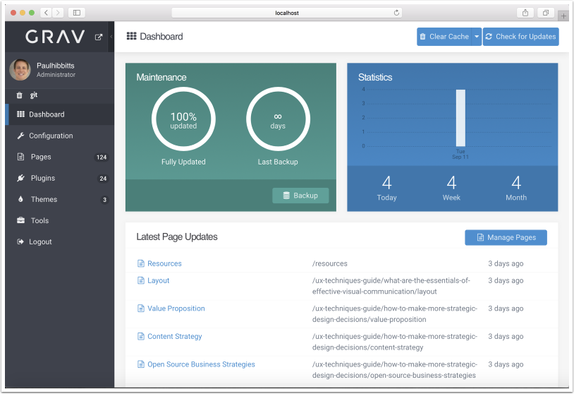

##### 2. Tap "Configuration"

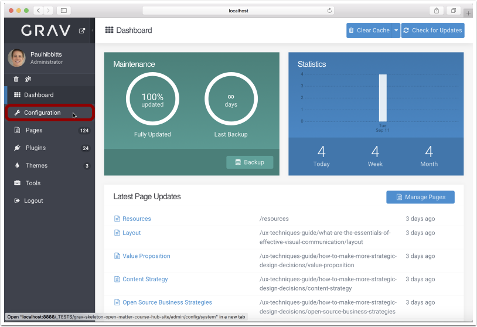

##### 3. Tap the "Site" tab

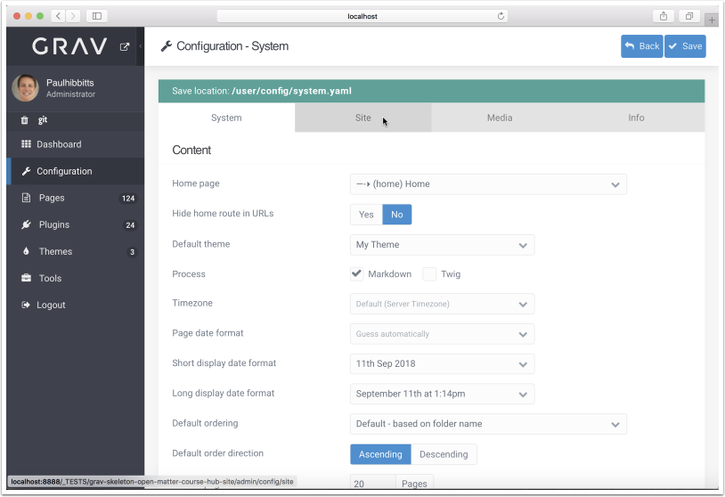

##### 4. Modify the Site Title

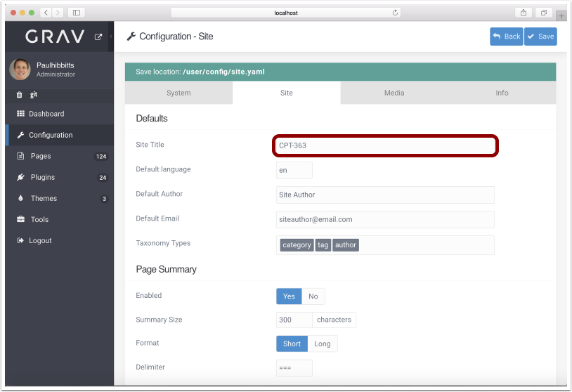

##### 5. Tap "Themes"

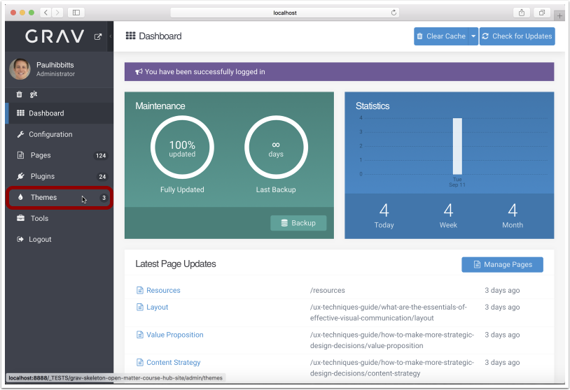

##### 6. Tap "My Theme"

If the "My Theme" theme is not available, tap on the "Bootstrap4 Open Matter" theme.

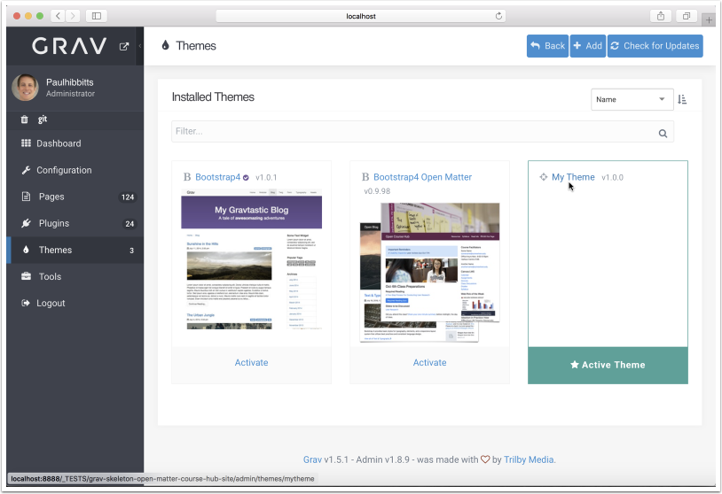

##### 7. Modify Open Matter options

On the "Open Matter" tab you can change various options, including for Git Sync, H5P, Creative Commons License display, and custom Menubar items.

##### 8. Modify Bootstrap4 options

On the "Bootstrap4 Options" tab you can change various Bootstrap options, including the color for the site NavBar (Menubar).

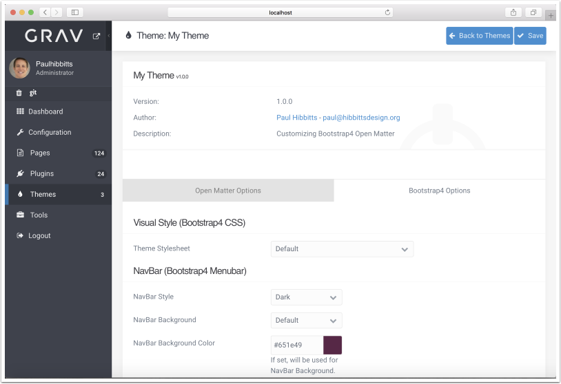

##### 9. Save any Theme option changes

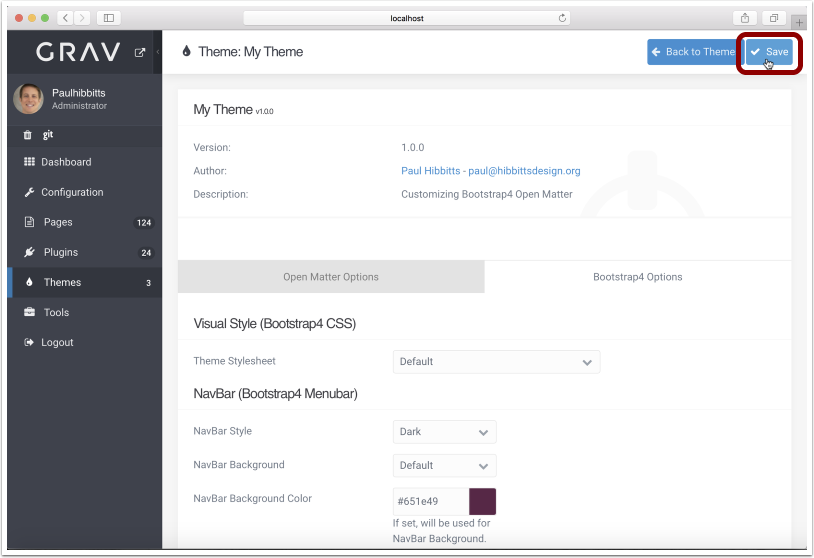

##### 10. Tap "Pages"

##### 11. Review the Course Hub site structure

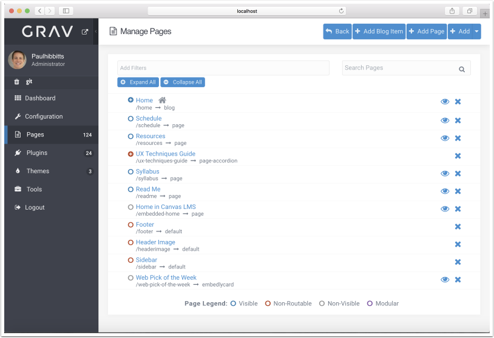

##### 12. Modify the site header image

Remove the existing "Page Media" image and replace with an image of your choice.

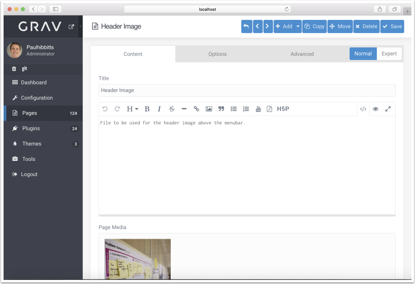

##### 13. Modify the site sidebar

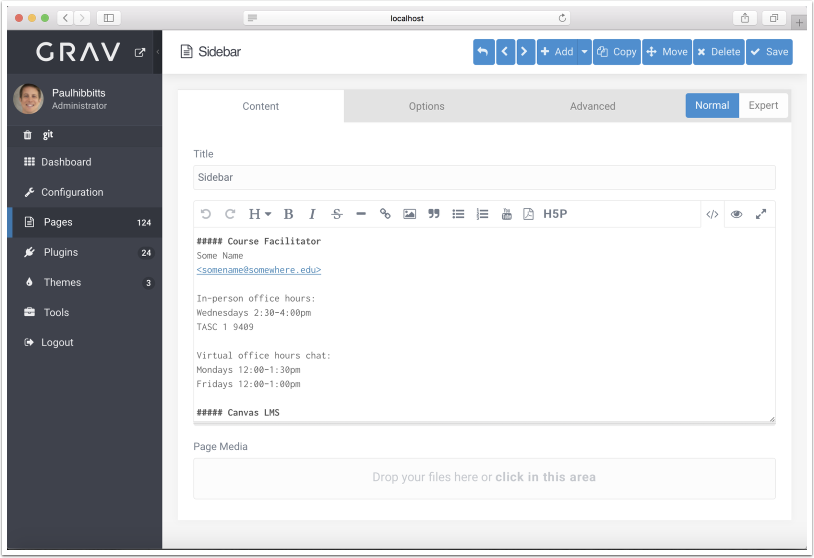

##### 14. Tap on the "+" sign to view Home page items

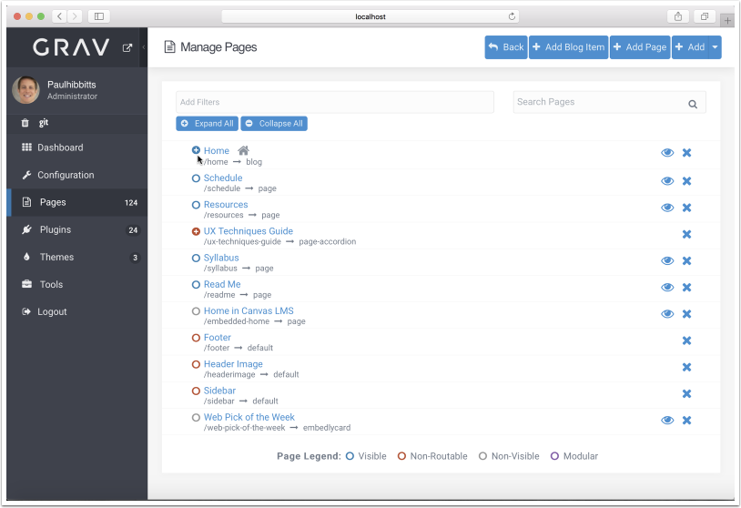

##### 15. Review the Home page items and sample blog posts

##### 16. Modify Important Reminders

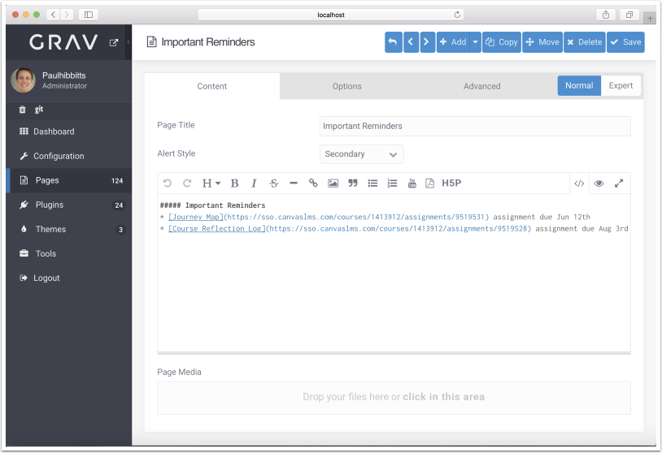

##### 17. Modify Class Preparations

##### 18. Modify a Homepage blog post (i.e. module/class summary)

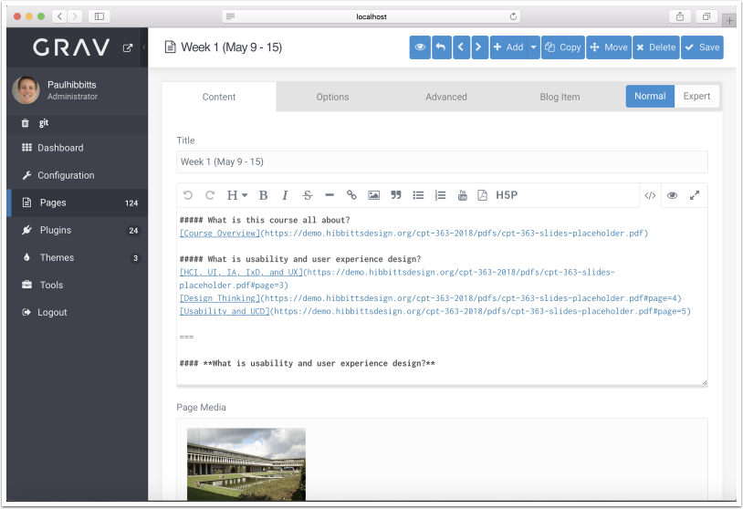

##### 19. Adding a new Homepage blog post (i.e. module/class summary)

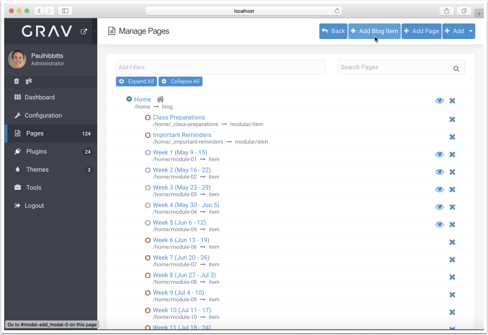

##### 20. Adding a new top-level page

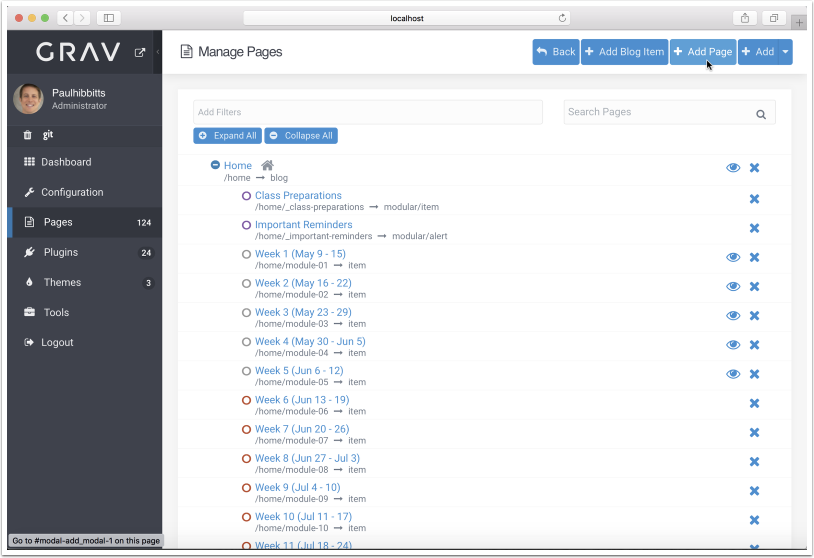

##### 21. Hide page (or Homepage blog post item)

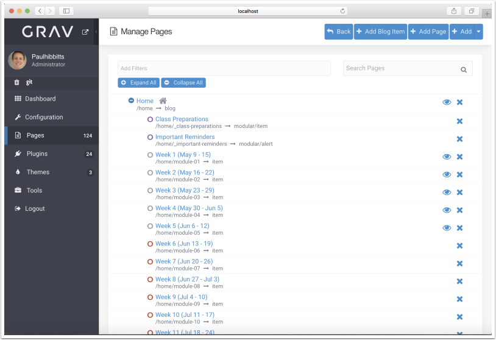

###### 21.1 Tap page title to open page

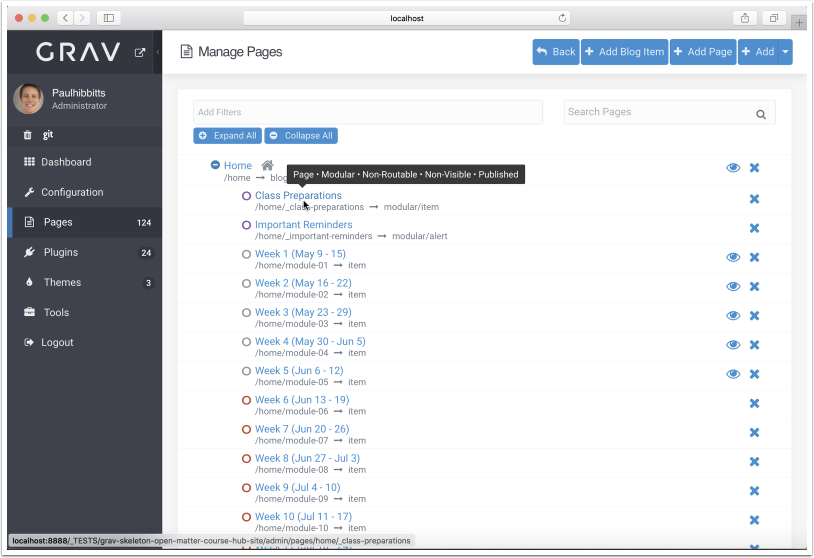

###### 21.2 Tap Options

###### 21.3 Tap "No" for Published option

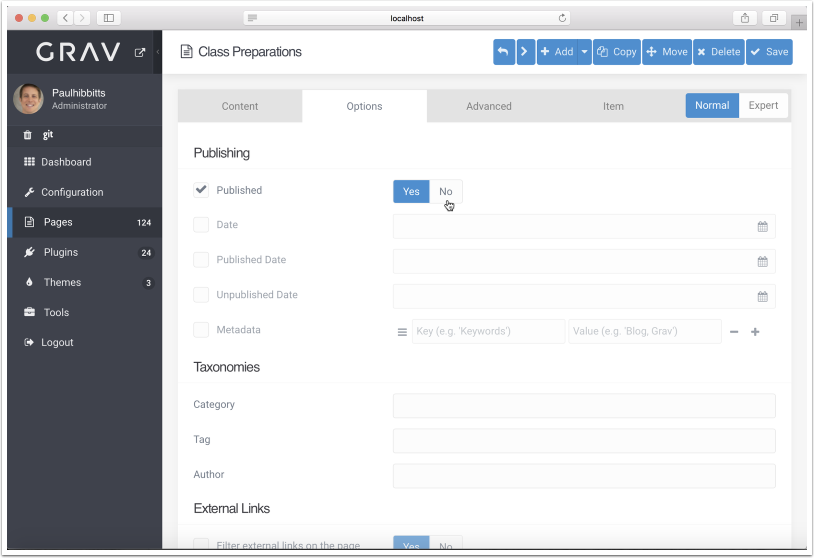

###### 21.4 Tap "Save"

