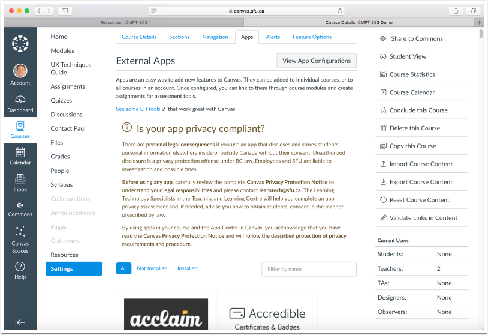
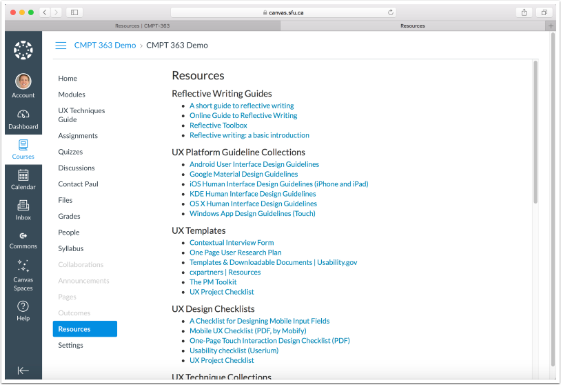

The 'chromeless' feature of the Grav Course Hub hides a site's global navigation elements for seamlessly displaying Course Hub page content within the Canvas LMS in three different ways:

* [Displaying Course Hub Content Within a Canvas Page](#displaying-course-hub-content-within-a-page)
* [Adding Course Hub Content to a Canvas Module](#adding-course-hub-content-to-a-canvas-module)
* [Adding a Link to Course Hub Content in the Canvas Menu](#adding-a-link-to-course-hub-content-in-the-canvas-menu)

Curious what all this might look like? Visit an [example Canvas LMS site with Grav Course Hub Content](https://canvas.sfu.ca/courses/36662).

#### Displaying Course Hub Content Within a Page

##### 1. View the page you want to embed, and copy the full URL of that page

![][3]

[3]: ../../images/displaying-course-hub-content-within-a-canvas-page/view-the-page-you-want-to-embed--and-copy-the-full-url-of-that-page.png

##### 2. Navigate to the Canvas Page you want to embed your Course Hub content into, and tap the "Edit" button

![][2]

[2]: ../../images/displaying-course-hub-content-within-a-canvas-page/navigate-to-the-canvas-page-you-want-to-embed-your-course-hub-content-into--and-tap-the--edit--butto.png

##### 3. Tap the "HTML Editor" link

![][4]

[4]: ../../images/displaying-course-hub-content-within-a-canvas-page/tap-the--html-editor--link.png

##### 4. Tap the "Rich Content

![][5]

[5]: ../../images/displaying-course-hub-content-within-a-canvas-page/tap-the--rich-content.png

##### 5. Paste the HTML iFrame code, using the below example

```
<p><iframe style="border:0px #ffffff none; margin-top:-16px" src="https://example.com/chromeless:true" width="100%" height="950px" allowfullscreen="allowfullscreen"></iframe></p>

```

![][6]

[6]: ../../images/displaying-course-hub-content-within-a-canvas-page/paste-the-html-iframe-code--using-the-below-example.png

##### 6. Highlight the default URL within the iFrame code, not including the "/chromeless=true" text (this will be needed to be included after your URL)

![][7]

[7]: ../../images/displaying-course-hub-content-within-a-canvas-page/highlight-the-default-url-within-the-iframe-code--not-including-the---chromeless-true--text--this-wi.png

##### 7. Paste the previously copied Course Hub page HTTPS URL, and ensure that the "/chromeless:true" text is still part of the URL

![][8]

[8]: ../../images/displaying-course-hub-content-within-a-canvas-page/paste-the-previously-copied-course-hub-page-https-url--and-ensure-that-the---chromeless-true--text-i.png

##### 8. Tap the "Save" button

![][9]

[9]: ../../images/displaying-course-hub-content-within-a-canvas-page/tap-the--save--button.png

##### 9. Review the final result of the embedded iFrame code.

###### If a scroll bar is present, you may want to re-edit your iFrame code and adjust the "height" value.

![][26]

[26]: ../../images/displaying-course-hub-content-within-a-canvas-page/review-the-final-result-of-the-embedded-iframe-code.png

Additional URL flags supported which might be helpful in addition to the 'chromeless' URL parameter:

* hidepagetitle:true
* summaryonly:true

#### Adding Course Hub Content to a Canvas Module

##### 1. View the page you want to add to a Module, and copy the full URL of that page

![][11]

[11]: ../../images/displaying-course-hub-content-within-a-canvas-page/view-the-page-you-want-to-add-to-a-module--and-copy-the-full-url-of-that-page.png

##### 2. Navigate to the "Modules" section in Canvas, and tap the "+" button next to a Module

![][12]

[12]: ../../images/displaying-course-hub-content-within-a-canvas-page/navigate-to-the--modules--section-in-canvas--and-tap-the-----button-next-to-a-module-.png

##### 3. Choose to add an "External URL"

![][13]

[13]: ../../images/displaying-course-hub-content-within-a-canvas-page/choose-to-add-an--external-url-.png

##### 4. Paste the previously copied Course Hub page HTTPS URL, and add "/chromeless:true" to the end of the URL

![][14]

[14]: ../../images/displaying-course-hub-content-within-a-canvas-page/paste-the-previously-copied-course-hub-page-https-url--and-add---chromeless-true--to-the-end-of-the-.png

##### 5. Enter the name for the Module item

![][15]

[15]: ../../images/displaying-course-hub-content-within-a-canvas-page/enter-the-name-for-the-module-item.png

##### 6. Publish the Module item by tapping on the crossed-circle icon on the far-right of the item

![][16]

[16]: ../../images/displaying-course-hub-content-within-a-canvas-page/publish-the-module-item-by-tapping-on-the-crossed-circle-icon-on-the-far-right-of-the-item.png

##### 7. With the Module item now published, tap on the item to view it

![][17]

[17]: ../../images/displaying-course-hub-content-within-a-canvas-page/with-the-module-item-now-published--tap-on-the-item-to-view-it.png

##### 8. Review the final result of the Module item External URL

![][18]

[18]: ../../images/displaying-course-hub-content-within-a-canvas-page/review-the-final-result-of-the-module-item-external-url.png

#### Adding a Link to Course Hub Content in the Canvas Menu

##### 1. View the page you want to add to the Canvas menu, and copy the full URL of that page

![][20]

[20]: ../../images/displaying-course-hub-content-within-a-canvas-page/view-the-page-you-want-to-add-to-the-canvas-menu--and-copy-the-full-url-of-that-page.png

##### 2. Tap on "Settings" in the Canvas menu, and then tap the "Redirect Tool" button (large curved arrow)

If you do not see the "Redirect Tool" icon, you will need to install it. Tap on the "All" button to view all External Apps and chose the "Redirect Tool" to install it.

![][21]

[21]: ../../images/displaying-course-hub-content-within-a-canvas-page/tap-on--settings--in-the-canvas-menu--and-then-tap-the--redirect-tool--button--large-curved-arrow-.png

##### 3. Tap on the "+ Add App" button

![][22]

[22]: ../../images/displaying-course-hub-content-within-a-canvas-page/tap-on-the---add-app--button.png

##### 4. Enter the name for your Canvas menu item in the "Name" field

![][23]

[23]: ../../images/displaying-course-hub-content-within-a-canvas-page/enter-the-name-for-your-canvas-menu-item-in-the--name--field.png

##### 5. Paste the previously copied Course Hub page HTTPS URL into the "URL Redirect" field, and add "/chromeless:true" to the end of the URL

![][24]

[24]: ../../images/displaying-course-hub-content-within-a-canvas-page/paste-the-previously-copied-course-hub-page-https-url-into-the--url-redirect--field--and-add---chrom.png

##### 6. Tap the "Add App" button

![][25]

[25]: ../../images/displaying-course-hub-content-within-a-canvas-page/tap-the--add-app--button.png

##### 7. After returning to the "External Apps" page, refresh your Browser and tap on the newly created Canvas menu item



##### 8. Review the final result of the added Course Hub page



_TIP: If you are using the most recent version of the Course Hub Bootstrap Theme, there is a theme option to use a Bootstrap CSS styling optimized to match the Canvas LMS._
