The 'chromeless' feature of the Grav Course Hub hides a site's global navigation elements for seamlessly displaying Course Hub page content within the Moodle LMS in three different ways:

* [Displaying Course Hub Content Within a Moodle Page](#displaying-course-hub-content-within-a-moodle-page)
* [Displaying Course Hub Unit Summary in a Moodle Topic](#displaying-course-hub-unit-summary-in-a-moodle-topic)
* [Adding Course Hub Content using the External Tool](#adding-course-hub-content-using-the-external-tool)

#### Displaying Course Hub Content Within a Moodle Page

##### 1. View the page you want to embed, and copy the full URL of that page

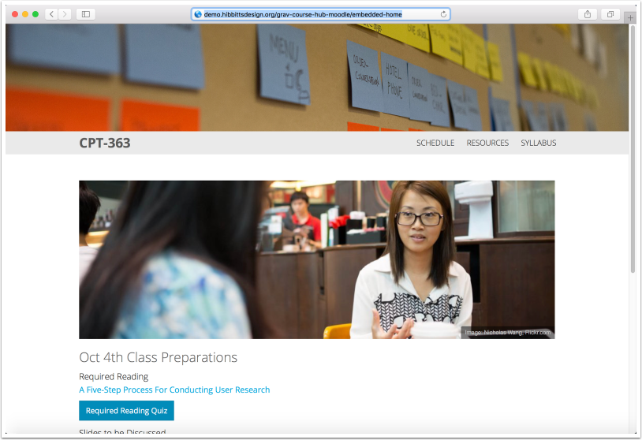

##### 2. Navigate to the Moodle Section/Page you want to embed your Course Hub content into, and choose the "Edit" option


##### 3. Tap the "Show more buttons" button

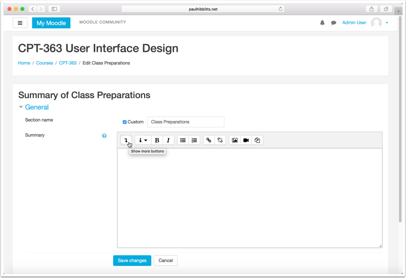

##### 4. Tap the "HTML" editor button


##### 5. Paste the HTML iFrame code, using the below example

```
<p><iframe scrolling="no" style="border: 0px #ffffff none; " src="http://example.com/chromeless:true" allowfullscreen="allowfullscreen" height="540px" width="100%"></iframe></p>
```

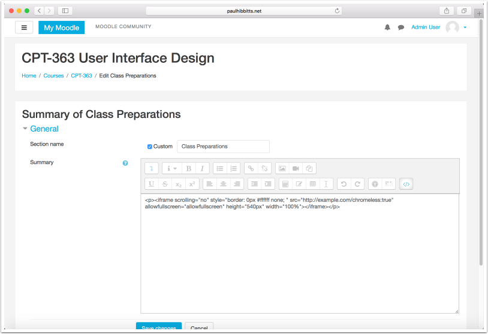

##### 6. Highlight the default URL within the iFrame code, not including the "/chromeless=true" text (this will be needed to be included after your URL)

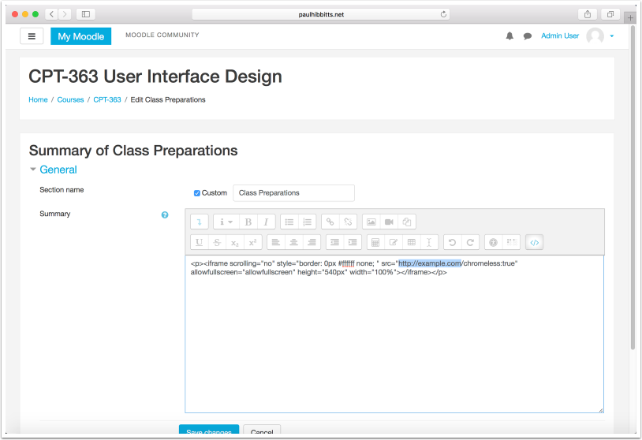

##### 7. Paste the previously copied Course Hub page HTTP URL, and ensure that the "/chromeless:true" text is still part of the URL

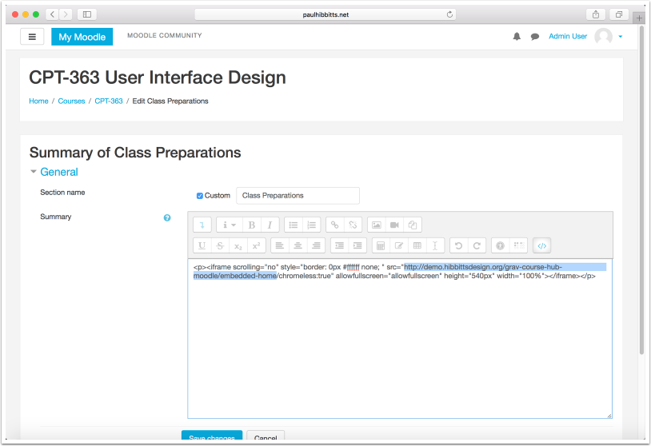

##### 8. Tap the "Save changes" button

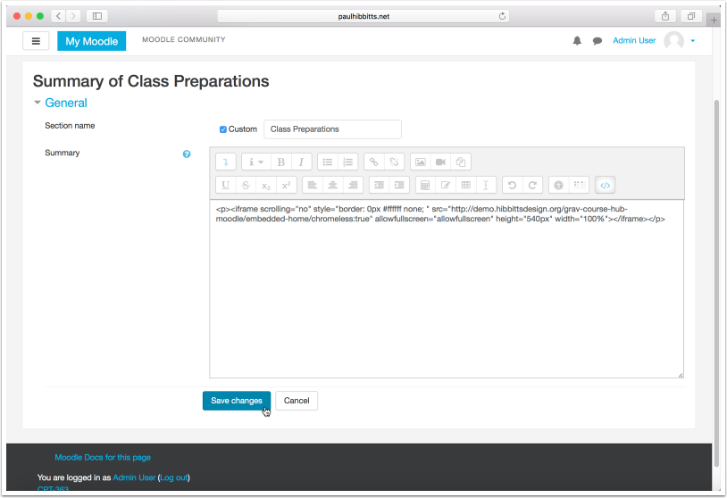

##### 9. Review the final result of the embedded iFrame code.

If all of the content expected is not displayed, or there is too much space between the bottom of the content and the next Moodle item, you may want to re-edit your iFrame code and adjust the "height" value.


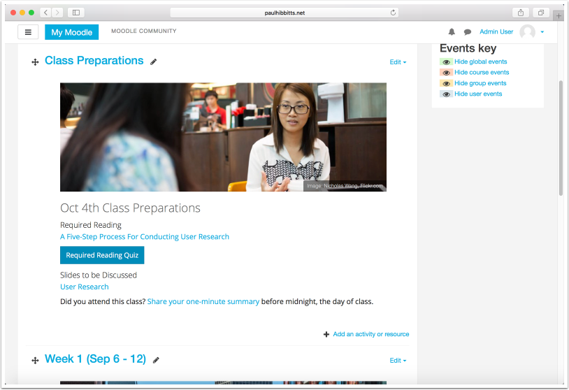

#### Displaying Course Hub Unit Summary in a Moodle Topic

##### 1. View the Unit (i.e. Week) page you want to include in a Topic, and copy the full URL of that page

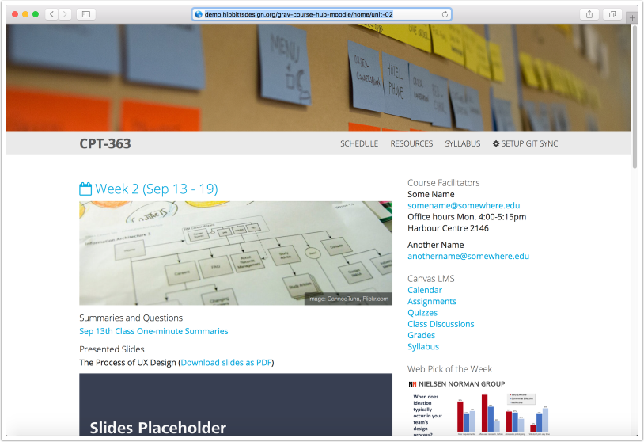

##### 2. Navigate to the Moodle Topic you want to embed your Course Hub content into, and choose the "Edit" option

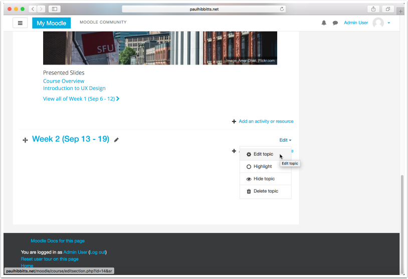

##### 3. Tap the "Show more buttons" button

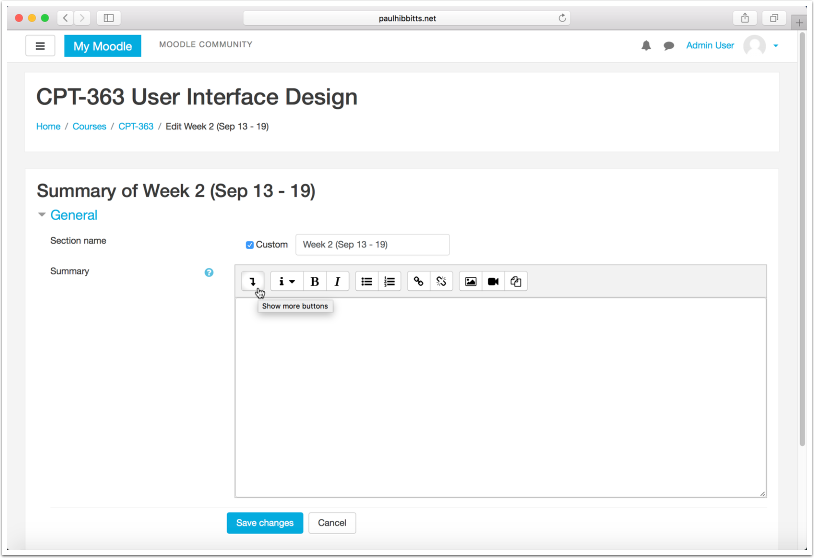

##### 4. Tap the "HTML" editor button

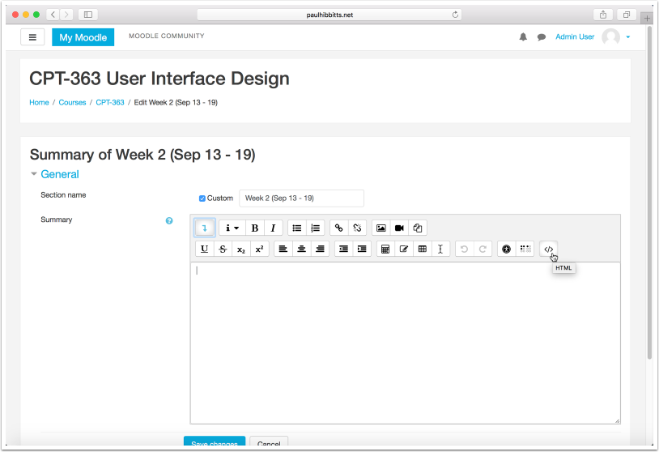

##### 5. Paste the HTML iFrame code, using the below example

```
<p><iframe scrolling="no" style="border: 0px #ffffff none; " src="http://example.com/chromeless:true" allowfullscreen="allowfullscreen" height="540px" width="100%"></iframe></p>
```

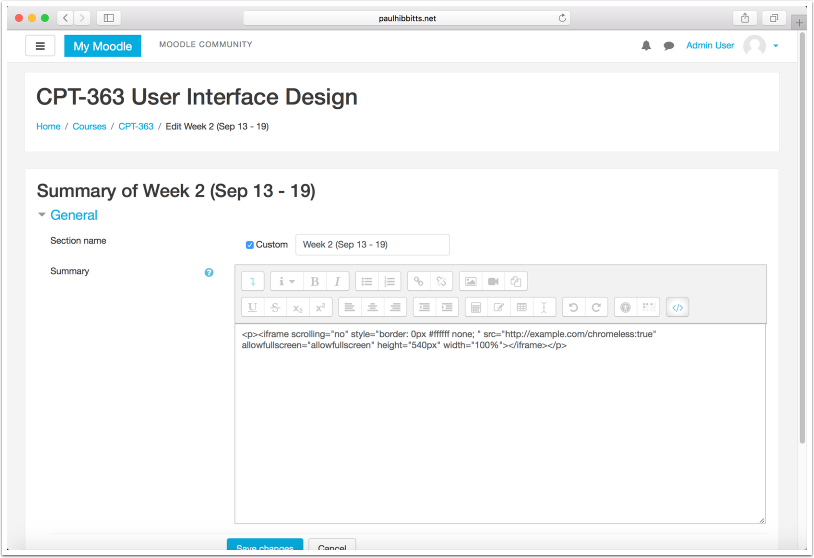

##### 6. Highlight the default URL within the iFrame code, not including the "/chromeless=true" text (this will be needed to be included after your URL)

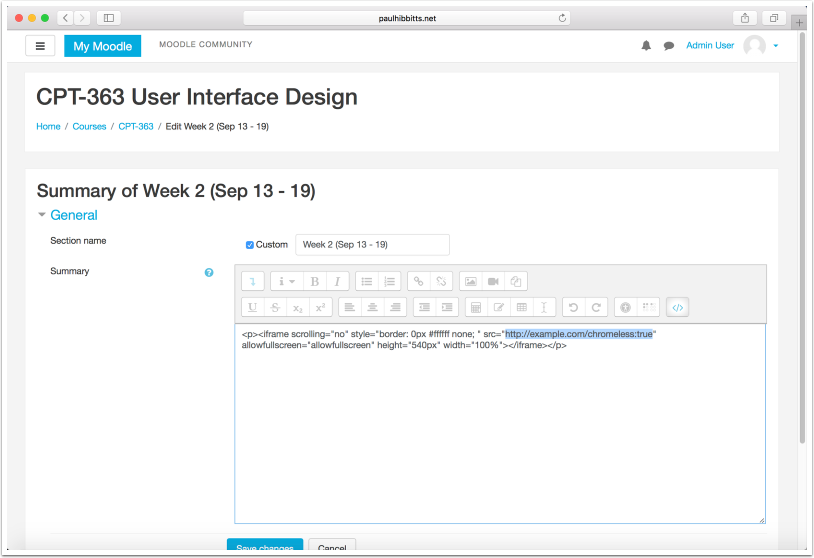

##### 7. Add additional URL flags to only display the Unit summary ("/summaryonly:true") and hide the page title ("/hidepagetitle:true").

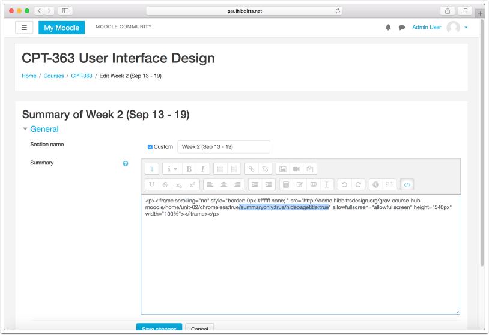

##### 8. Tap the "Save changes" button

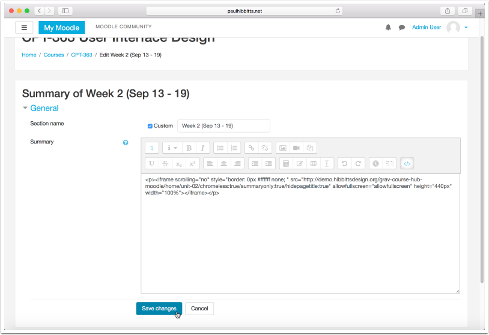

##### 9. Review the final result of the embedded iFrame code.

If all of the content expected is not displayed, or there is too much space between the bottom of the content and the next Moodle item, you may want to re-edit your iFrame code and adjust the "height" value.


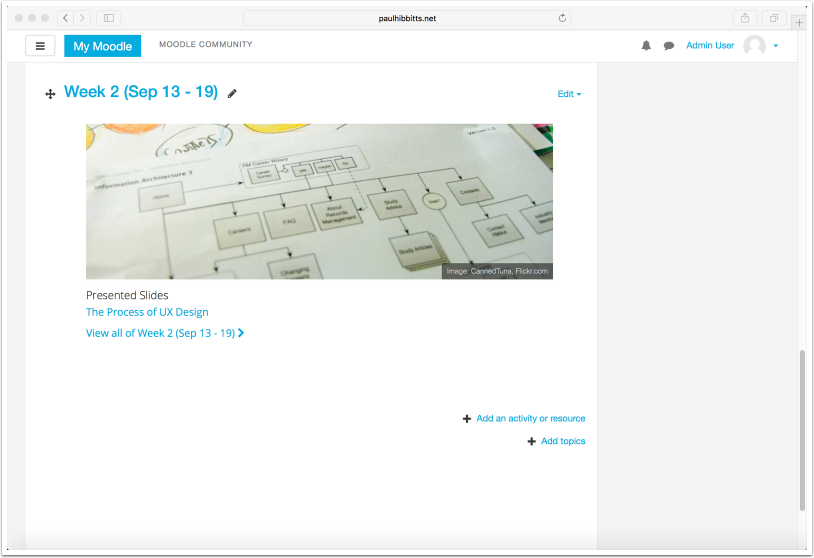

#### Adding Course Hub Content using the External Tool

Please note that you can also add Course Hub Content using the URL object in Moodle.

##### 1. View the page you want to add to add using the External Tool, and copy the full URL of that page

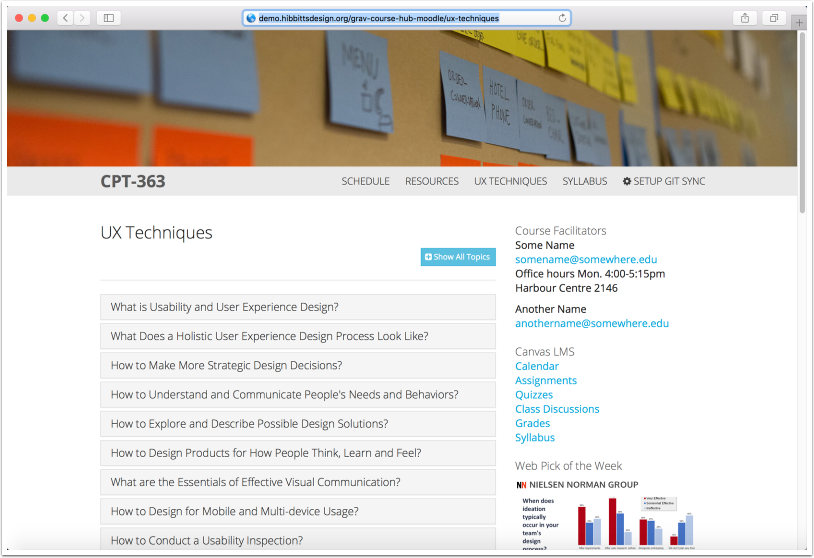

##### 2. Navigate to the Moodle item you want to add an External Tool link to and tap the Add option

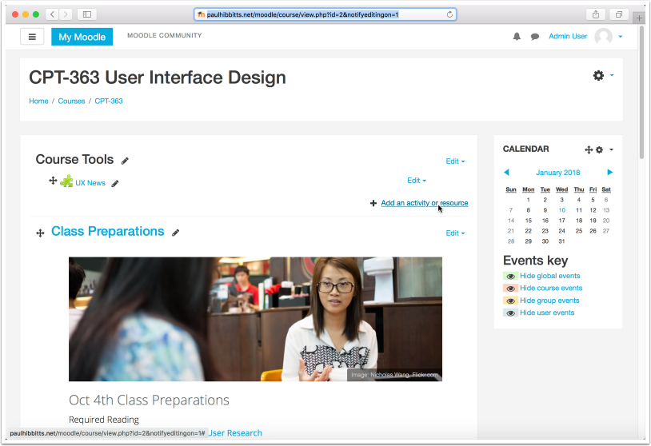

##### 3. Choose the "External Tool" option

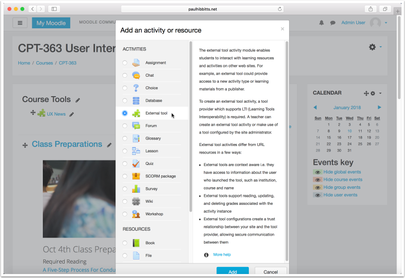

##### 4. Tap the "Add" button

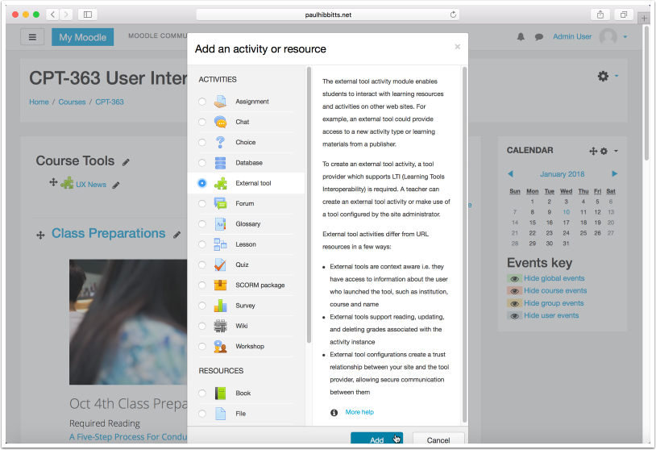

##### 5. Enter the name for the External Tool link

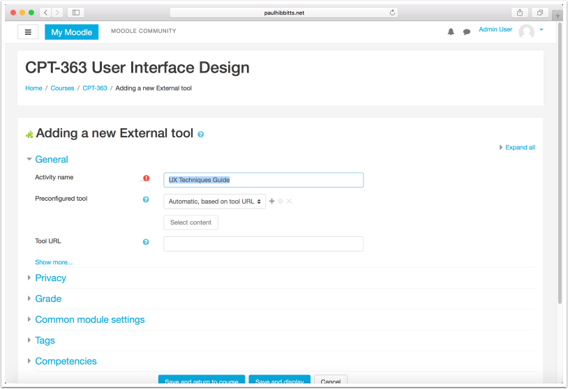

##### 6. Paste the previously copied Course Hub page HTTPS URL into the "URL Redirect" field, and add "/chromeless:true" to the end of the URL

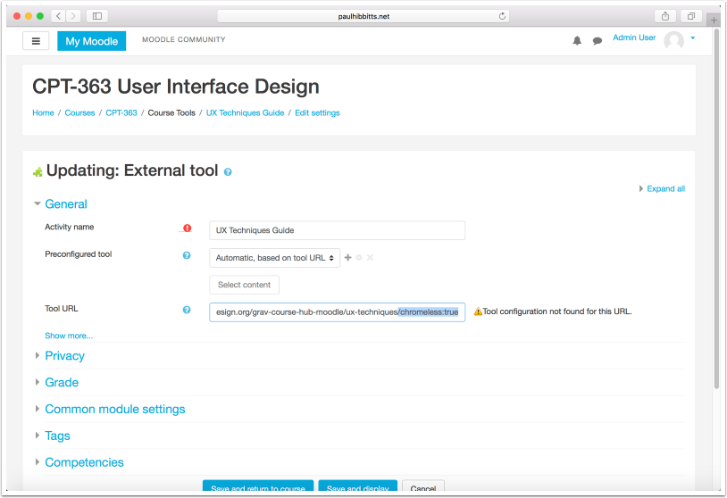

##### 7. Tap the "Save and display" button

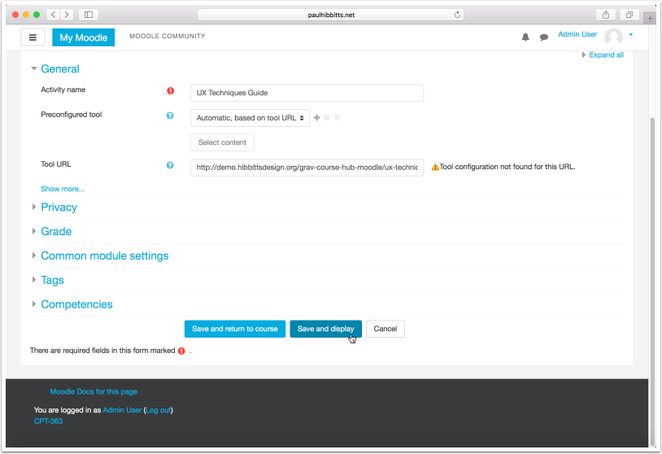

##### 8. Review the final result of the added Course Hub page


