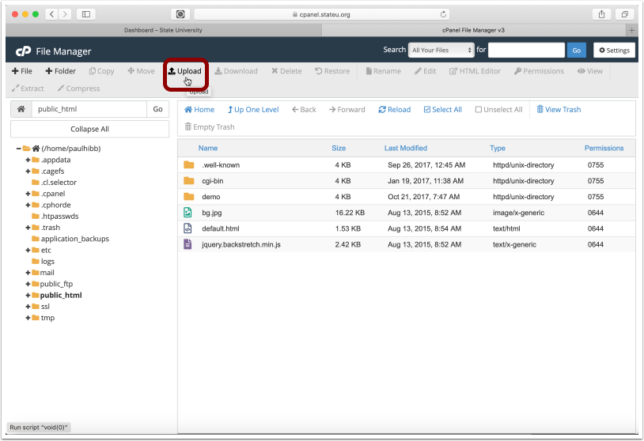
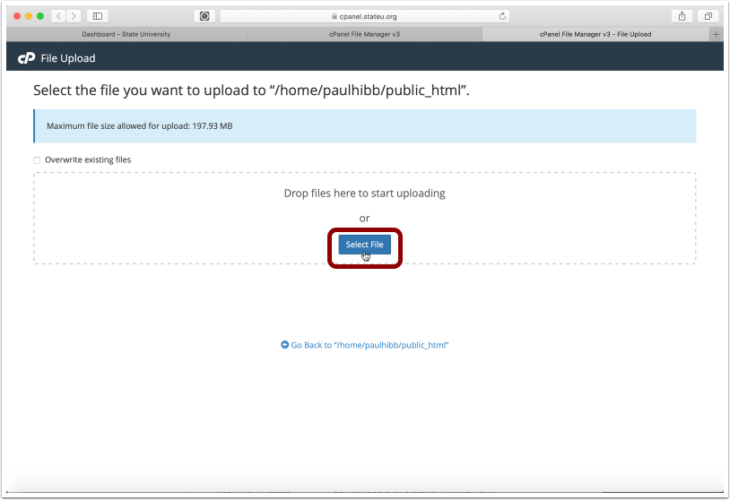
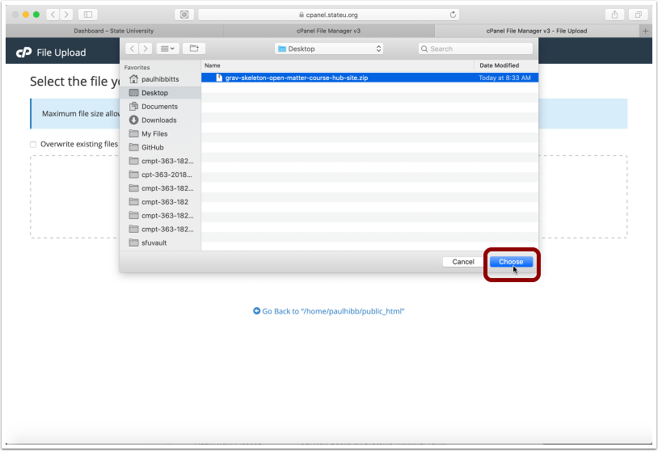
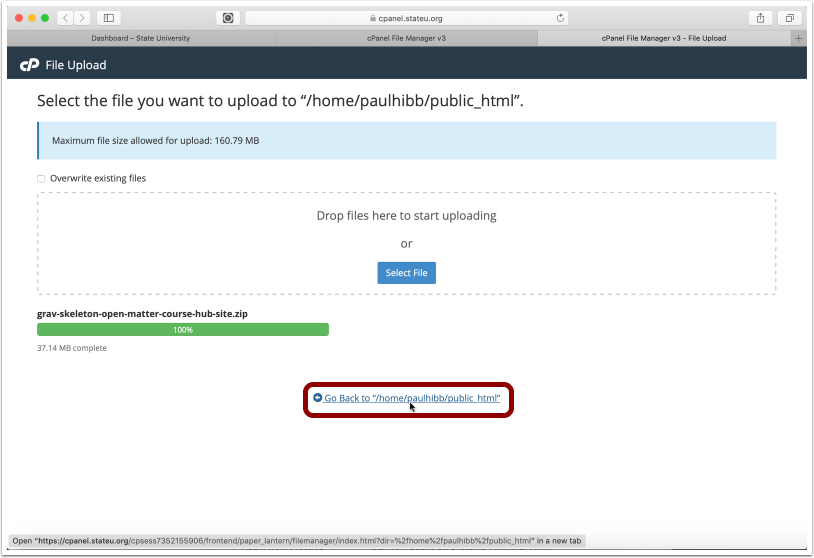
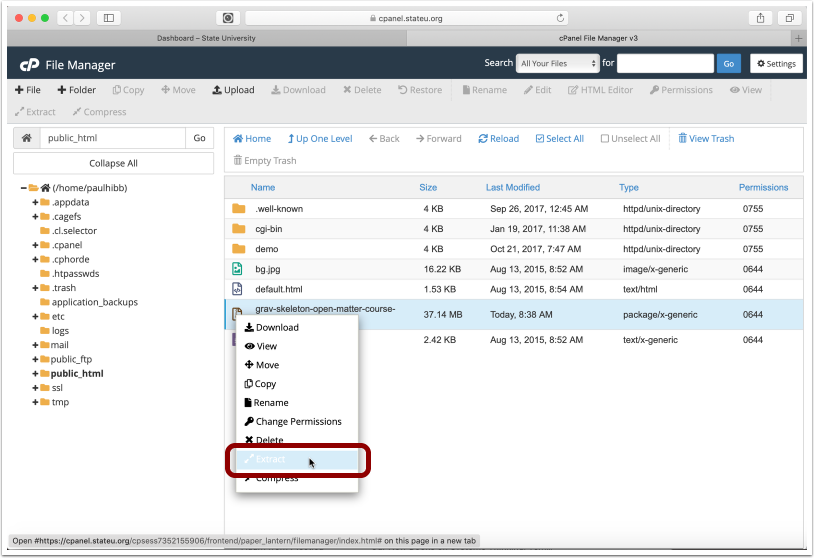
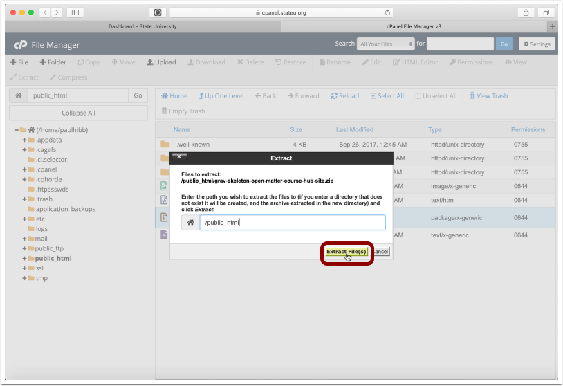
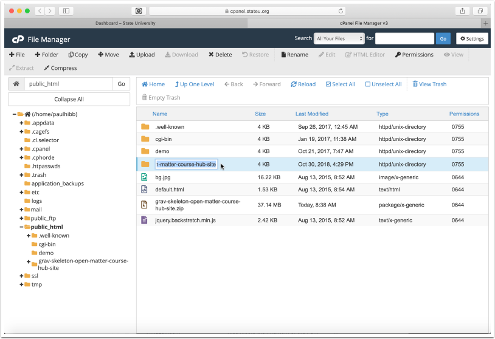
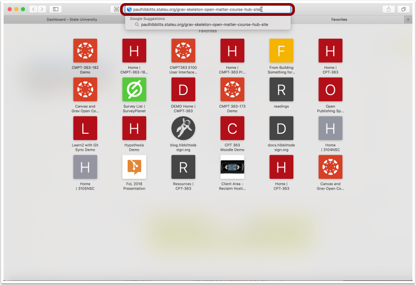
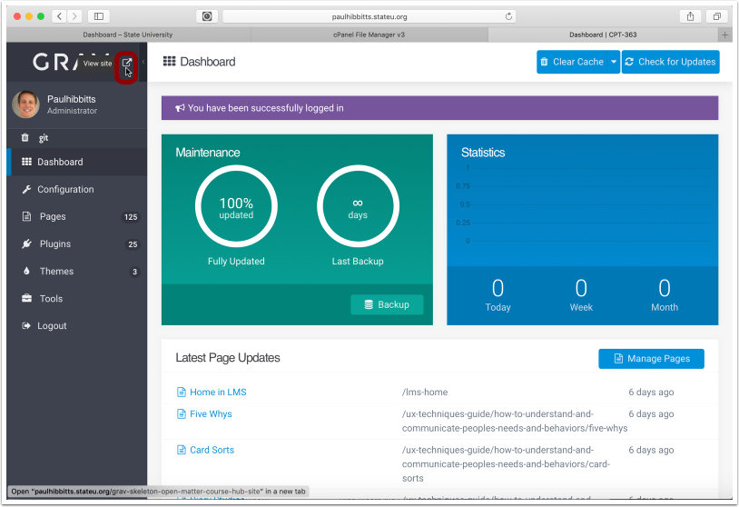
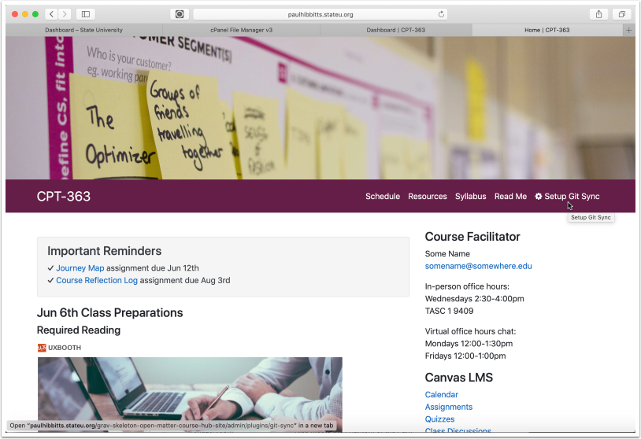

##### 2.1 Tap "Upload"

##### 2.2 Tap "Select File"

##### 2.3 Choose the downloaded Course Hub ZIP file

##### 2.4 Return to the file listing view

##### 2.5 Right-tap on the Course Hub ZIP file and choose "Extract"

##### 2.6 Tap "Extract File(s)" button

##### 2.7 Tap "Close" button

##### 2.8 Copy the folder name to your clipboard (but first, change it to what you would like)

##### 2.9 Enter the URL to your Course Hub

##### 2.10 Complete the Admin config form

##### 2.11 Tap on the arrow-square to preview site

##### 2.12 Explore your newly created site!

