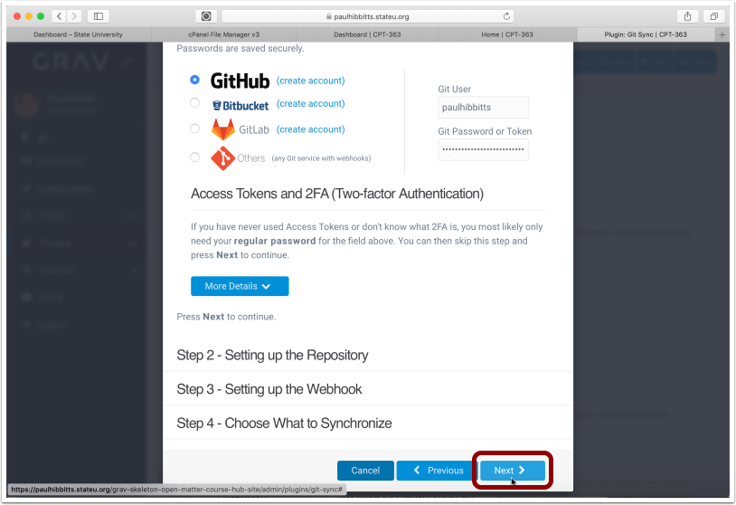
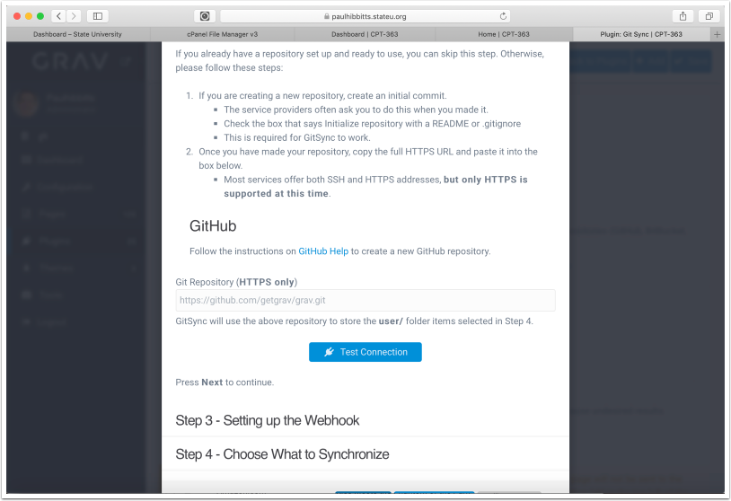
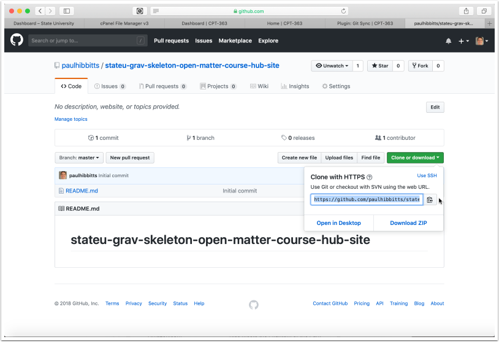
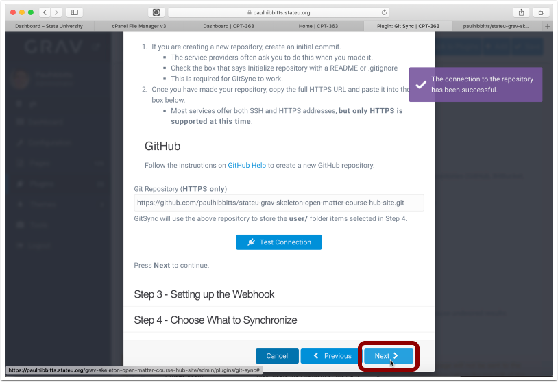
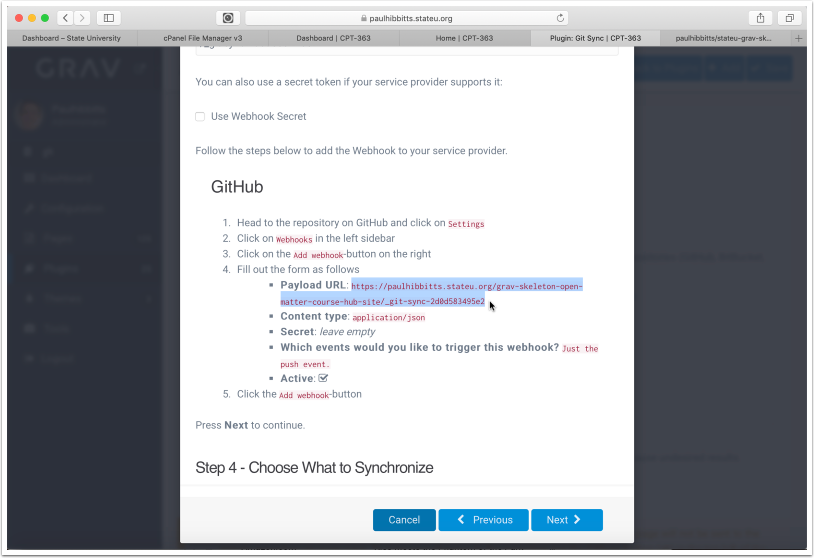
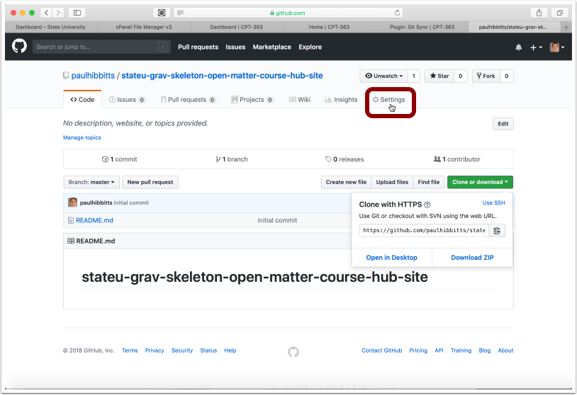
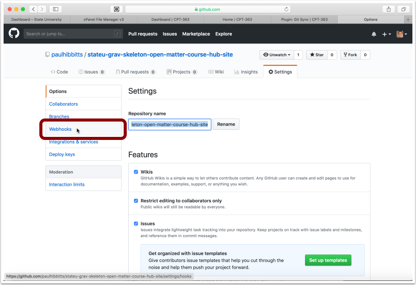
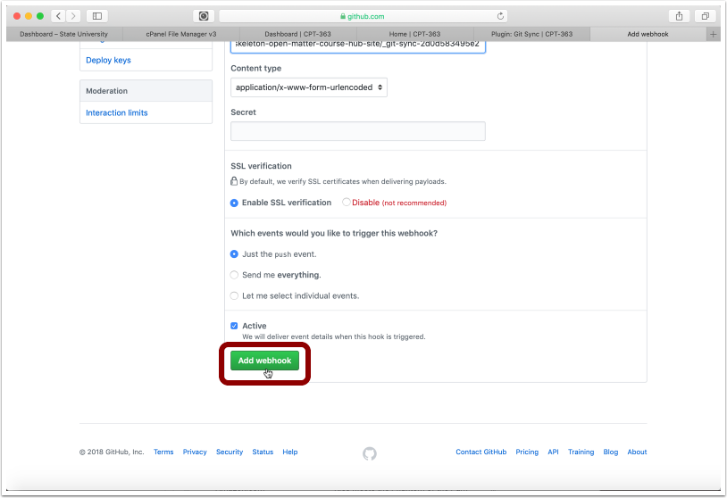
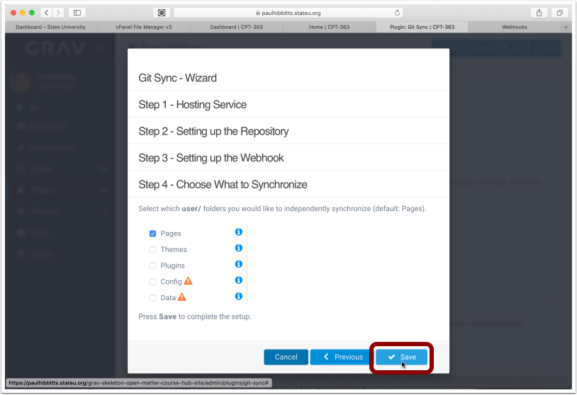
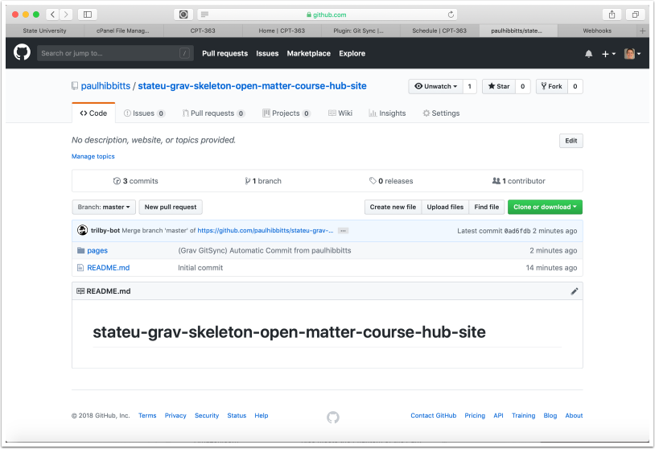

##### 3.1 Tap the "Setup Git Sync" link

##### 3.2 Tap the "Next" button

##### 3.3 Choose the Git service and enter your username and password for it

##### 3.4 Scroll down (if needed) and Tap the "Next" button

##### 3.5 Before continuing, you will need to create a repository on your Git service.

If you have already created a Git repository (with at least one commit, for example a ReadMe file) you may skip to step 3.10

##### 3.6 Create a new repository in your chosen Git service (GitHub example shown)

##### 3.7 Enter repository name

##### 3.8 Choose to include a ReadMe file

##### 3.9 Create the new repository

##### 3.10 Copy the HTTPS URL of the repository to your clipboard

##### 3.11 Paste the Git repository HTTPS URL into the "Git Repository" field and tap "Test Connection"

##### 3.12 Tap the "Next" button

##### 3.13 Select the displayed Webhook URL and copy it to your clipboard

##### 3.14 Add the Webhook to your Git repository settings, in GitHub tap "Settings"

##### 3.15 Tap "Webhooks"

##### 3.16 Tap "Add Webhook"

##### 3.17 Paste the copied Course Hub Webhook URL into the "Payload URL" field

Note: if you change the folder name or location of your site you will also need to update the "Payload URL" field

##### 3.18 Scroll down, and tap "Add Webhook"

##### 3.19 Once the new Webhook is displayed, return to your site

##### 3.20 Tap the "Next" button

##### 3.21 Tap the "Save" button

Note: you can also choose to sync other user folders here, and as well in the plugin configuration panel

##### 3.22 Tap the arrow-square button to once again preview the site

##### 3.23 To test your Git Sync configuration, tap on the "View Content Repositiry" link

Note: you can change this link to also go directly to the displayed page in your Active Theme settings

##### 3.24 The site Content Repository should now be displayed in GitHub

