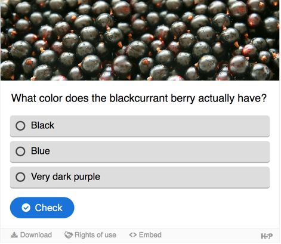

Get the most out of your Open Course Hub!

* [Editing Course Hub content on your desktop](#editing-site-content-on-your-desktop)
* [Customizing your Course Hub theme](#customizing-your-course-hub-theme)
* [URL Parameters (e.g. for embedding pages)](#url-parameters-e-g-for-embedding-pages)
* [Making a homepage blog post 'sticky'](#making-a-homepage-blog-post-sticky)
* [Hiding a post from the homepage post list](#hiding-a-post-from-the-homepage-post-list)
* [Override a page's automatic Git Repository URL](#override-a-pages-automatic-git-repository-url)
* [Built-in ShortCodes](#built-in-shortcodes)

##### Editing site content on your desktop

You can use the [GitHub Desktop](https://desktop.github.com/) application with either [GitLab](https://about.gitlab.com/) or [GitHub](https://github.com/) to clone and edit your Open Course Hub pages on your own computer:

* [GitHub & GitHub Desktop](/github-githubdesktop)
* [GitLab & GitHub Desktop](/gitlab-githubdesktop)

##### Customizing your Course Hub theme

The Open Course Hub skeleton package comes with an [Inherited Theme](https://learn.getgrav.org/themes/customization#theme-inheritance) called 'mytheme' all ready for your further customization.

In addition, this theme is also automatically synced to the Git repository of your site. This means that you can invite other people, such as fellow educators or your students, to assist in the further customization of your site.

##### URL Parameters (e.g. for embedding pages)

When displaying Open Course Hub pages within another system (e.g. LMS) it is often helpful to only display page content and not include header navigation and the sidebar.

To support this use of Open Course Hub, a number of URL parameters are available:

* `chromeless`
* `embedded`
* `hidepagetitle`
* `hideheaderimage`
* `summaryonly`

**Chromeless Parameter**  
The `chromeless:true` URL parameter will display a page without global navigation elements. For example, [https://demo.hibbittsdesign.org/grav-open-matter-course-hub/ux-techniques-guide/chromeless:true](https://demo.hibbittsdesign.org/grav-open-matter-course-hub/ux-techniques-guide/chromeless:true)

**Embedded Parameter**  
An alias for 'chromeless', for example `embedded:true` is the same as `chromeless:true`. For example, [https://demo.hibbittsdesign.org/grav-open-matter-course-hub/ux-techniques-guide/embedded:true](https://demo.hibbittsdesign.org/grav-open-matter-course-hub/ux-techniques-guide/embedded:true)

**HidePageTitle Parameter**  
The addition of the `hidepagetitle:true` URL parameter will display a 'chromeless' page without it's title. For example, [https://demo.hibbittsdesign.org/grav-open-matter-course-hub/ux-techniques-guide/chromeless:true/hidepagetitle:true](https://demo.hibbittsdesign.org/grav-open-matter-course-hub/ux-techniques-guide/chromeless:true/hidepagetitle:true)

**HideHeaderImage Parameter**  
The addition of the `hideheaderimage:true` URL parameter will display a page without it's header image. For example, [http://demo.hibbittsdesign.org/grav-open-matter-course-hub/resources/chromeless:true/hidepagetitle:true/hideheaderimage:true](http://demo.hibbittsdesign.org/grav-open-matter-course-hub/home/module-01/chromeless:true/hidepagetitle:true/hideheaderimage:true)

**Summary Only Parameter**  
The addition of the `summaryonly:true` URL parameter will display the summary of a 'chromeless' blog page. For example, [https://demo.hibbittsdesign.org/grav-open-matter-course-hub/home/module-01/chromeless:true/summaryonly:true](https://demo.hibbittsdesign.org/grav-open-matter-course-hub/home/module-01/chromeless:true/summaryonly:true)

##### Making a homepage blog post 'sticky'

To make a blog post precede all other blog posts listed, add a `featured` tag to it's taxonomy field (located on the `Options` panel when editing a page in the Admin Panel). The frontmatter that is added to the page will look like this:

```
taxonomy:
    tag:
        - featured
```

##### Hiding a post from the homepage post list

To hide a blog post from the homepage post list, but still make it available on other pages, add the following page frontmatter option:

```
hide_from_post_list: true
```

##### Override a page's automatic Git Repository URL

To override the automatically calculated Git Repository URL on a page (i.e. to view a folder containing child pages), add the desired URL to the page frontmatter like this:

```
git_sync_repo_link: https://github.com/hibbitts-design/grav-skeleton-course-hub/tree/master/pages/01.home
```

##### Built-in ShortCodes

**Badge**

This ShortCode displays a badge, with an optional link.

```
[badge label="Fri Aug 3rd 11:59pm PDT"][/badge]
[badge label="Mon Mar 15th 11:59pm PST" url="https://www.timeanddate.com/worldclock/fixedtime.html?msg=CMPT-363+Group+Storyboards+Mockups+Due+Date&iso=20210315T2359&p1=256"]
```

**Button**

This ShortCode displays a link as a Bootstrap button, with optional size, classes, type and target.

```
[button label="Go to GetGrav.org" url="http://getgrav.org"]
```

View more details at [getbootstrap.com/docs/4.5/components/buttons/](https://getbootstrap.com/docs/4.5/components/buttons/)

**Embed.ly**

This ShortCode embeds an [Embed.ly](http://embed.ly/) card Webpage preview.

```
[embedly url="http://getgrav.org"]
```

Example (image)


**Google Slides**

This ShortCode embeds a [Google Slides](https://www.google.ca/slides/about/) deck.

```
[googleslides url="https://docs.google.com/presentation/d/e/2PACX-1vSPiOUzmRG4EB6ng8KQgOwZEbVuN2u1d5tGVTiAyzlVuO_o4Zjyli3oAf_U_CqXml_6GMUBR9nUyEYb/embed?start=false&loop=false&delayms=3000"]
```

Example (image)


**H5P**

This ShortCode embeds an [H5P](https://h5p.org) content item.

```
[h5p id="712"]
[h5p url="https://h5p.org/h5p/embed/712"]
```

When using the `[h5p id=""]` format the H5P Content Embed Source URL must be set in the Active Theme settings.

Example (image)



**iFrame**

This ShortCode embeds an iFrame.

```
[iframe url="http://getgrav.org"]
[iframe url="http://getgrav.org" aspectratio="4by3"] (default)
[iframe url="http://getgrav.org" aspectratio="16by9"]
```

**Markdown File**

This ShortCode embeds an external [Markdown](https://en.wikipedia.org/wiki/Markdown) file.

```
[markdownfile url="https://raw.githubusercontent.com/hibbitts-design/grav-skeleton-course-hub/master/README.md"]
```

**PDF File**

This ShortCode embeds an external [PDF](https://en.wikipedia.org/wiki/PDF) file.

```
[pdf url="https://qofr.files.wordpress.com/2016/11/q-of-r-presentation-11.pdf"]
```

**Show if Embedded**

This ShortCode shows content when a Grav page is embedded (i.e displayed 'chromelessly') in another platform.

```
[showifembedded]
This content would only be shown when the page is embedded
[/showifembedded]
```

**Hide if Embedded**

This ShortCode hides content when a Grav page is embedded (i.e. displayed 'chromelessly') in another platform.

```
[hideifembedded]
This content would only be shown when the page is not embedded
[/hideifembedded]
```
