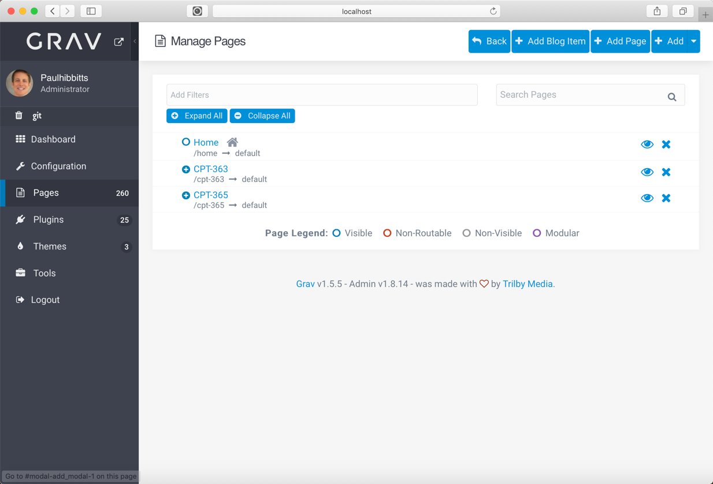

With the v2.7 release of the Grav Course Hub skeleton package Multi-course Hubs are now supported.

##### Multi-course Hub skeleton package

Download from the hibbittsdesign.org site at [hibbittsdesign.org/blog/downloads/grav-skeleton-open-matter-multi-course-hub-site.zip
](http://hibbittsdesign.org/blog/downloads/grav-skeleton-open-matter-multi-course-hub-site.zip
)
