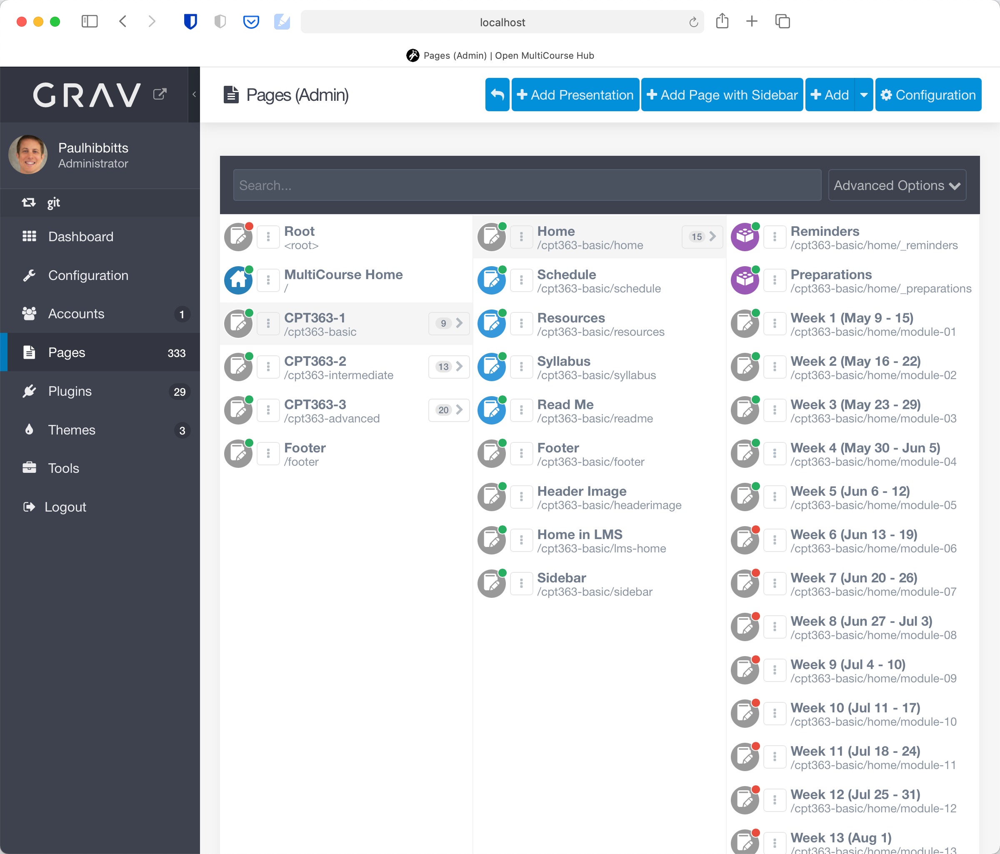
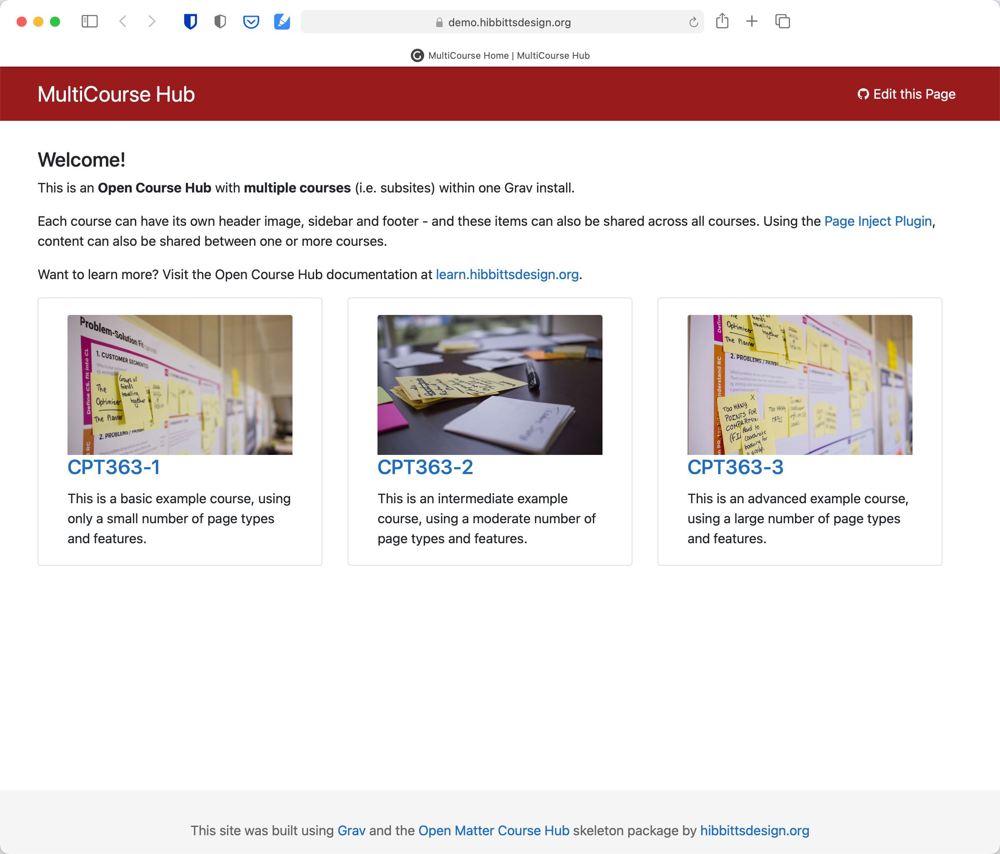
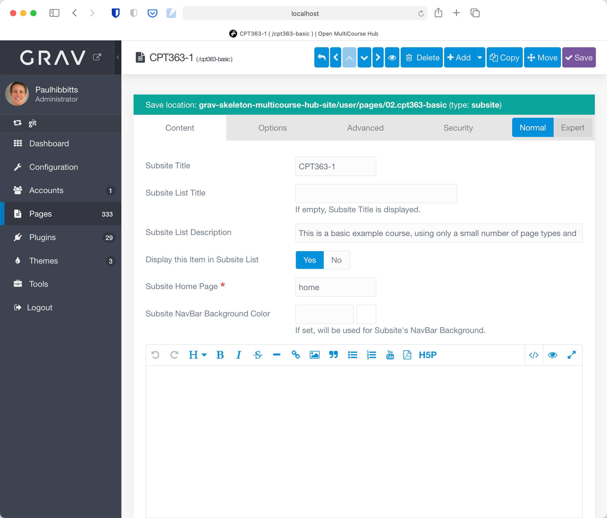

With the v2.7 release of the Grav Open Course Hub skeleton package [MultiCourse Hubs](https://demo.hibbittsdesign.org/grav-skeleton-open-matter-multi-course-hub-site/) are now supported.

  

Each course within a MultiCourse Hub is structured the same as a single course, and stored within its own top-level page (folder) with the template 'subsite'. A course header image, menubar, sidebar and footer can be specific to each course, or shared between one or more courses.

  

An automatically generated list of all courses within a site is possible by creating a top-level page with the template 'subsitelist', as shown below.

Each listed course has a number of options available, including being selectively hidden from the course list.

  

##### MultiCourse Hub skeleton packages
Download the standard MultiCourse Hub from the hibbittsdesign.org site at [hibbittsdesign.org/blog/downloads/grav-skeleton-open-matter-multicourse-hub-site.zip
](http://hibbittsdesign.org/blog/downloads/grav-skeleton-open-matter-multicourse-hub-site.zip
).
