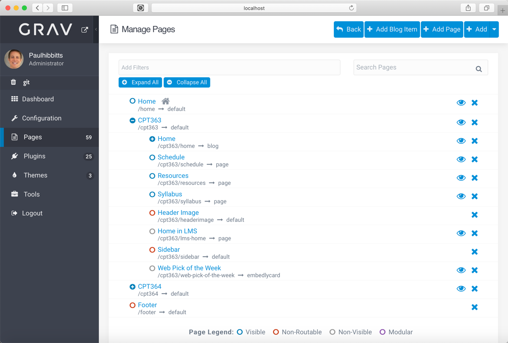
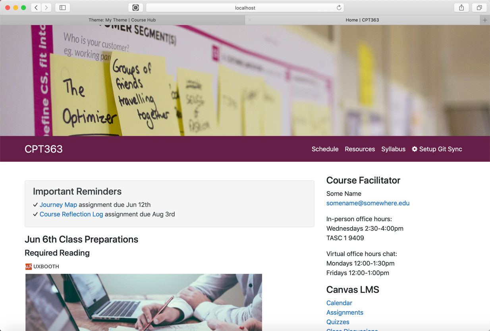

With the v2.7 release of the Grav Open Course Hub skeleton package [MultiCourse Hubs](https://demo.hibbittsdesign.org/grav-skeleton-open-matter-multi-course-hub-site/) are now supported.

  

Each course within a MultiCourse Hub is structured the same as a single course, and stored within its own top-level page (folder) with the template 'course'. A course header image, menubar, sidebar and footer can be specific to each course, or shared between one or more courses.

  

An automatically generated list of all courses within a site is possible by creating a top-level page with the template 'courselist', as shown below. Courses may also be selectively hidden from this list.

It is also possible to group multiple course instances, for example by term.

  

##### MultiCourse Hub skeleton packages
Download the standard MultiCourse Hub from the hibbittsdesign.org site at [hibbittsdesign.org/blog/downloads/grav-skeleton-open-matter-multicourse-hub-site.zip
](http://hibbittsdesign.org/blog/downloads/grav-skeleton-open-matter-multicourse-hub-site.zip
) and the MultiCourse Hub with Course Groups from [hibbittsdesign.org/blog/downloads/grav-skeleton-open-matter-multicourse-hub-site.zip
](http://hibbittsdesign.org/blog/downloads/grav-skeleton-open-matter-multicoursegroups-hub-site.zip
).
