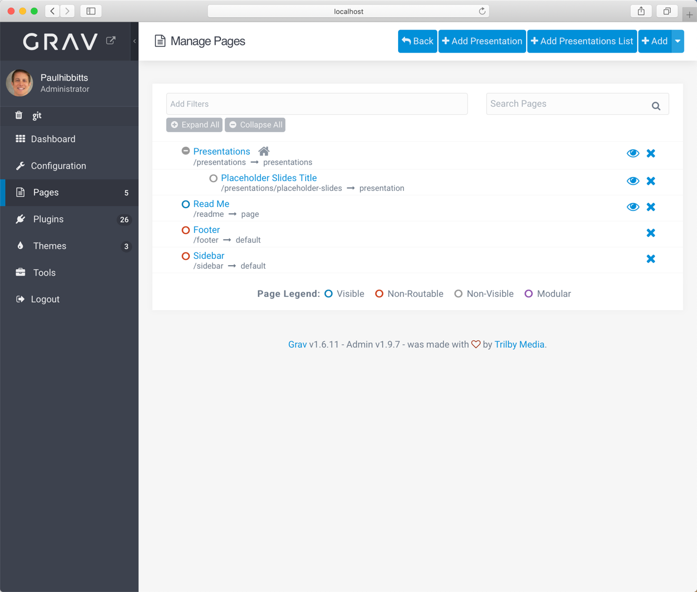
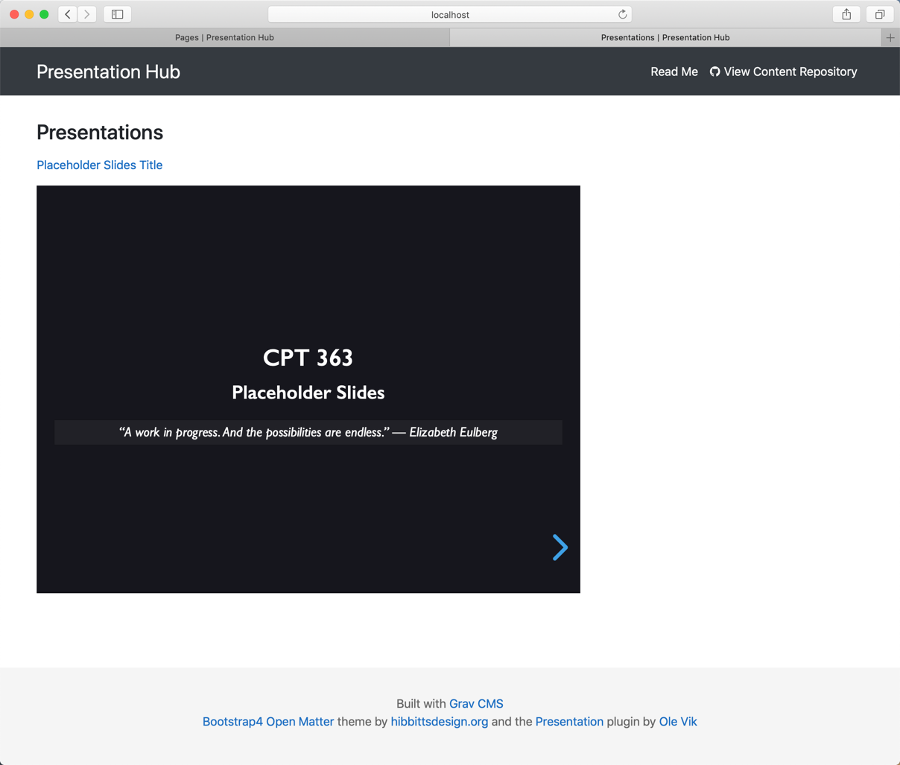
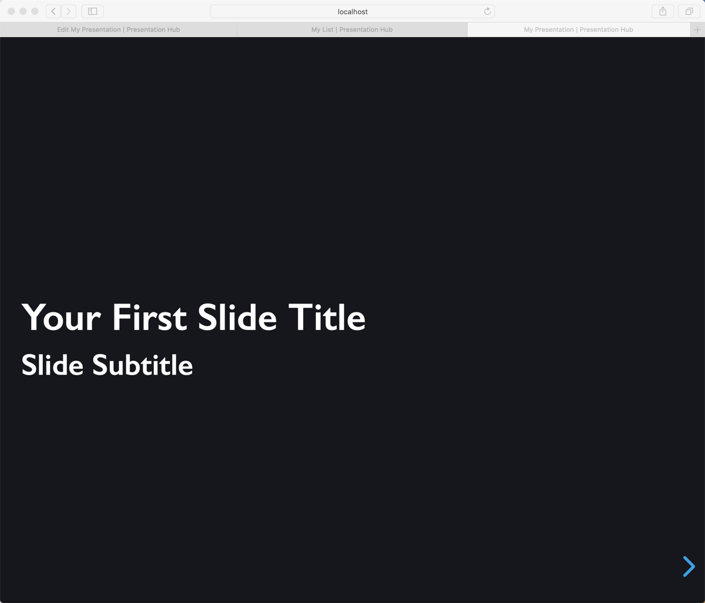

With the v3.08 release of the Grav Open Course Hub skeleton package [Presentation Hubs](https://demo.hibbittsdesign.org/grav-skeleton-open-matter-presentation-hub-site/) are now supported.

  

  

  

Learn more about the [Presentation Plugin](https://github.com/OleVik/grav-plugin-presentation/blob/master/README.md) and the [Deckset Syntax Plugin](https://github.com/OleVik/grav-plugin-presentation-deckset) used by the Presentation Hub example slides.

##### Presentation Hub skeleton package
Download the Presentation Hub from the hibbittsdesign.org site at [hibbittsdesign.org/blog/downloads/grav-skeleton-open-matter-presentation-hub-site.zip](http://hibbittsdesign.org/blog/downloads/grav-skeleton-open-matter-multicourse-hub-site.zip).
