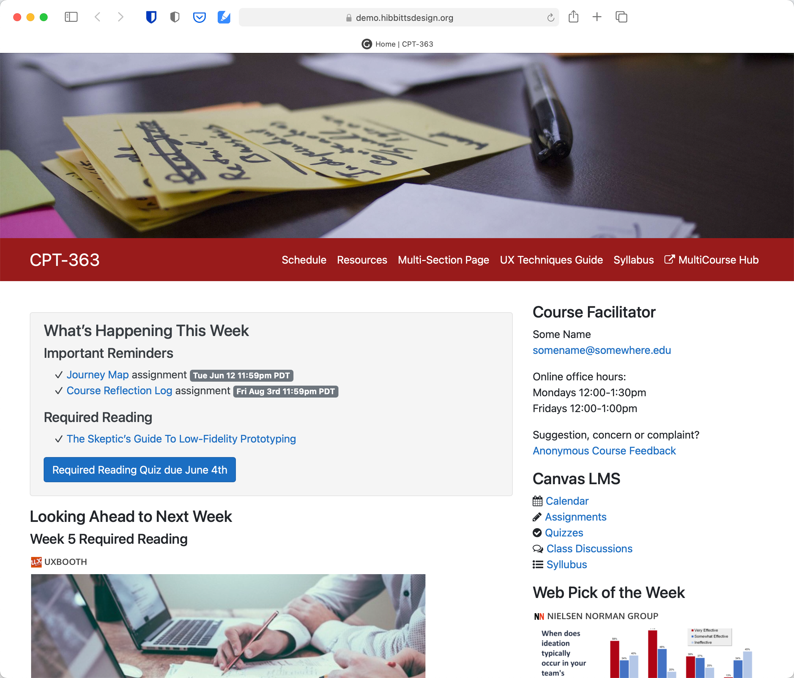

# Open Course Hub

[Grav Open Course Hub](https://github.com/hibbitts-design/grav-skeleton-course-hub) with [Git Sync](https://github.com/trilbymedia/grav-plugin-git-sync) is designed to give organizations or individual tech-savvy instructors an open, collaborative and flexible platform that they can partner with their current Learning Management System (LMS). With this approach, content presentation can be handled by a CMS while assessment still occurs within the institutional LMS. 

One or more Open Course Hub pages can also be seamlessly embedded into another system (i.e. LMS) with the 'chromeless' feature. For example, view a [Open Course Hub site](http://demo.hibbittsdesign.org/grav-open-matter-course-hub) and then view the same open and collaborative content embedded within a [Canvas LMS site](https://sso.canvaslms.com/courses/1413912/).
