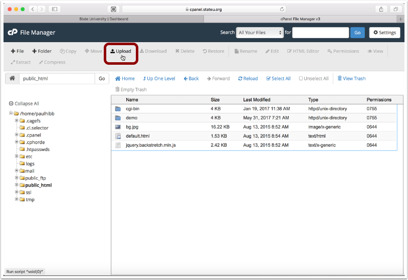
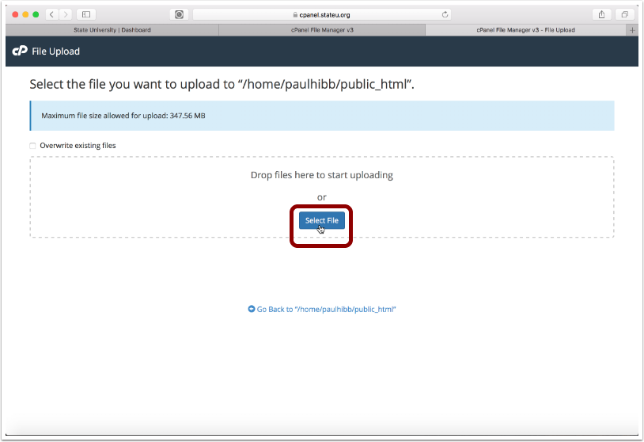
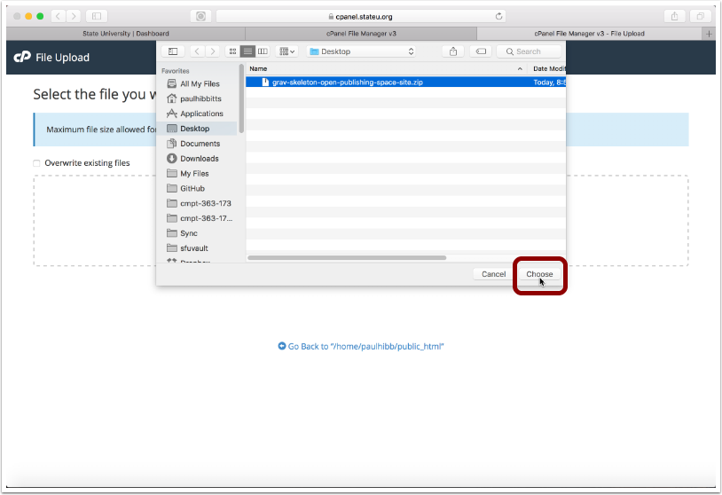
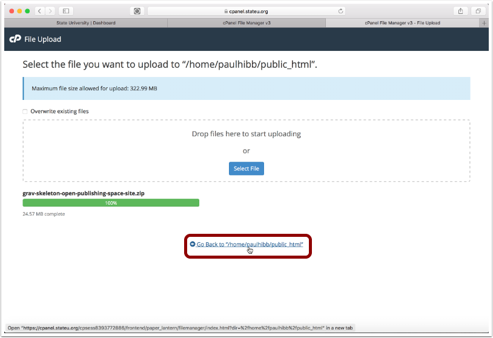
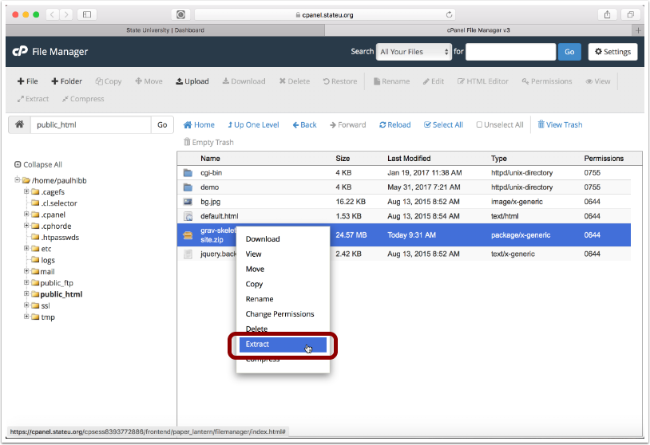
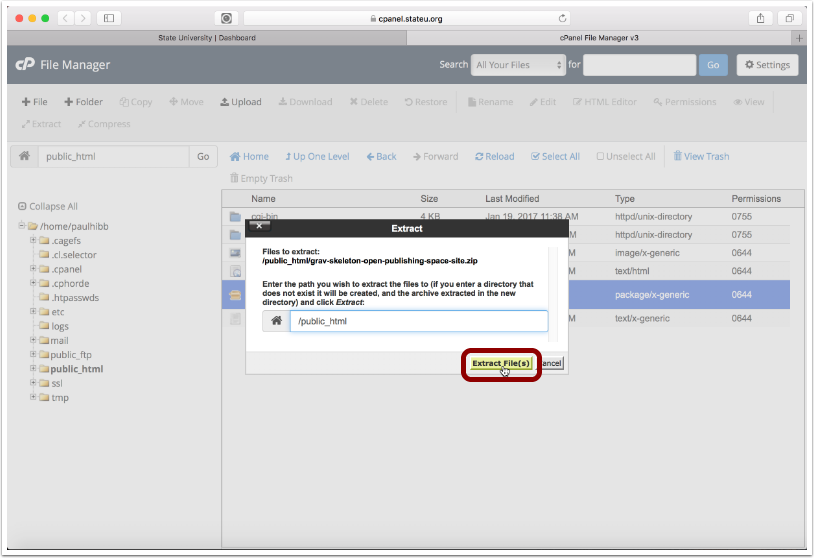
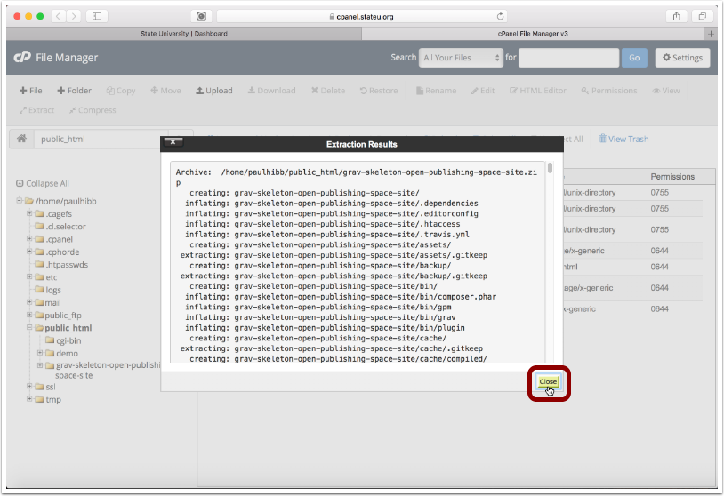
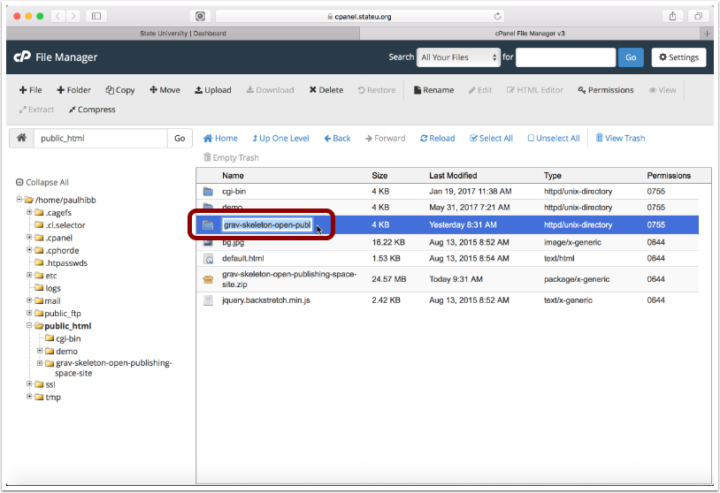
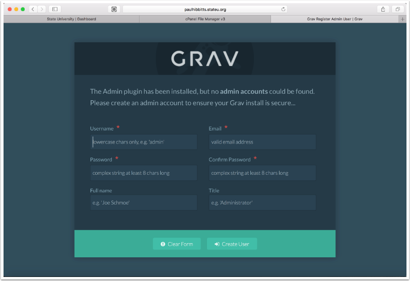
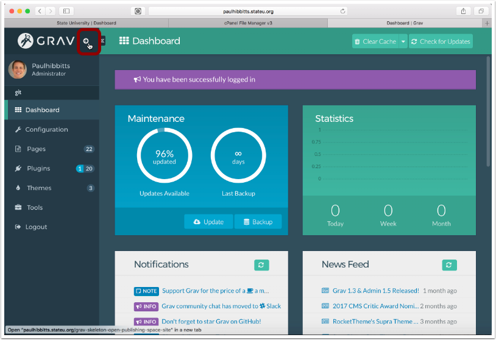

##### 2.1 Tap "Upload"

##### 2.2 Tap "Select File"

##### 2.3 Choose the downloaded Open Publishing Space ZIP file

##### 2.4 Return to file listing view

##### 2.5 Right-tap on Open Publishing Space ZIP file and choose "Extract"

##### 2.6 Tap "Extract File(s)" button

##### 2.7 Tap "Close" button

##### 2.8 Note (and ideally copy to your clipboard) the folder name for use in the URL to your site

##### 2.9 Visit the URL of your Open Publishing Space site and complete Admin config form

##### 2.10 Tap on the arrow-circle button to preview site

