##### 3.1 Tap the "Setup Git Sync Plugin" link

##### 3.2 Tap the "Next" button

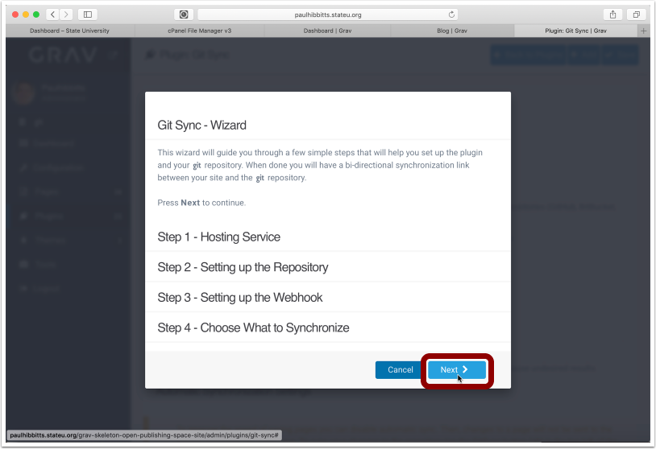

##### 3.3 Choose Git service and enter your username and password for it

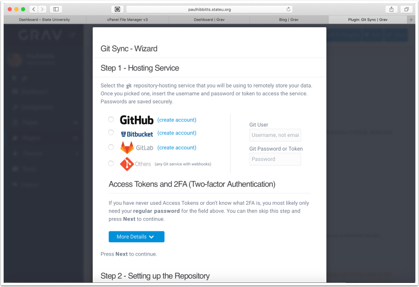

##### 3.4 Scroll down (if needed) and the tap the "Next" button

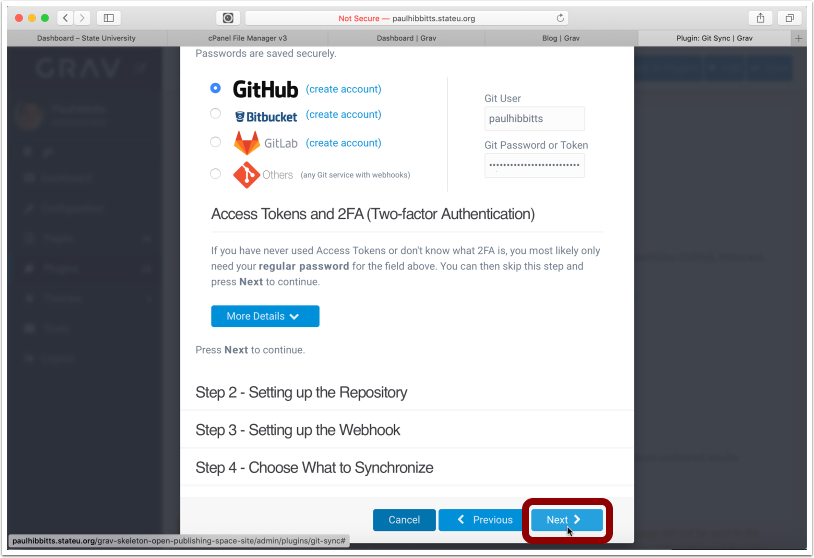

##### 3.5 Before continuing, you will need to create a repository on your Git service.

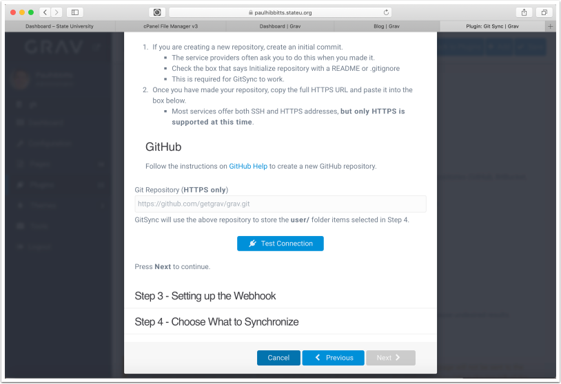

##### 3.6 Create a new repository in your choosen Git service (GitLab example shown)

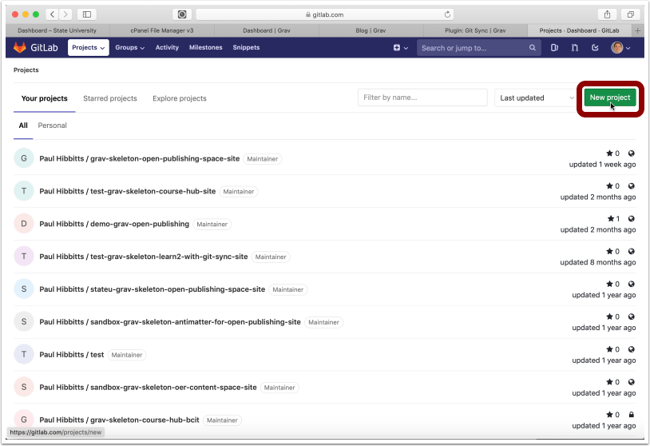

##### 3.7 Enter project (repository) name

##### 3.8 Tap "Public" to make the repository publicly available

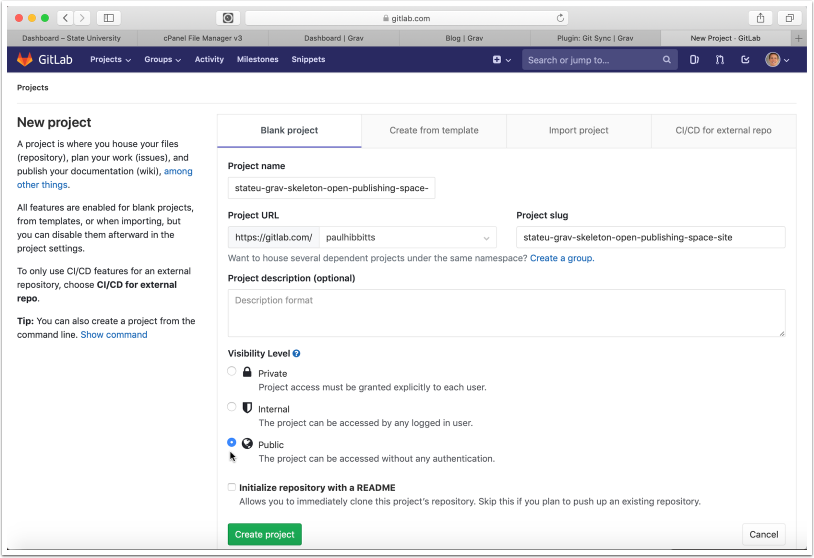

##### 3.9 Tap "Initialize repository with a README" to include a ReadMe file

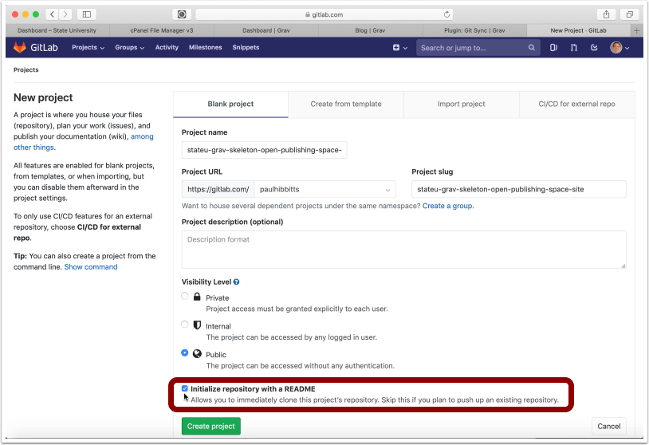

##### 3.10 Tap "Create project"

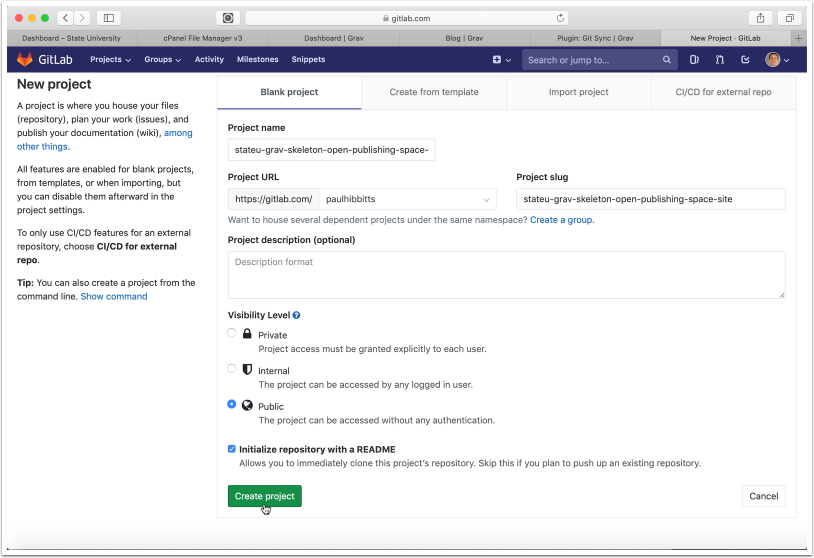

##### 3.11 Tap on the "SSH" menu button and choose "HTTPS"

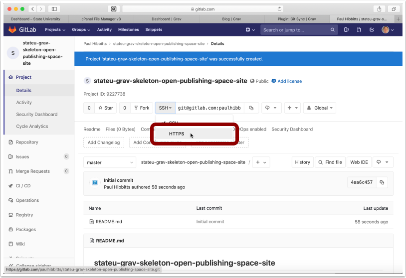

##### 3.12 Copy the HTTPS URL of the repository to your clipboard

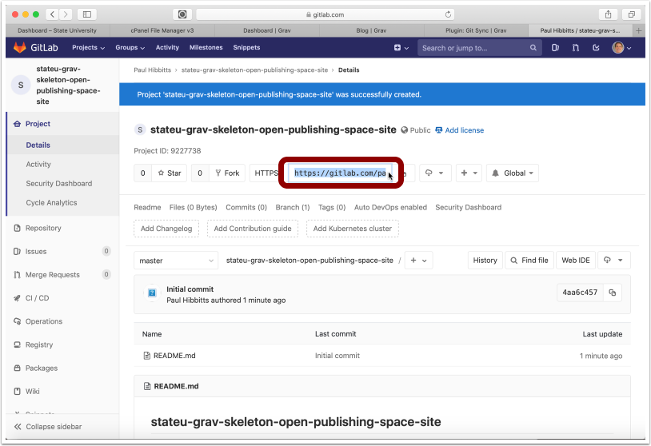

##### 3.13 Paste the Git repository HTTPS URL into the "Git Repository" field and tap "Test Connection"

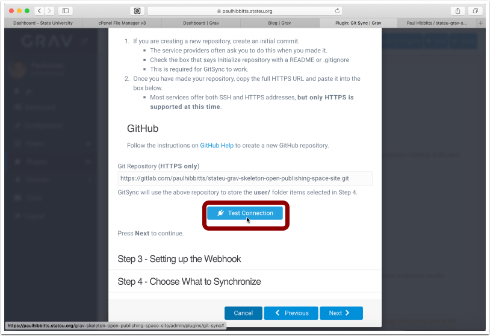

##### 3.14 Tap the "Next" button

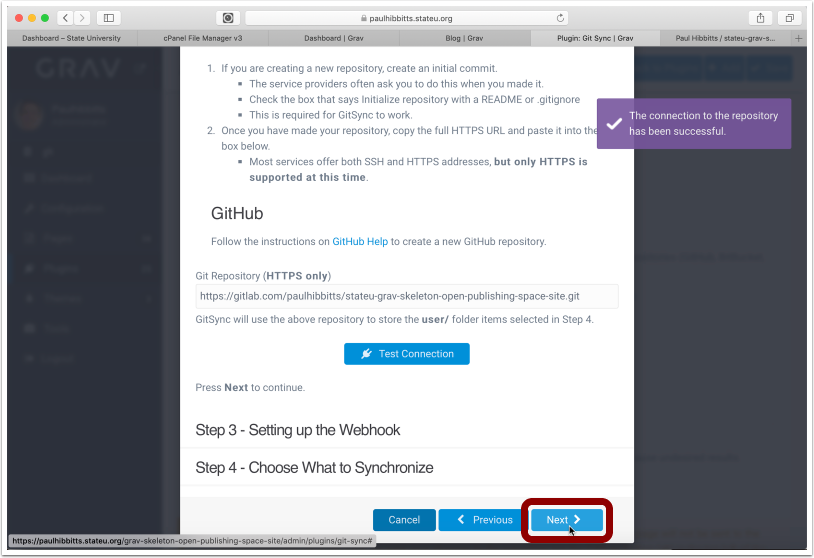

##### 3.15 Select the displayed Webhook URL and copy it to your clipboard

##### 3.16 Tap "Integrations" in the "Settings" menu

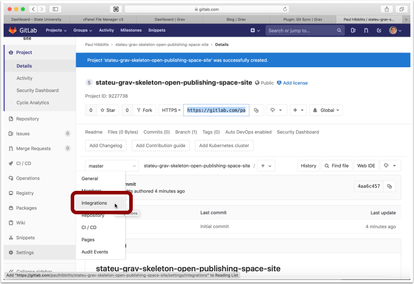

##### 3.17 Paste the copied Open Publishing Space Webhook URL into the "URL" field

Note: if you change the folder name or location of your Grav Open Publishing Space site you will also need to update the "URL" field

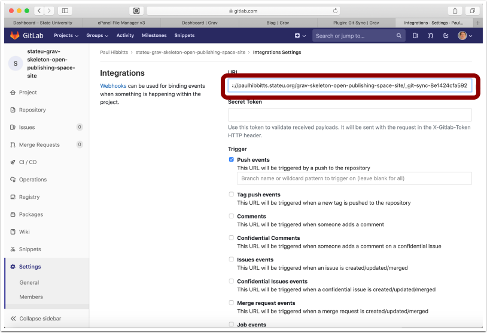

##### 3.18 Scroll down, and tap "Add webhook"

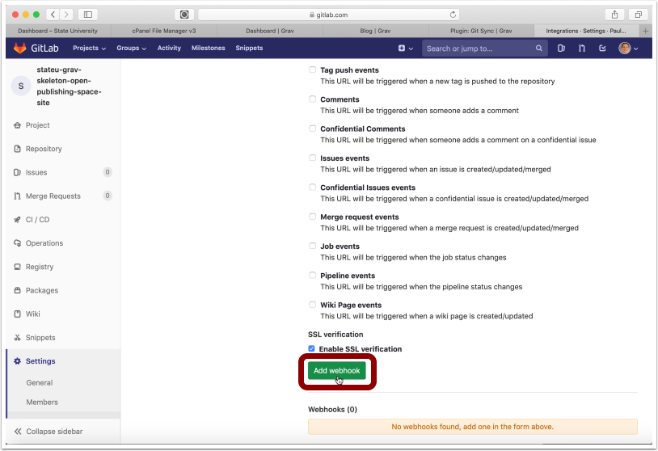

##### 3.19 Once the new Webhook is displayed, return to your Grav Open Publishing Space site

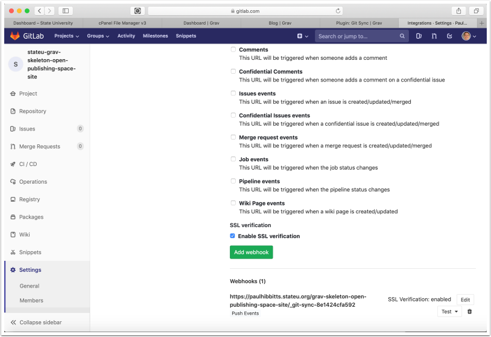

##### 3.20 Tap the "Next" button

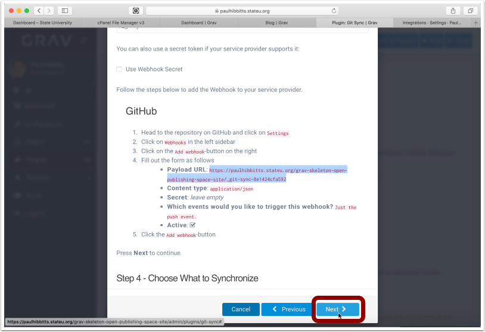

##### 3.21 Tap the "Save" button

Note: you can also choose to sync other user folders here, and as well in the plugin configuration panel

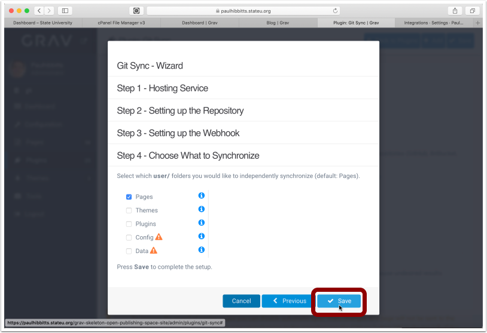

##### 3.22 Tap the arrow-square button to once again preview the site

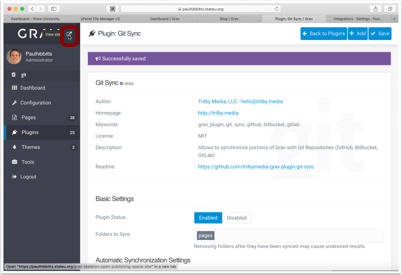

##### 3.23 To test your Git Sync configuration, tap on the "View Content Repository" link

Note: you can change this link to also go directly to the displayed page in your Active Theme settings

##### 3.24 The site Content Repository should now be displayed in GitLab

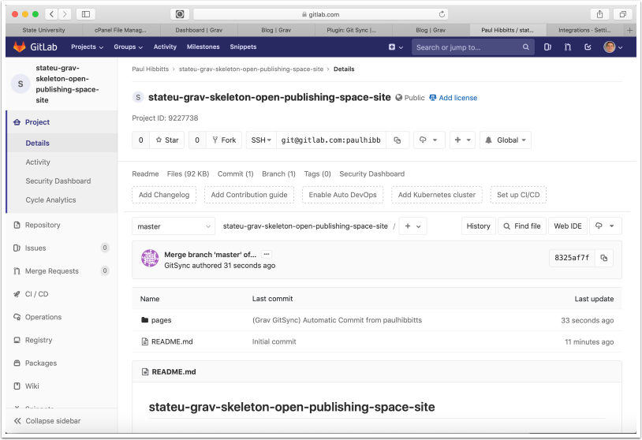
