##### 3.1 Tap the "Setup Git Sync Plugin" link

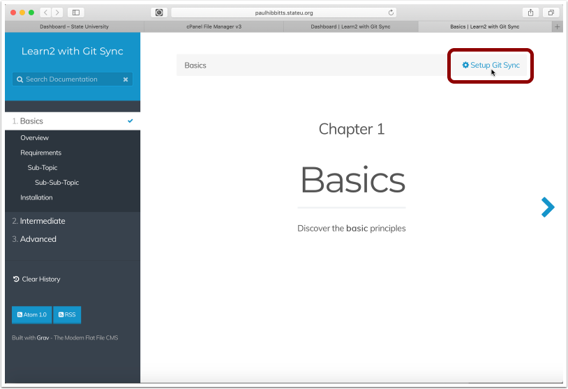

##### 3.2 Tap the "Next" button

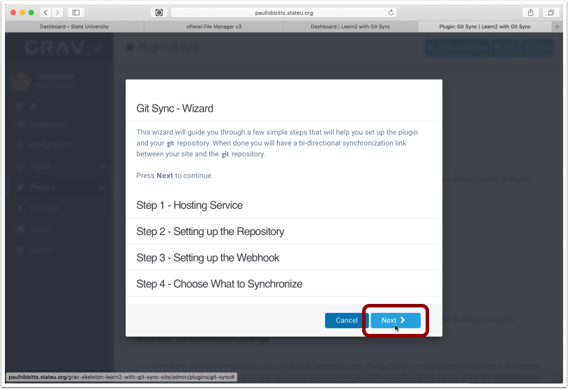

##### 3.3 Choose the Git service and enter your username and password for it

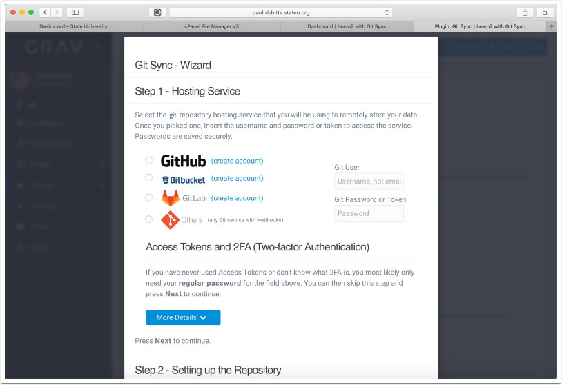

##### 3.4 Scroll down (if needed) and Tap the "Next" button

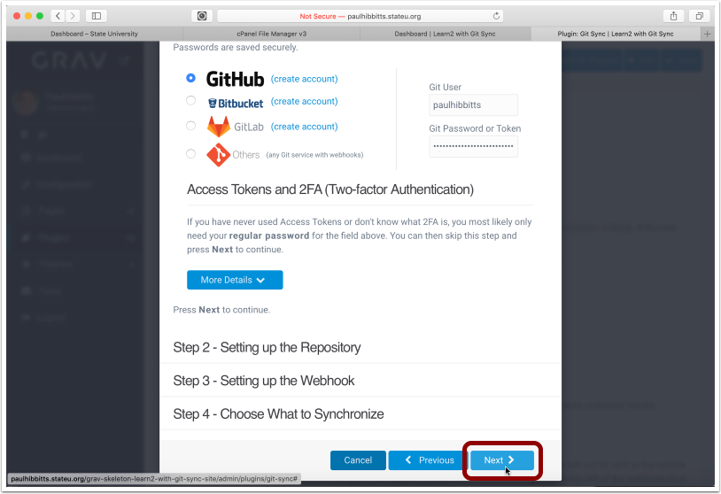

##### 3.5 Before continuing, you will need to create a repository on your Git service.

If you have already created a Git repository (with at least one commit, for example a ReadMe file) you may skip to step 3.10

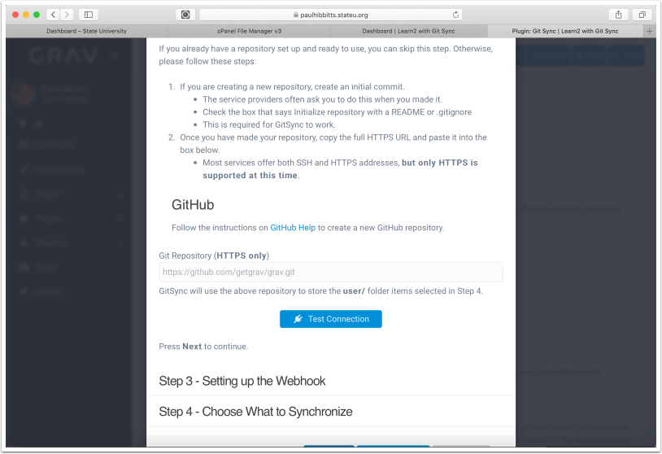

##### 3.6 Create a new repository in your chosen Git service (GitHub example shown)

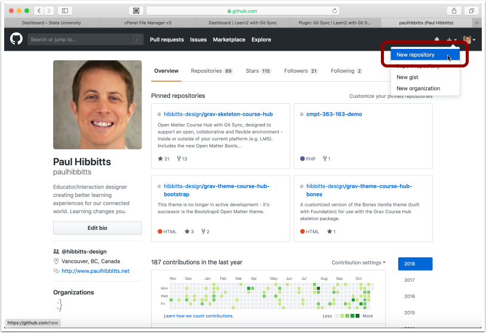

##### 3.7 Enter repository name

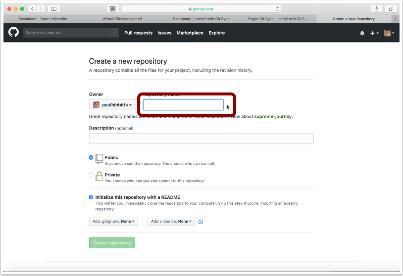

##### 3.8 Choose to include a ReadMe file

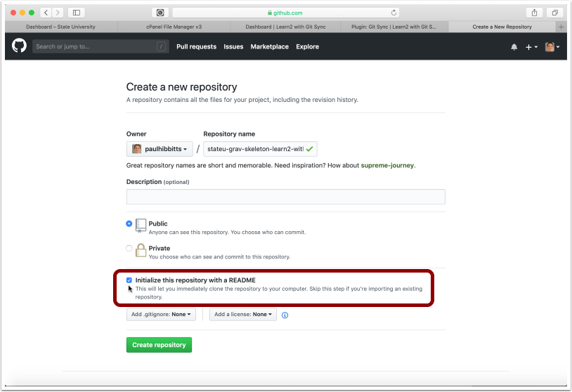

##### 3.9 Create the new repository

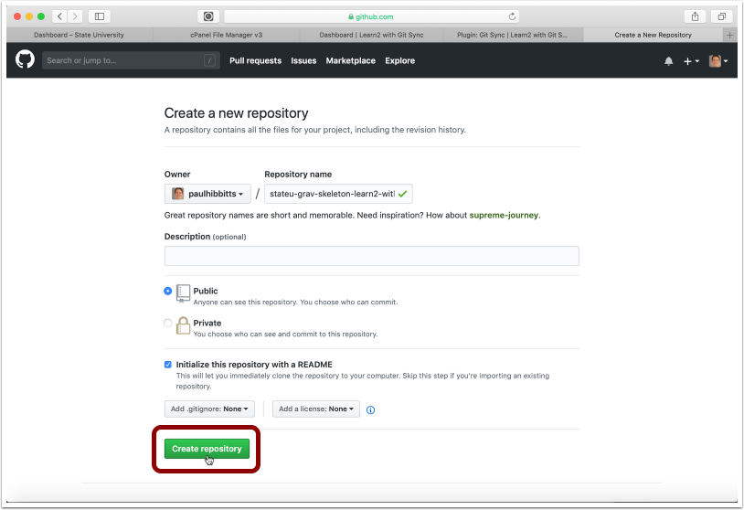

##### 3.10 Copy the HTTPS URL of the repository to your clipboard

##### 3.11 Paste the Git repository HTTPS URL into the "Git Repository" field and tap "Test Connection"

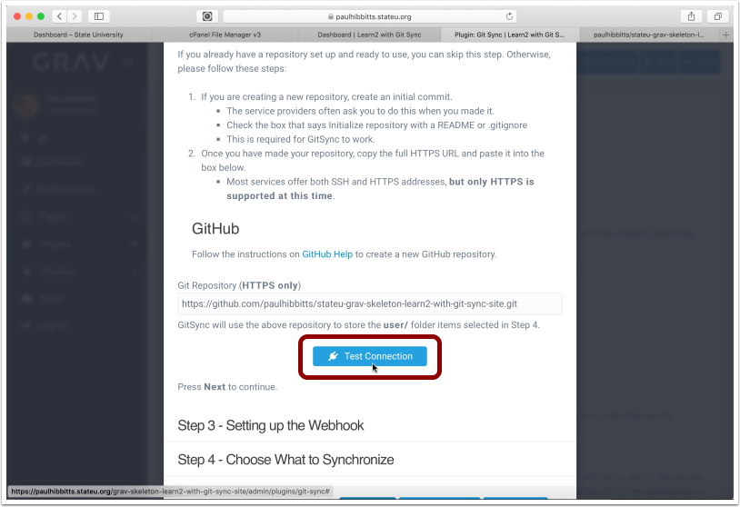

##### 3.12 Tap the "Next" button

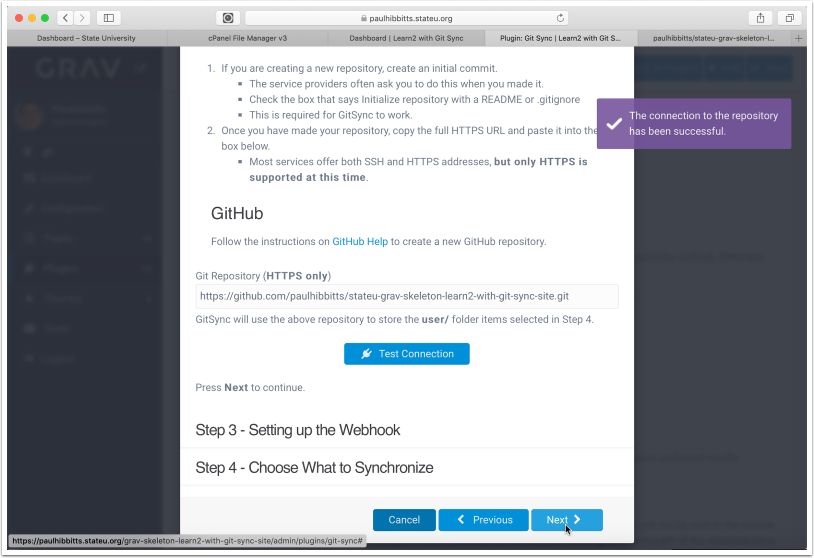

##### 3.13 Select the displayed Webhook URL and copy it to your clipboard

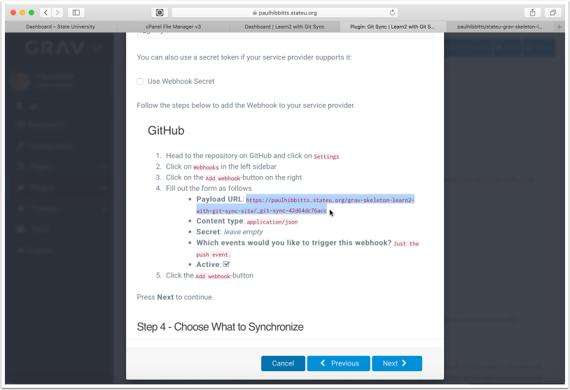

##### 3.14 Add the Webhook to your Git repository settings, in GitHub tap "Settings"eu-grav-skeleton-learn2-with-git-sync-site

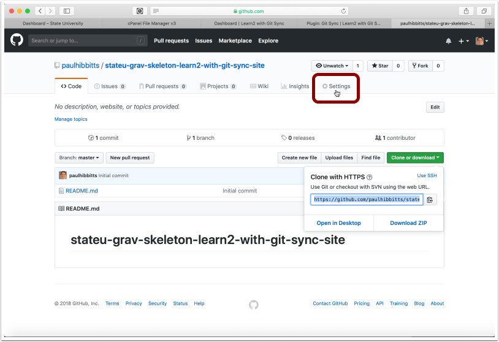

##### 3.15 Tap "Webhooks"

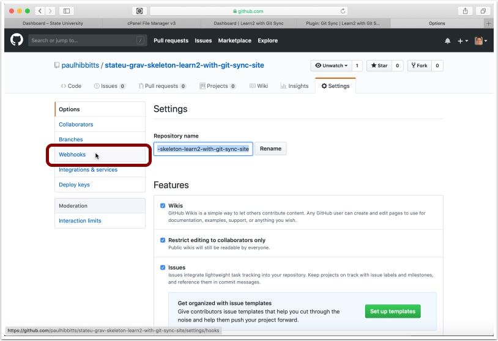

##### 3.16 Tap "Add Webhook"

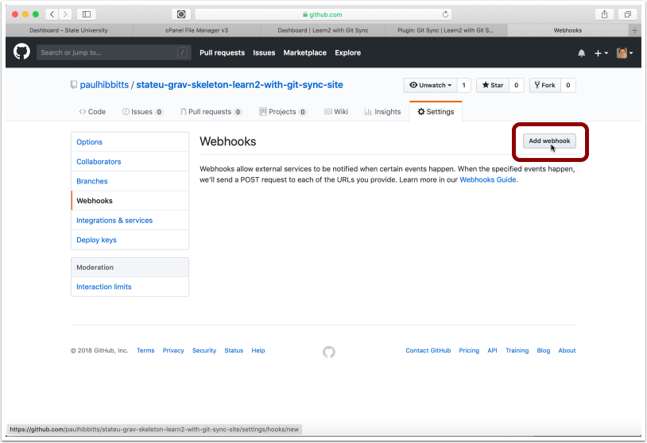

##### 3.17 Paste the copied Learn2 with Git Sync Webhook URL into the "Payload URL" field

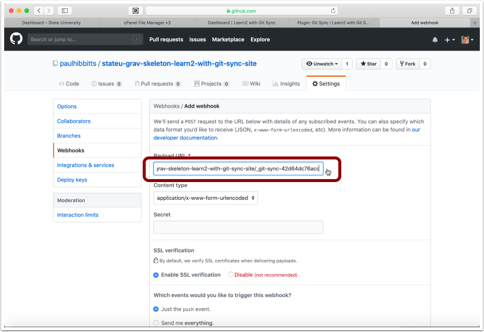

##### 3.18 Scroll down, and tap "Webhook"

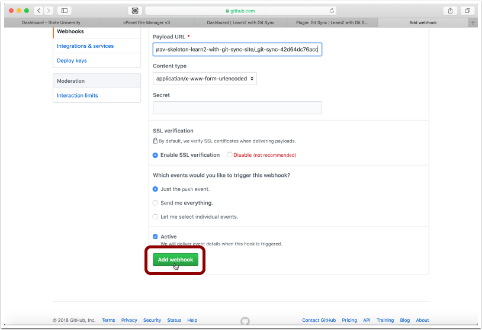

##### 3.19 Once the new Webhook is displayed, return to your Learn2 with Git Sync site

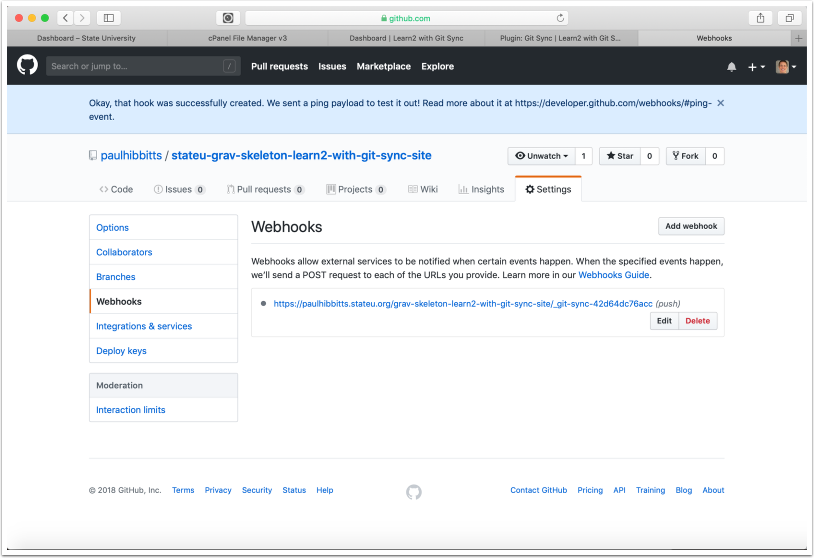

##### 3.20 Tap the "Next" button

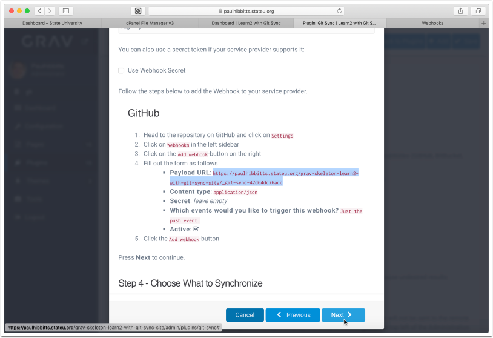

##### 3.21 Tap the "Save" button

Note: you can also choose to sync other user folders here, and as well in the plugin configuration panel

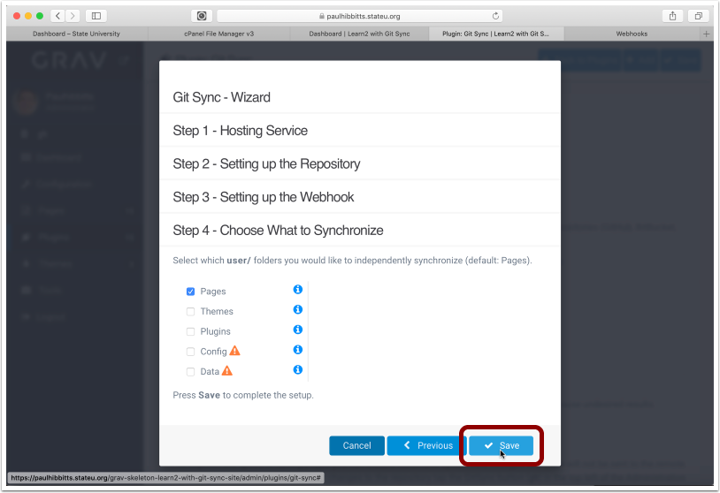

##### 3.22 Tap the arrow-square button to once again preview the site

##### 3.23 To test your Git Sync configuration, tap on the "Edit this Page" link

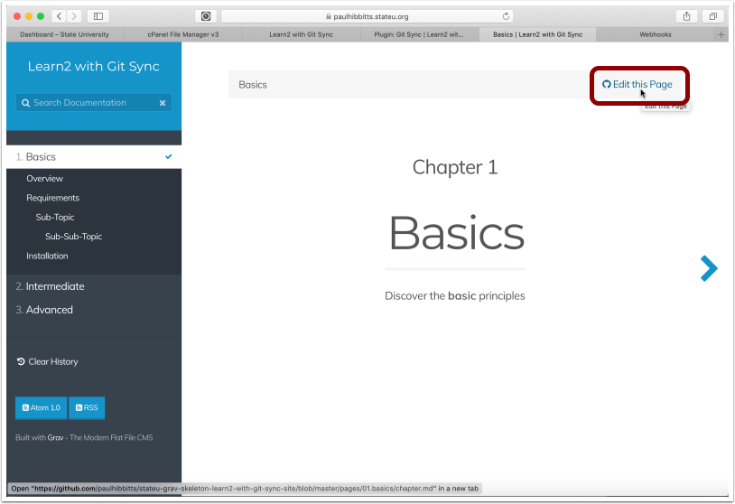

##### 3.24 The current site page should now be displayed in GitHub

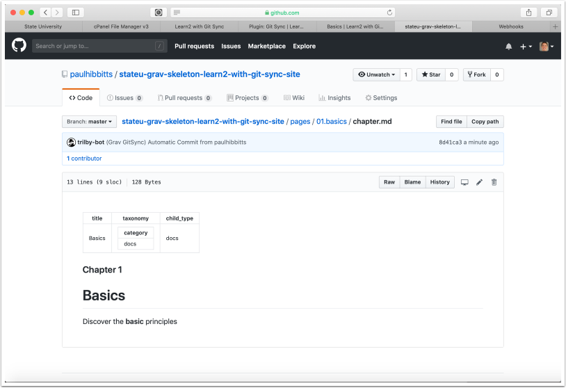
