##### 3.1 Tap the "Setup Git Sync Plugin" link

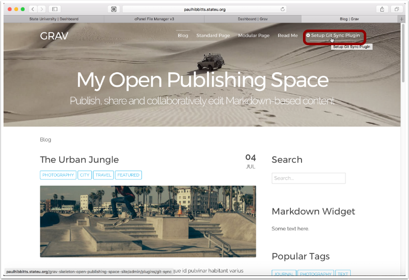

##### 3.2 Tap the "Next" button

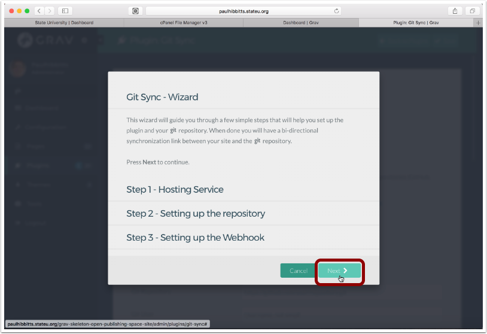

##### 3.3 Choose Git service and enter your username and password for it

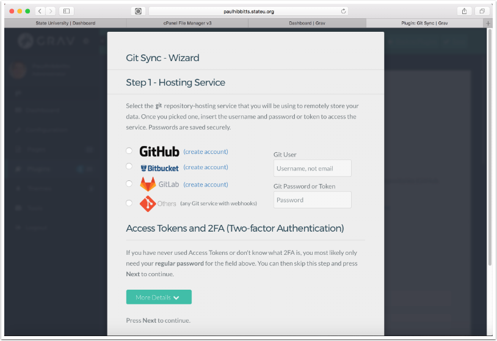

##### 3.4 Scroll down (if needed) and the tap the "Next" button

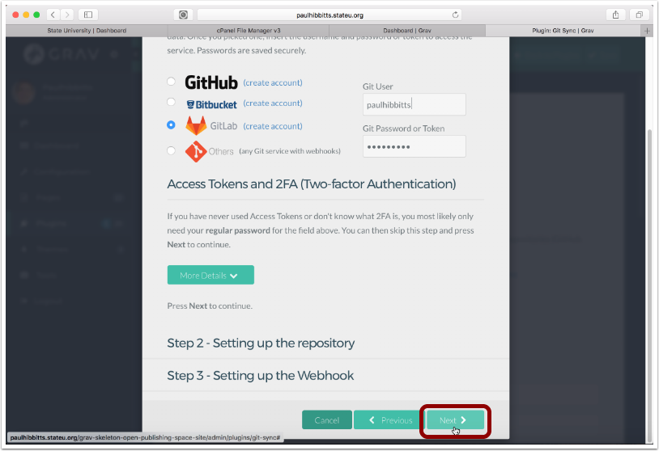

##### 3.5 Before continuing, you will need to create a repository on your Git service.

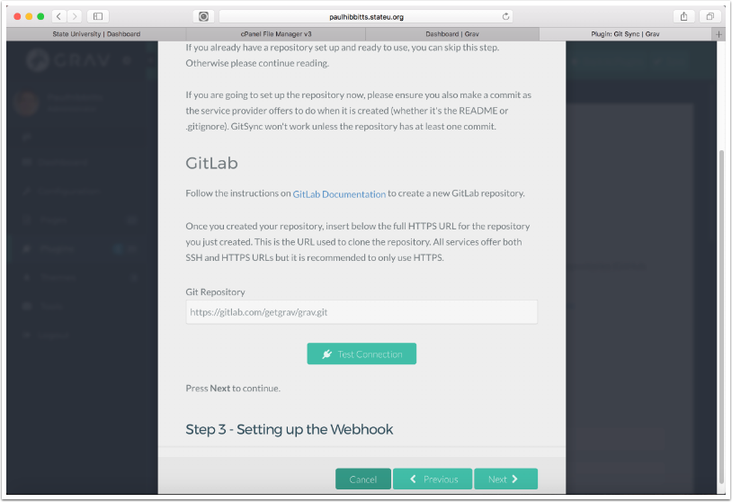

##### 3.6 Create a new repository in your choosen Git service (GitLab example shown)

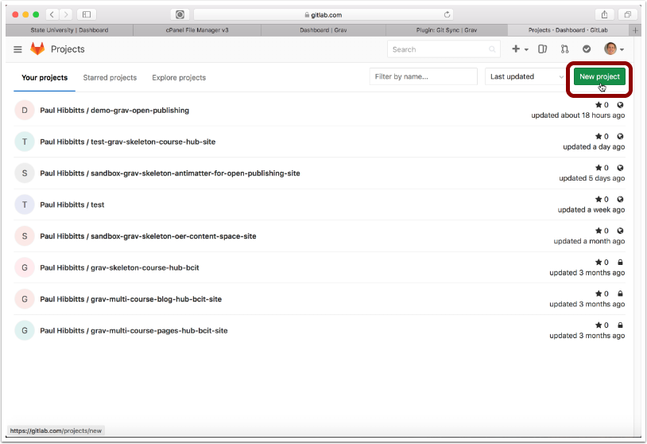

##### 3.7 Enter repository name

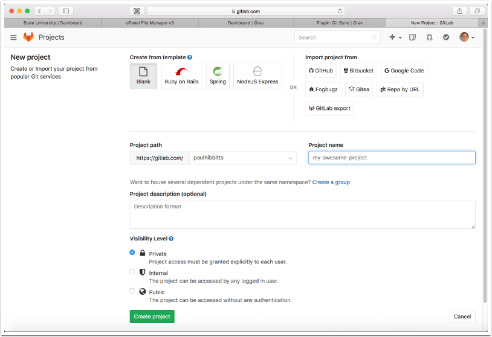

##### 3.8 Tap "README" link to include a ReadMe file

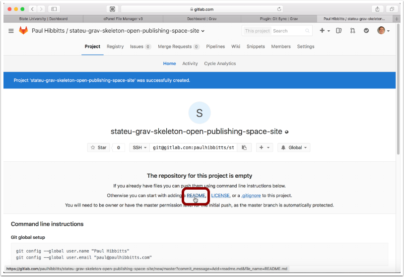

##### 3.9 Tap "Commit changes" to complete the creation of the ReadMe file.

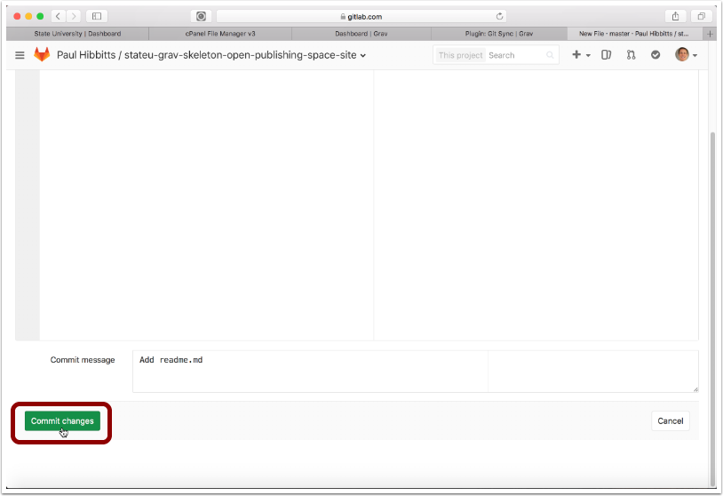

##### 3.10 Tap on "Project" to return to the main page of your new GitLab project repository.

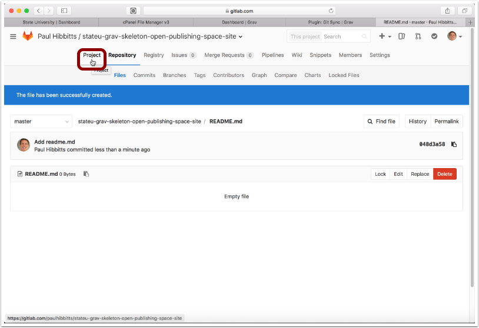

##### 3.11 Tap on the "SSH" menu button and choose "HTTPS"

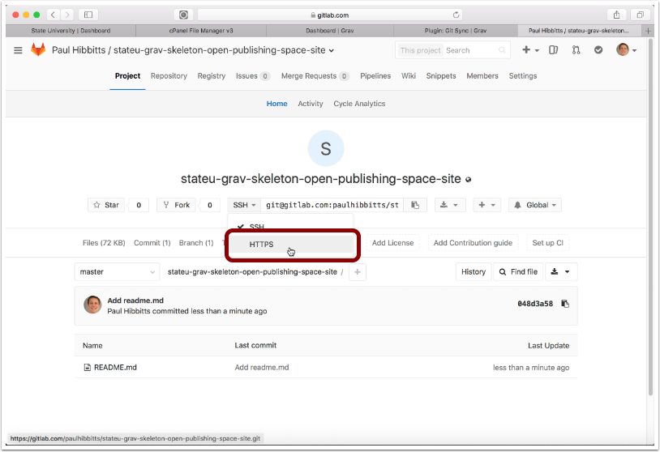

##### 3.12 Copy the HTTPS URL of the repository to your clipboard

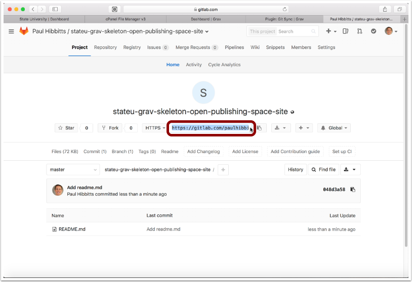

##### 3.13 Paste the Git repository HTTPS URL into the "Git Repository" field and tap "Test Connection"

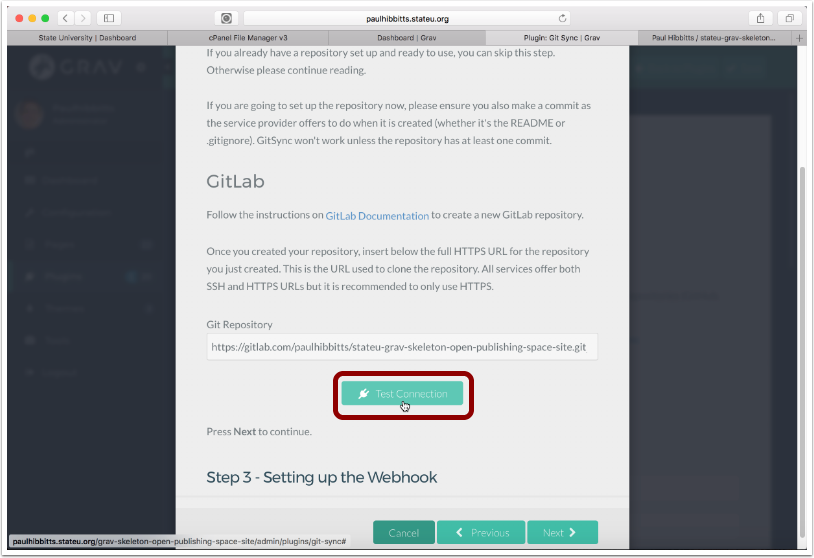

##### 3.14 Tap the "Next" button

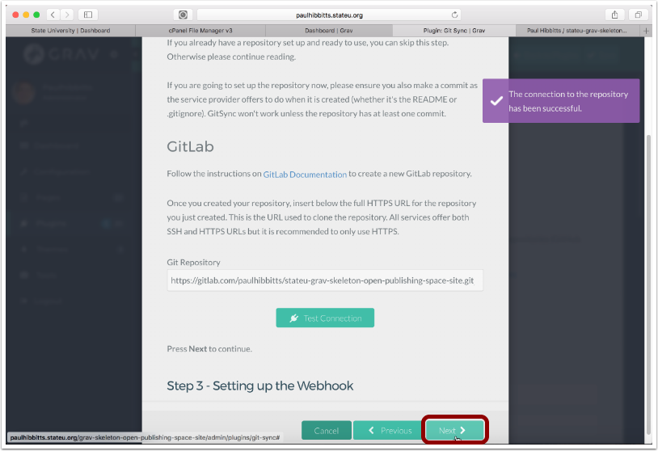

##### 3.15 Select the displayed Webhook URL and copy it to your clipboard

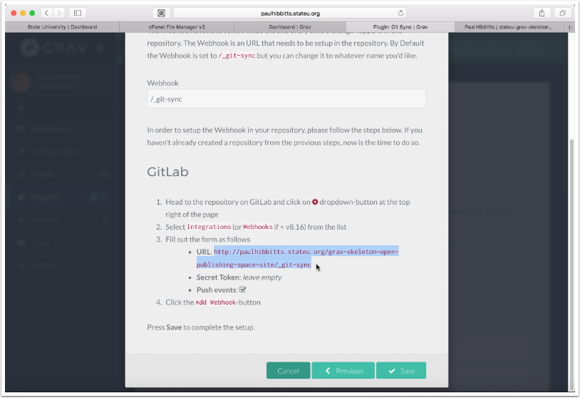

##### 3.16 Add the Webhook to your Git repository settings, in GitLab tap "Settings"

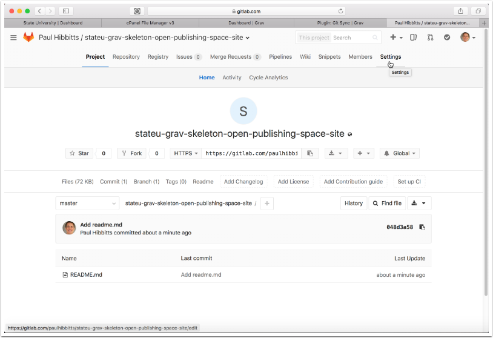

##### 3.17 Tap "Integrations"

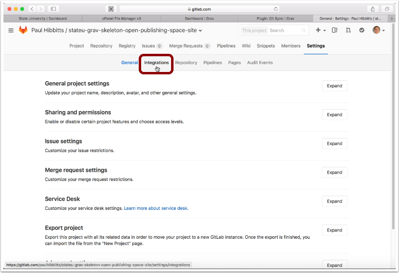

##### 3.18 Paste the copied Open Publishing Space Webhook URL into the "URL" field

Note: if you change the folder name or location of your Grav Open Publishing Space site you will also need to update the "URL" field.

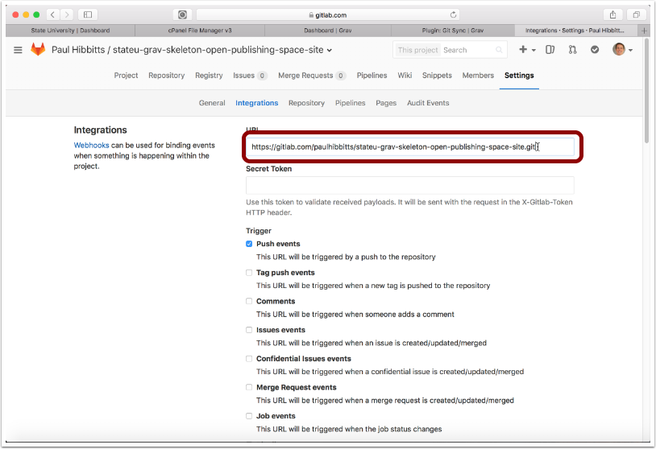

##### 3.19 Scroll down, and tap "Add webhook"

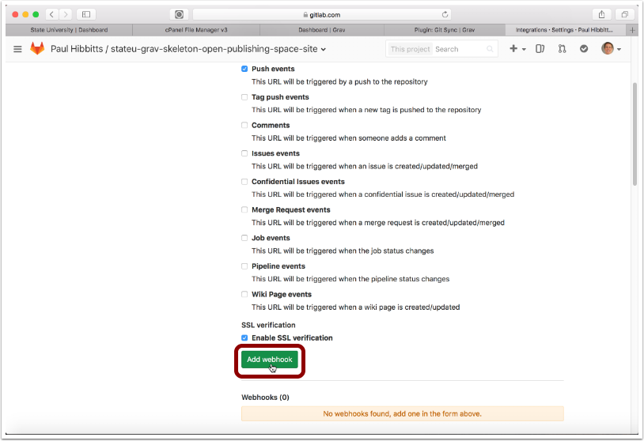

##### 3.20 Once the new Webhook is displayed, return to your Grav Open Publishing Space site

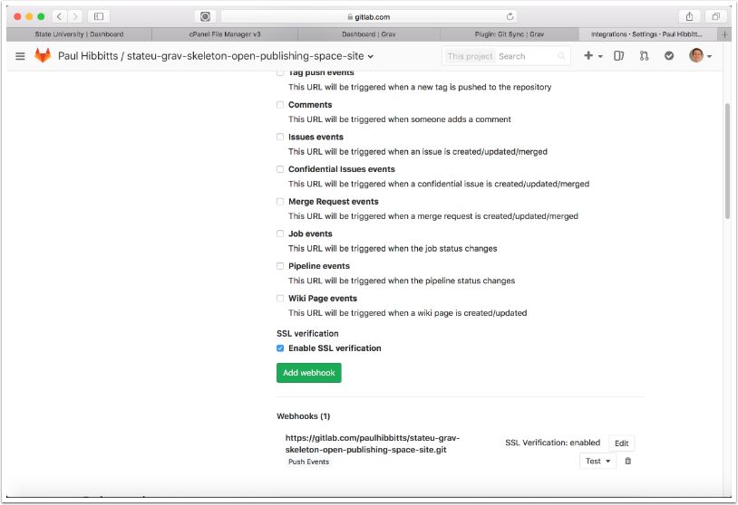

##### 3.21 Tap the "Save" button

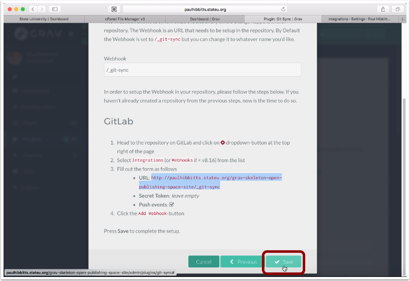

##### 3.22 Tap on the arrow-circle button to once again preview the site

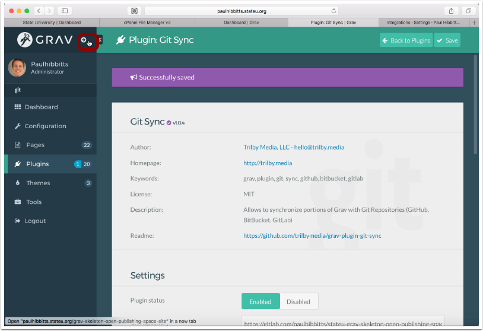

##### 3.23 Tap on the "View Content Repository" link

##### 3.24 Review the just synced contents of your GitLab repository

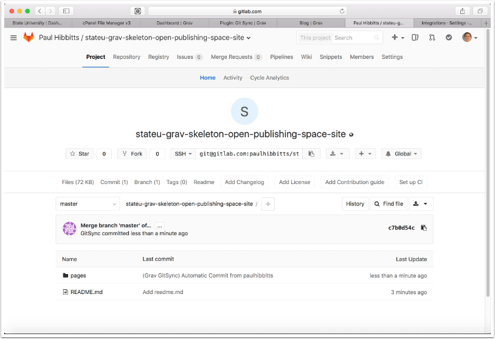
