##### 4.1 Go to the site Admin Panel for your Open Publishing Space site and tap "Themes'

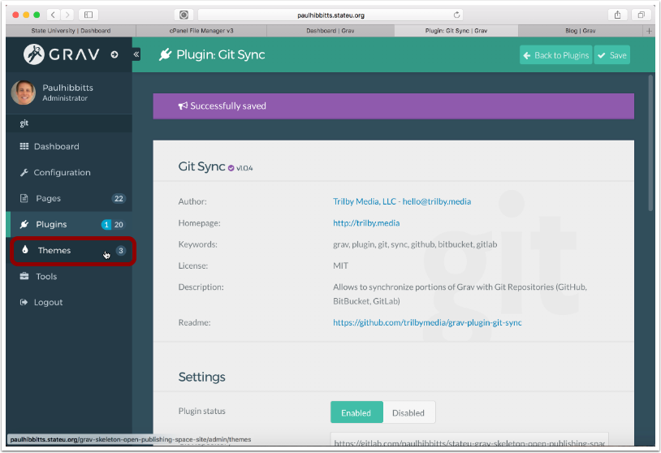

##### 4.2 Tap on the active Open Publishing Theme (Open Publishing Skeleton site shown)

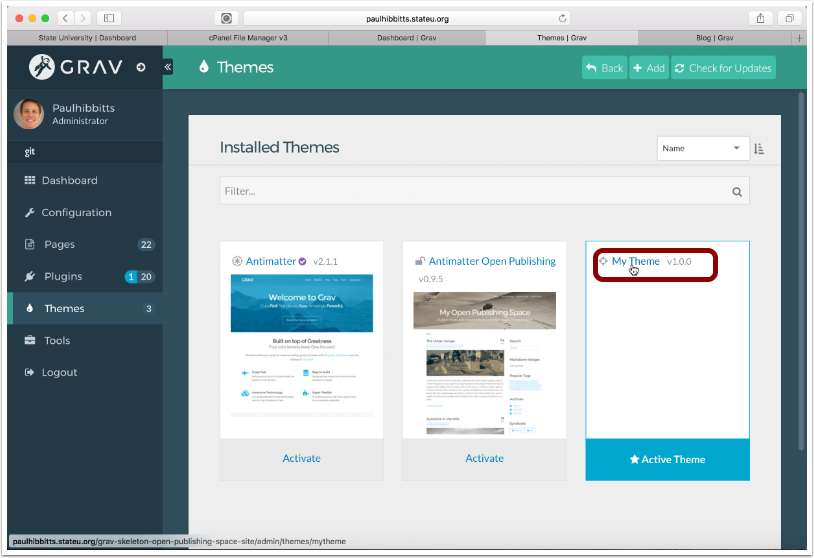

##### 4.3 Scroll down to the "Git Sync Link" section

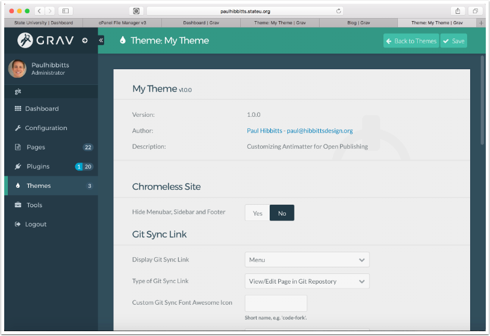

##### 4.4 Choose "View/Edit Page in Git Repository" option from the 'Type of Git Sync Link' menu

You will next need the URL to where your "pages" folder is stored within your Git repository.

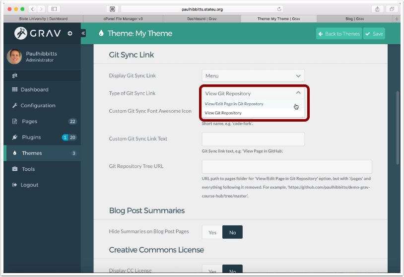

##### 4.5 Return to your Open Publishing Space GitLab repository and tap the 'pages' folder

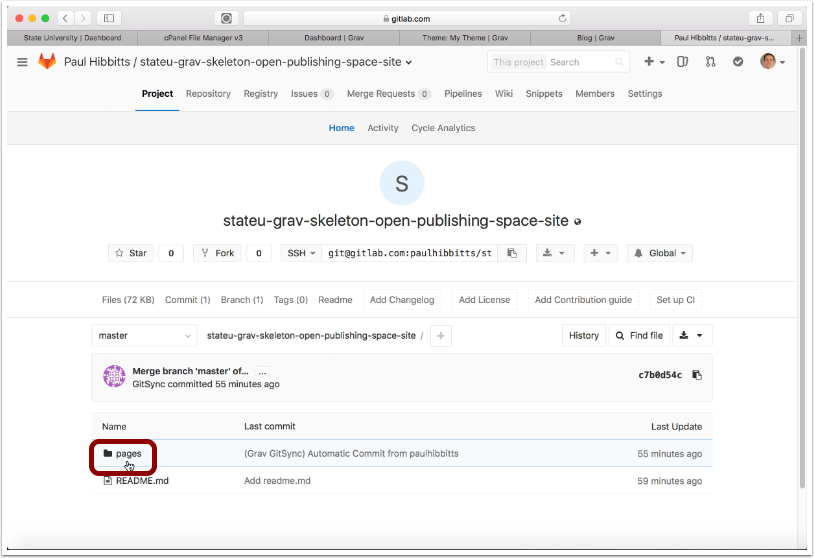

##### 4.6 When viewing the contents of the 'pages' folder, copy the current URL

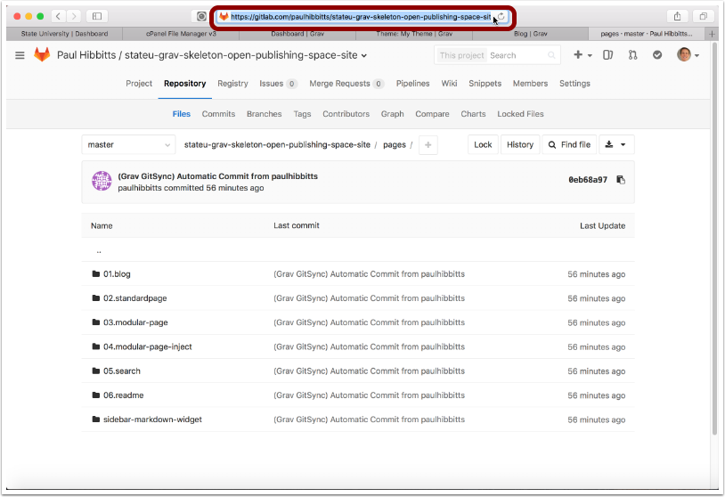

##### 4.7 Return to your Theme settings and paste the copied GitLab repository URL into the 'Git Repostory Tree URL' field

Make sure to remove '/pages' and everything after it from the pasted URL.

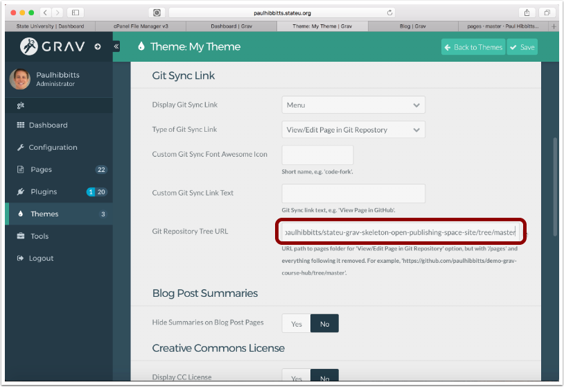

##### 4.8 Tap the 'Save' button

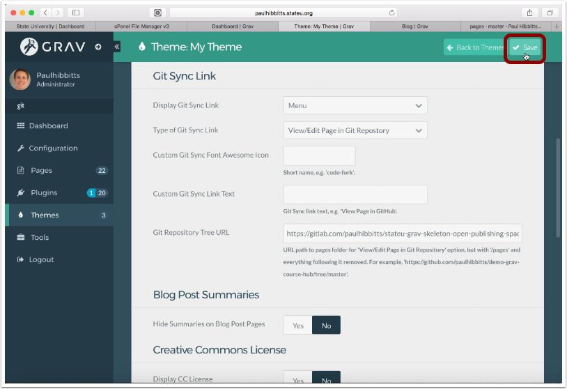

##### 4.9 Tap on the arrow-circle button to once again preview the site

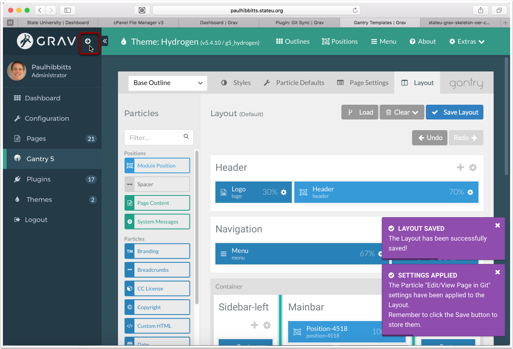

##### 4.10 Tap the now displayed "Edit this Page" link

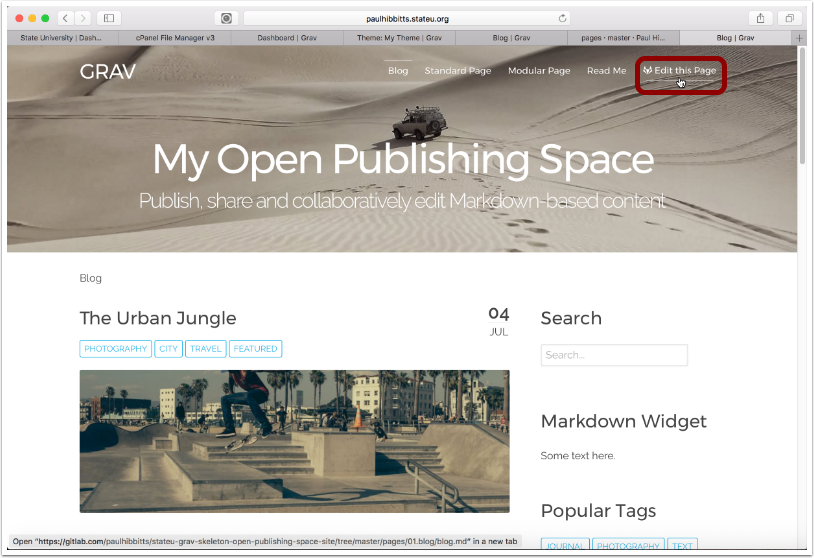

##### 4.11 Review the contents of the automatically linked Grav page in your GitLab repository

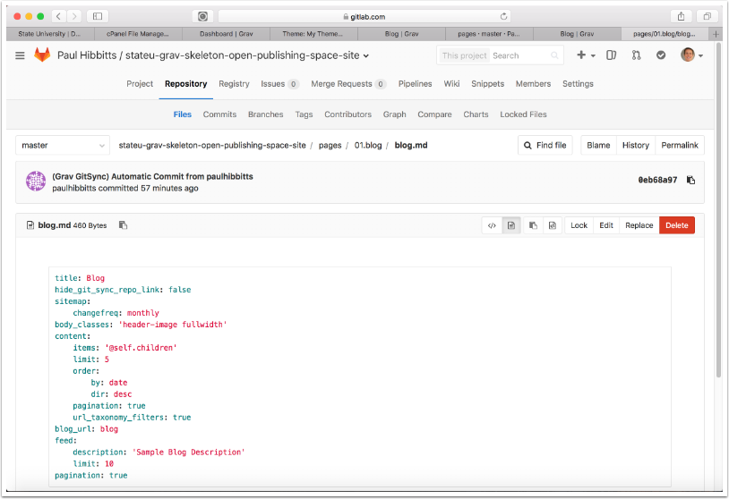
