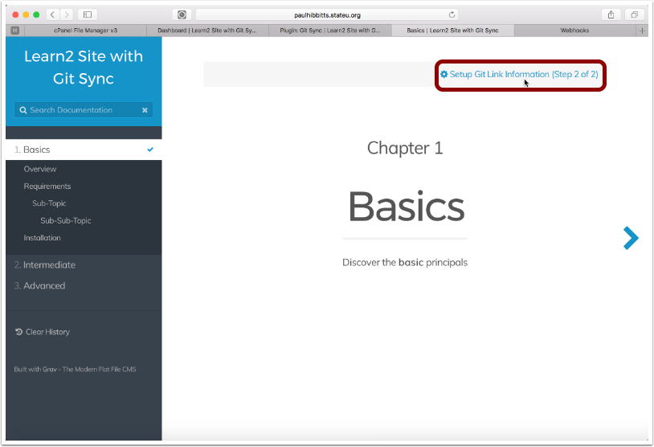
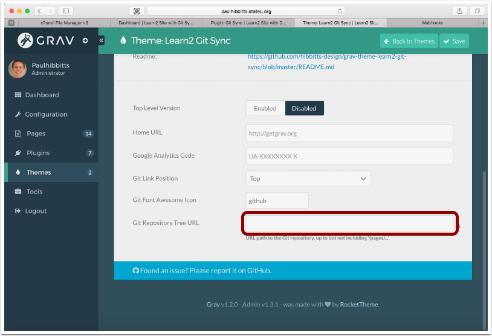
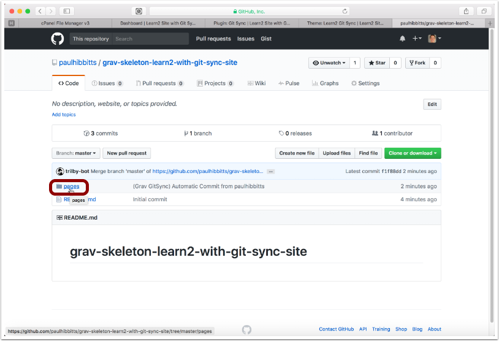
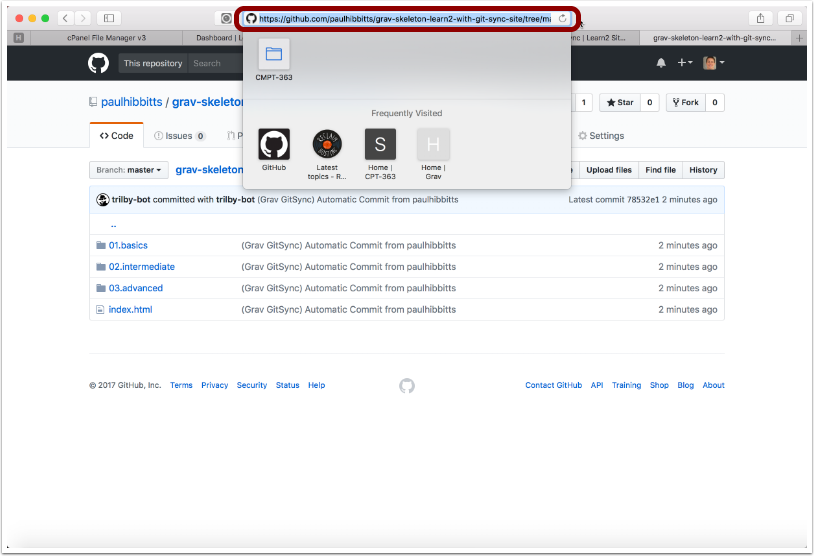
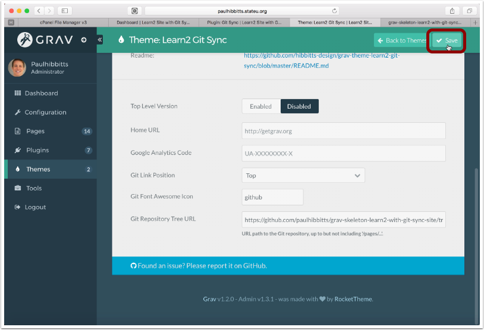
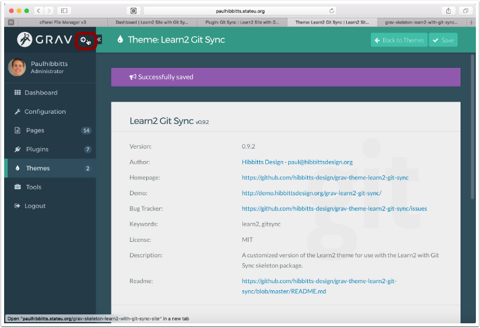
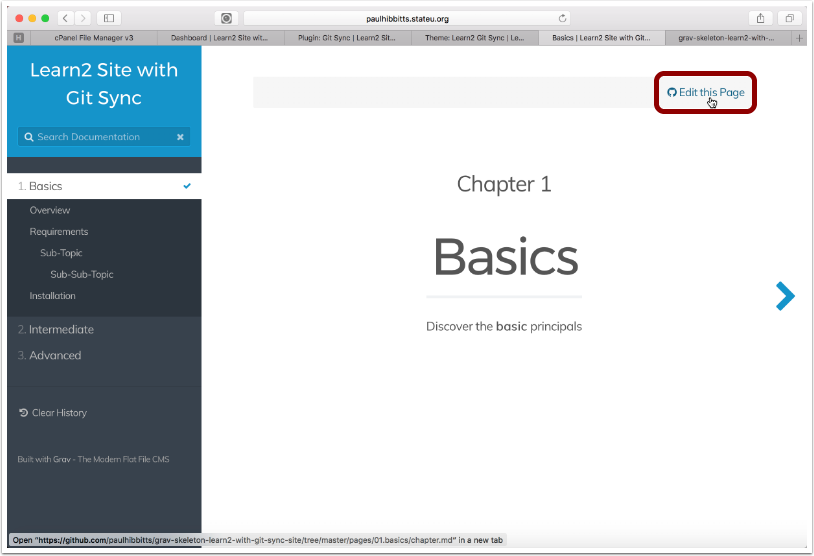
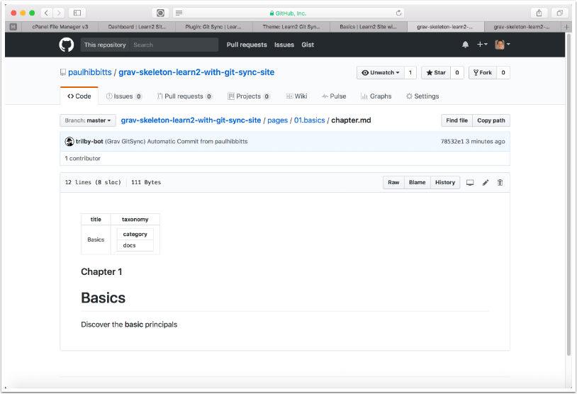

##### 4.1 Tap the "Setup Edit Page in Git Link (Step 2 of 2)" link

##### 4.2 Scroll down the page and locate the "Git Repository Tree URL" field, and then return to your previously created Git repository

##### 4.3 Open the "pages" folder within your Git repository

##### 4.4 When viewing your "pages" folder, copy the entire URL from your Browser

##### 4.5 Paste the URL of your Git repository, but remove '/pages/' and any other text after that

##### 4.6 Tap the "Save" button

##### 4.7 Tap on the arrow-circle button once again to preview the site

##### 4.8 For your final test, tap the "Edit this Page" link

##### 4.9 The Learn2 with Git Sync Chapter 1 page is displayed in GitHub

