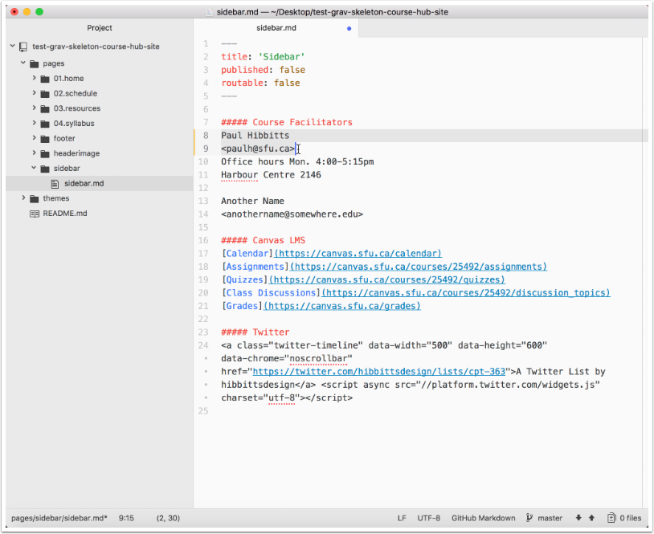
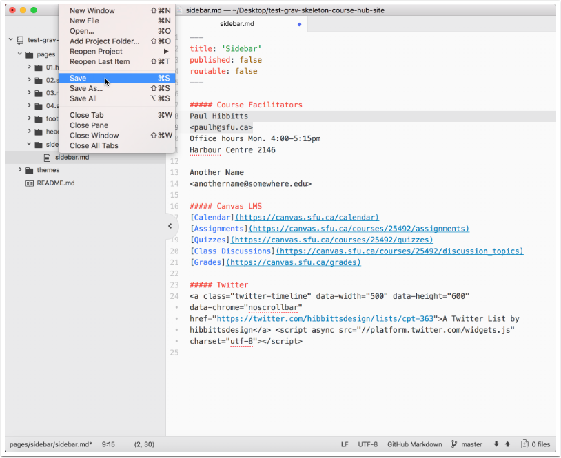
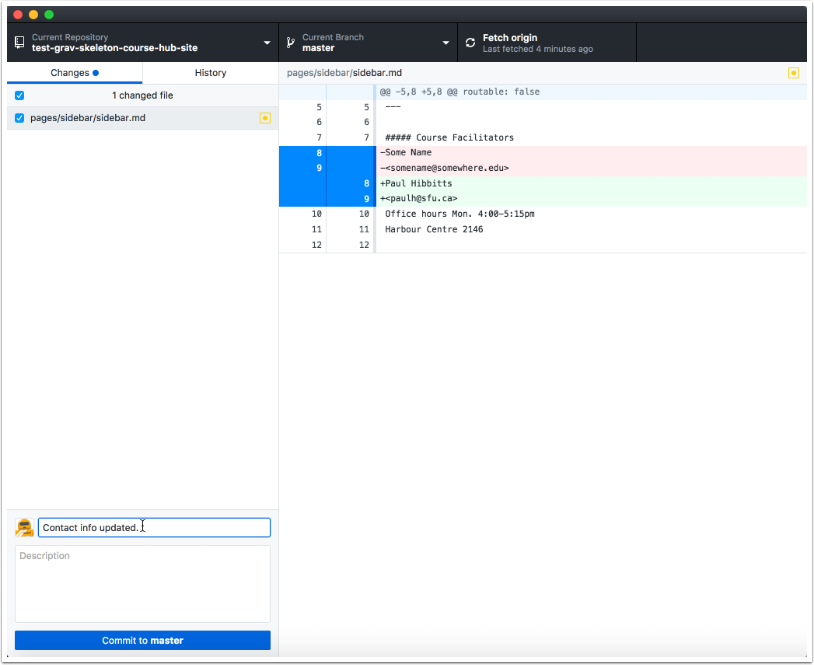
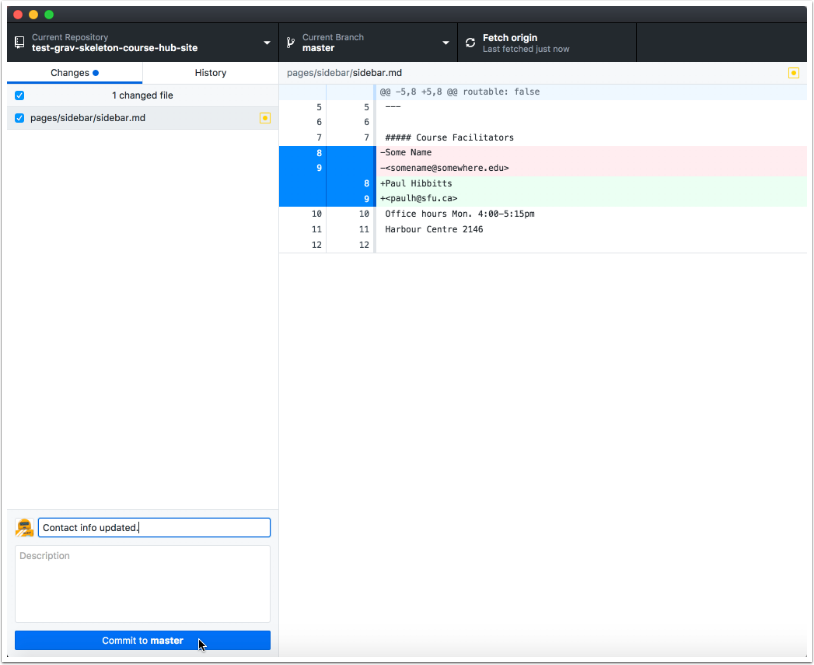
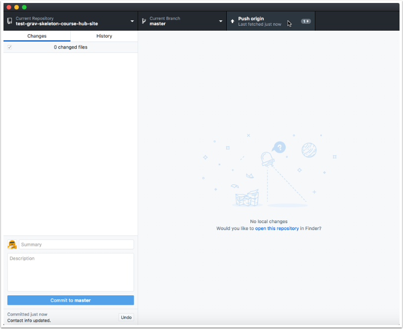
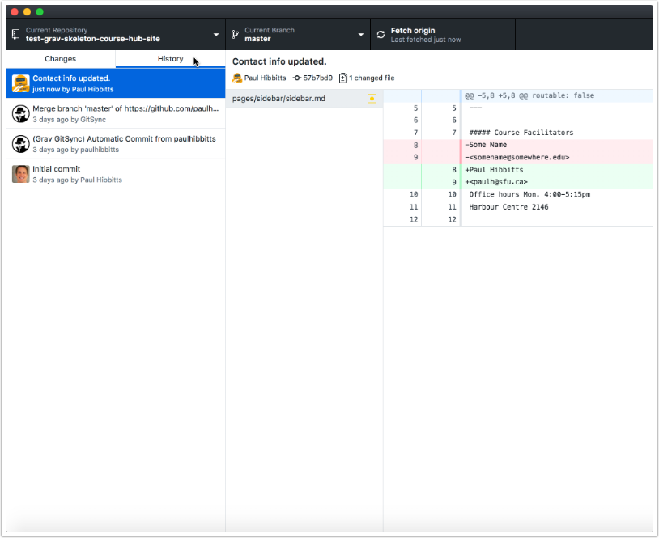
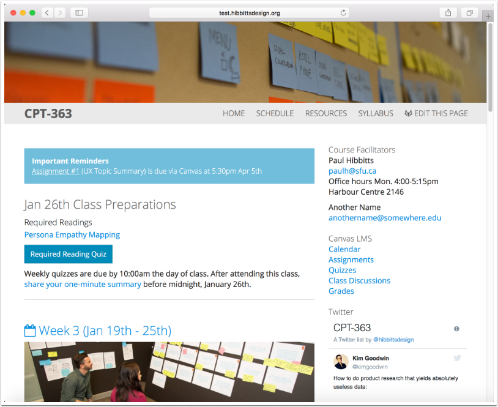

#### 3. Editing Local Repository Content

##### 3.1 Launch your desktop editor of choice (Atom.io shown) and open the Markdown file of your choice within the repository folder.

##### 3.2 Make edits to the markdown file.

##### 3.3 Save the edited Markdown file.

##### 3.4 Open GitHub Desktop Beta, select the cloned folder (if needed) and enter a comment for the changes.

##### 3.5 Tap the "Commit to master" button.

##### 3.6 Tap the "Push origin" button.

##### 3.7 Tap the "History" tab to review the commited and pushed changes.

##### 3.8 Refresh the site page to view the commited and pushed change(s).

