* [1. Create Local Repository](#1-create-local-repository)
* [2. Link Remote (GitLab) Repository](#2-link-remote-repository)
* [3. Delete Local Repository Folder](#3-delete-local-repository-folder)
* [4. Re-clone Repository](#4-re-clone-repository)

#### 1. Create Local Repository

##### 1.1 Tap on the "+" button in the upper-left of the GitHub Desktop window

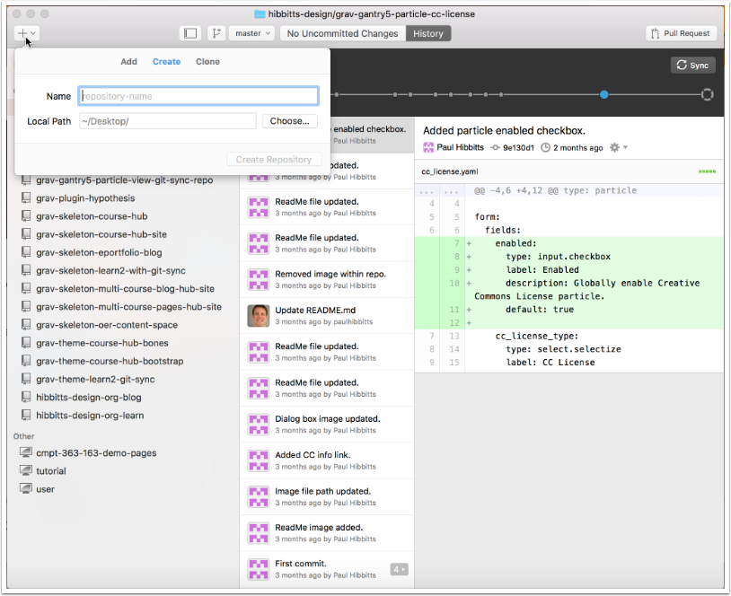

##### 1.2 In the "Create" panel enter the name for your repository and tap the "Create Repository" button

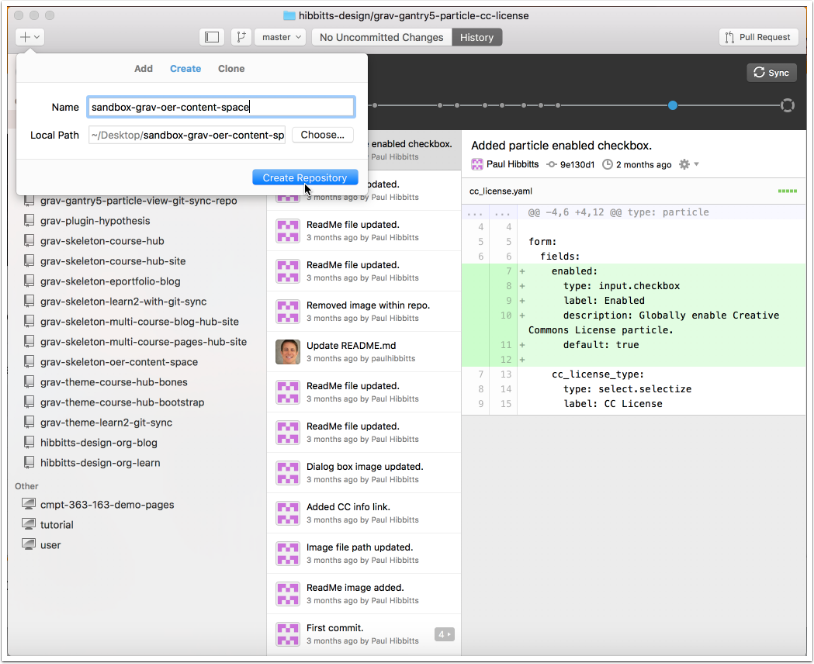

#### 2. Link Remote (GitLab) Repository

##### 2.1 View the settings for your newly created repository

On the Mac, tap the "Repository" menu and chose "Repository Settings...".
On Windows, tap on the gear icon in the upper-right of your GitHub Desktop window.

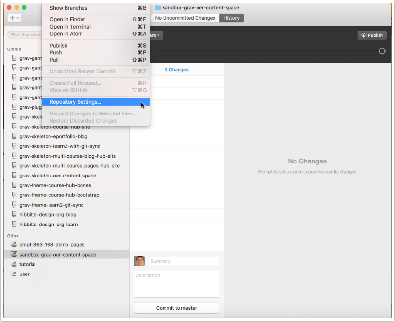

##### 2.2 With the "Remote" panel visible for your repository, open your Browser and sign into your GitLab account

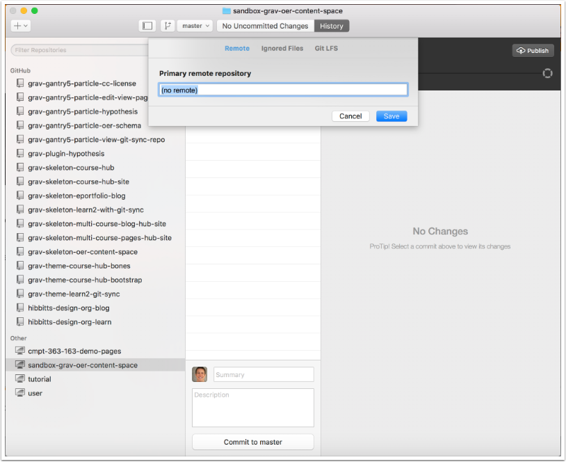

##### 2.3 Go to your GitLab project (repository) and tap on "HTTPS" to view that address for the repository

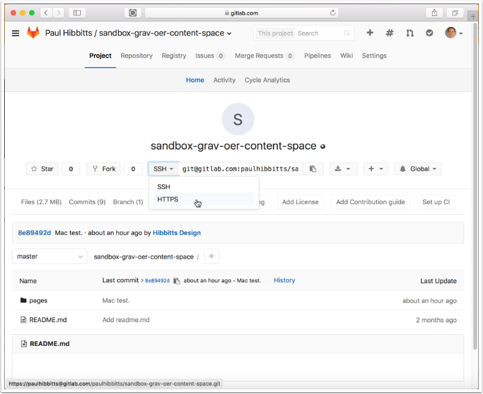

##### 2.4 Copy the HTTPS address of your GitLab project repository

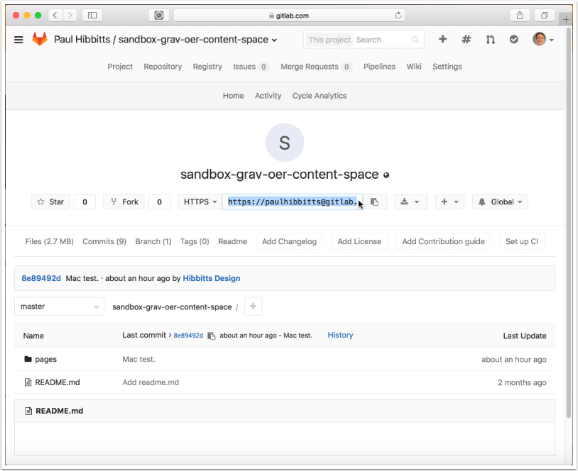

##### 2.5 Return to GitHub Desktop, paste the HTTPS address of your GitLab project into the "Primary remote repository" field and tap "Save"

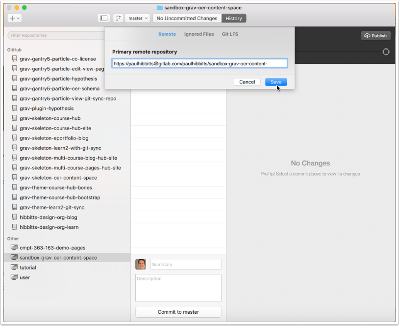

#### 3. Delete Local Repository Folder

##### 3.1 Right-tap the entry for your newly created local repository folder and view it's local folder

On a Mac, choose "Open in Finder"

On Windows,  choose "Open in Explorer"

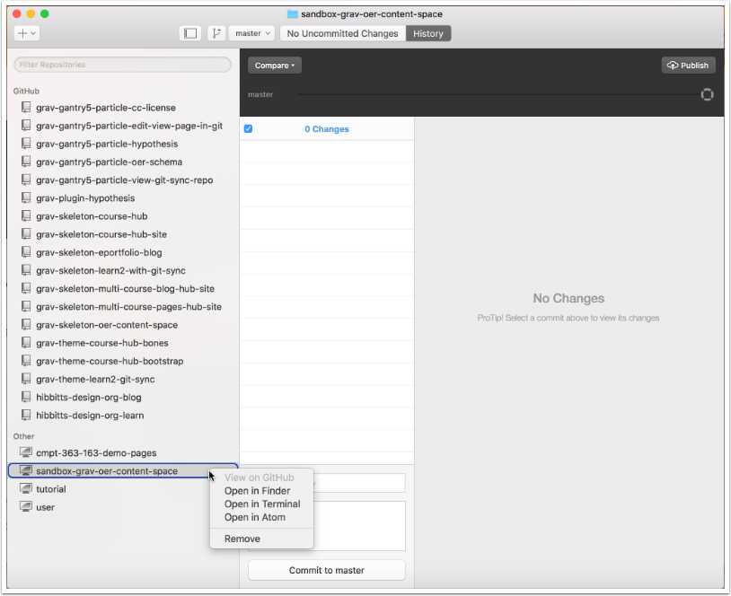

##### 3.2 Navigate up one level, so you can view the folder containing your local repository

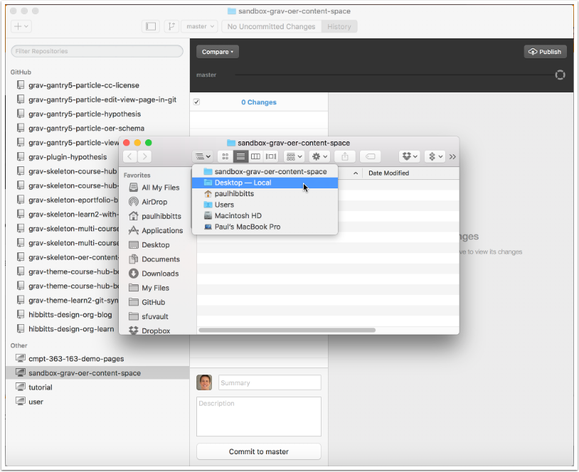

##### 3.3 Move the folder containing your local repository to the Trash/Recycling Bin

On Mac, right-tap the folder and choose "Move to Trash"
On Windows, right-tap the folder and choose "Delete"

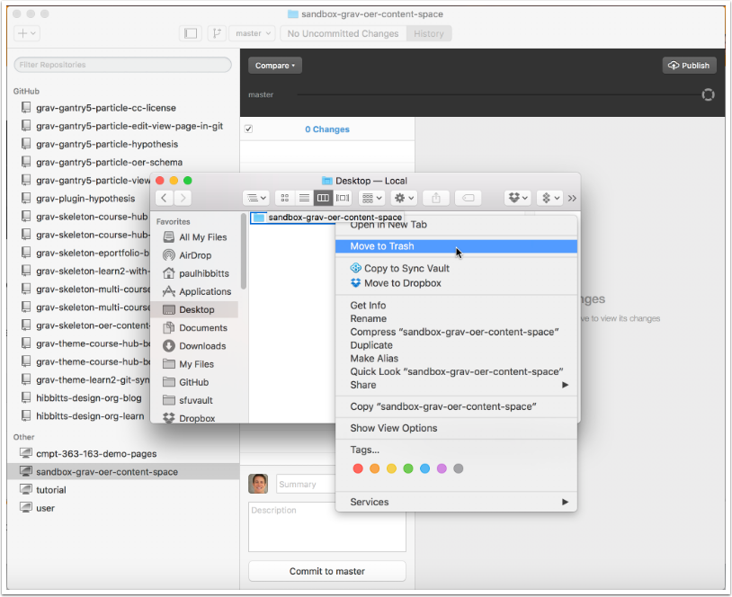

##### 3.4 Permanently delete the repository folder from your Trash/Recycling Bin

On Mac, right-tap the Trash Can and choose "Empty Trash"

On Windows, right-tap the Recycling Bin and and choose "Empty Recycle Bin"

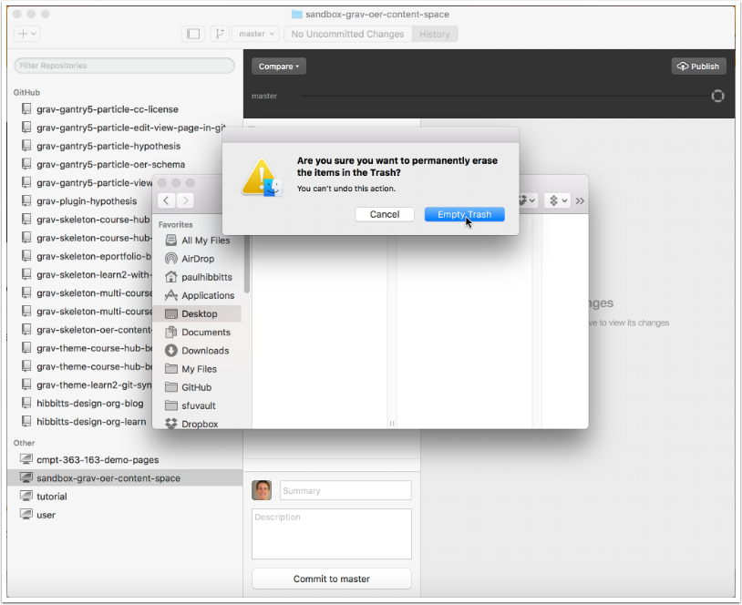

#### 4. Re-clone Repository

##### 4.1 Tap the "Clone Again" button in GitHub Desktop

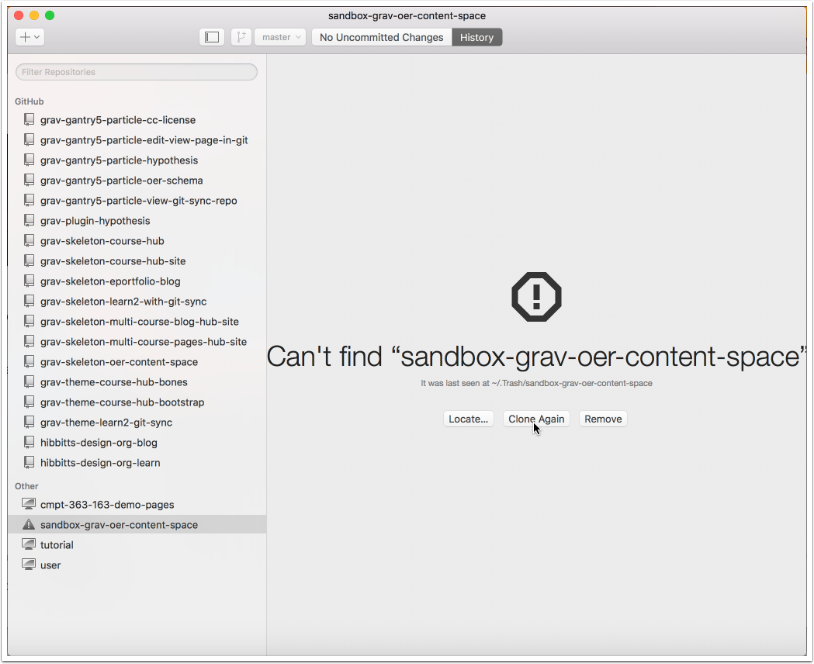

##### 4.2 Right-tap the entry for your newly created local repository folder and view it's local folder

On a Mac, choose "Open in Finder"
On Windows,  choose "Open in Explorer"

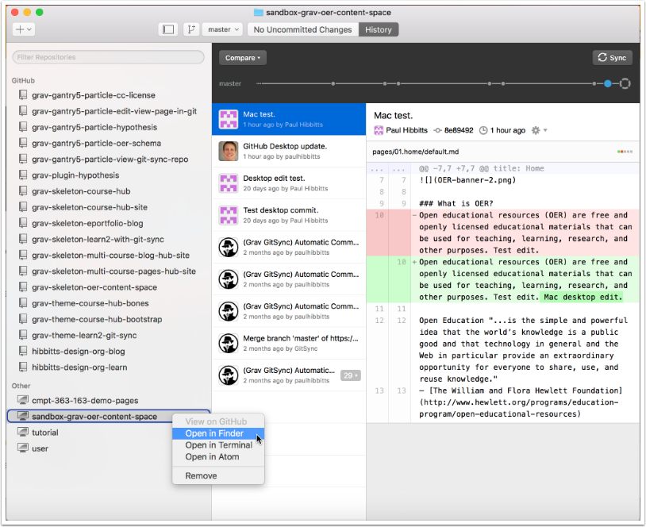

##### 4.3 Review the files of your cloned GitLab repository

You can now edit these files locally, and use GitHub Desktop to push changes to your remote repository.

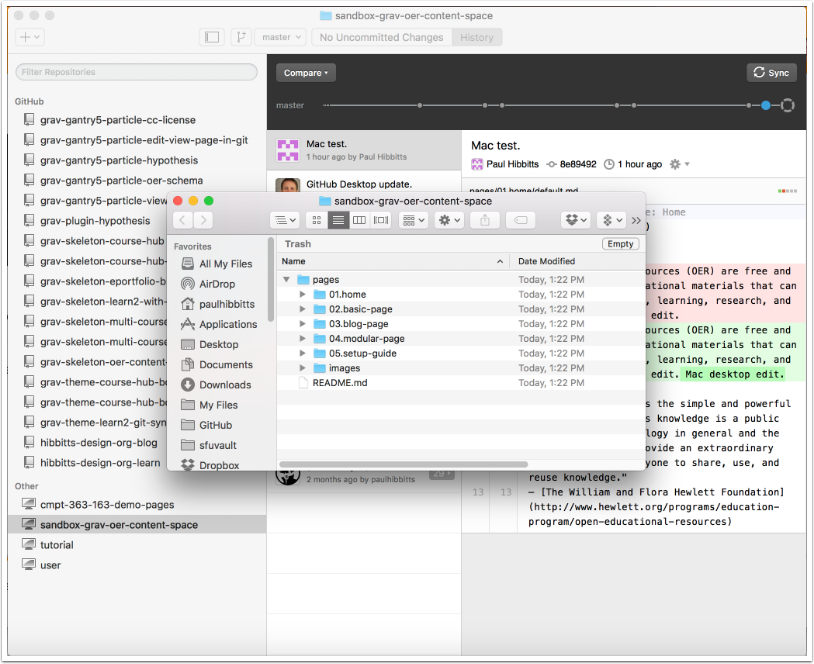
