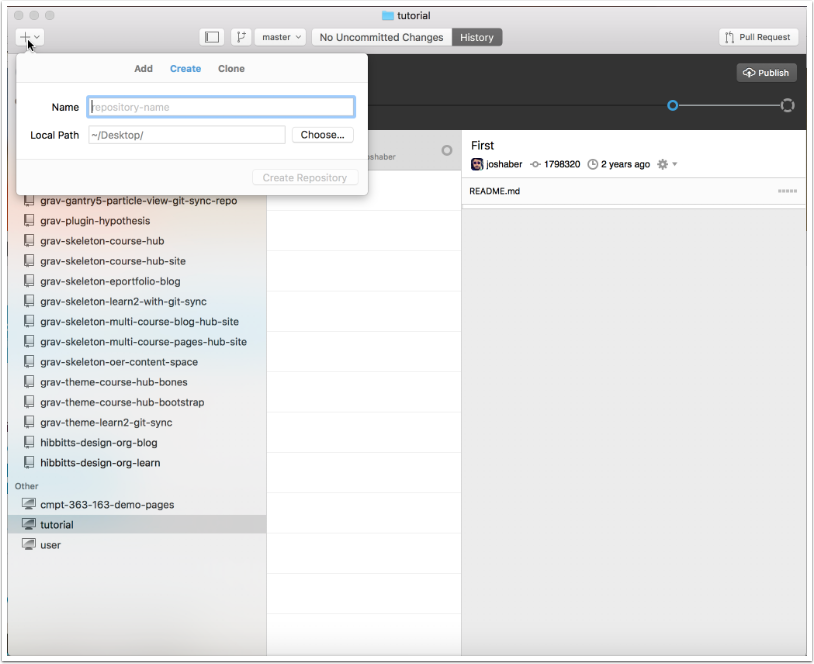
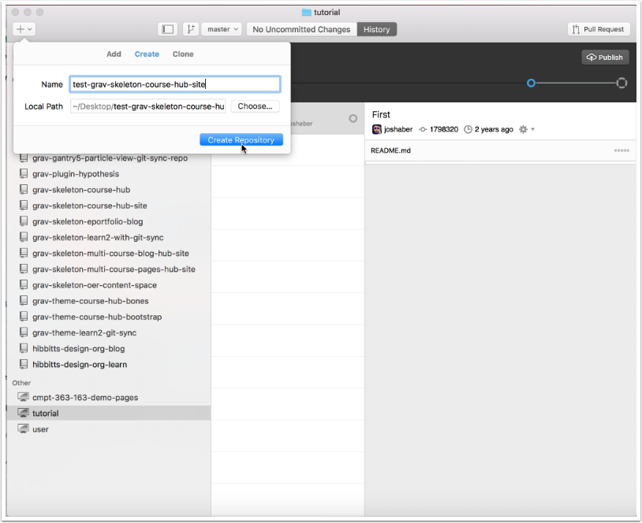
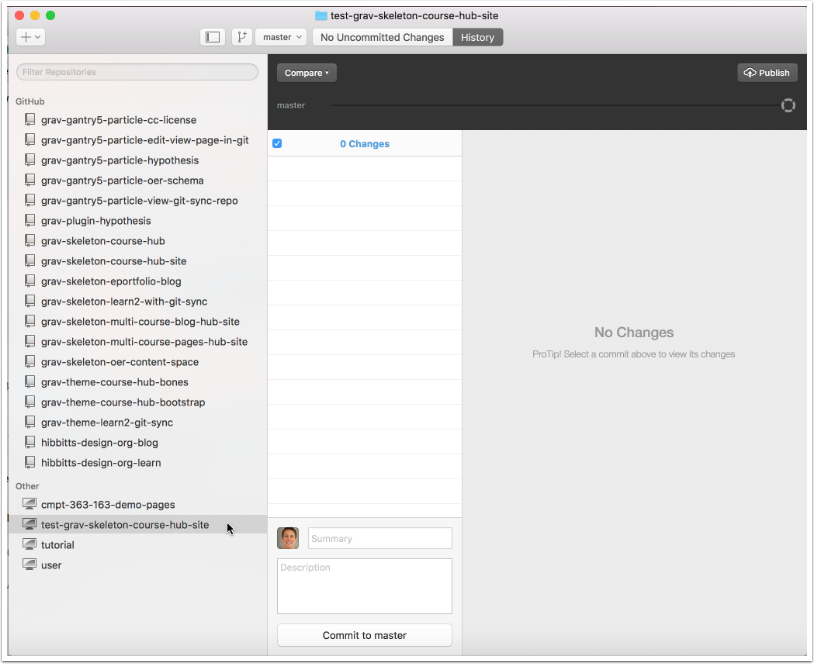
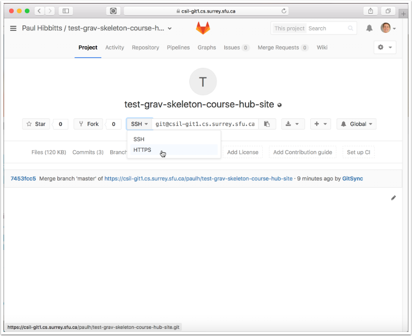
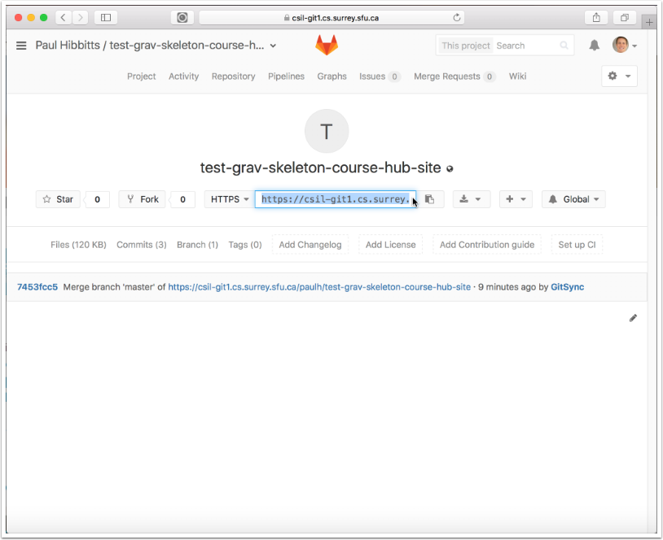
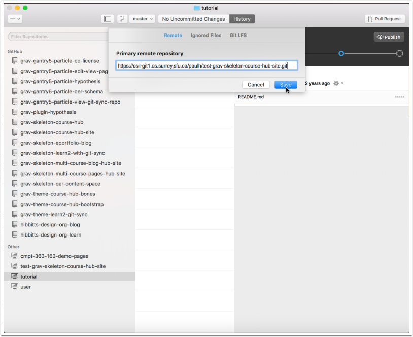
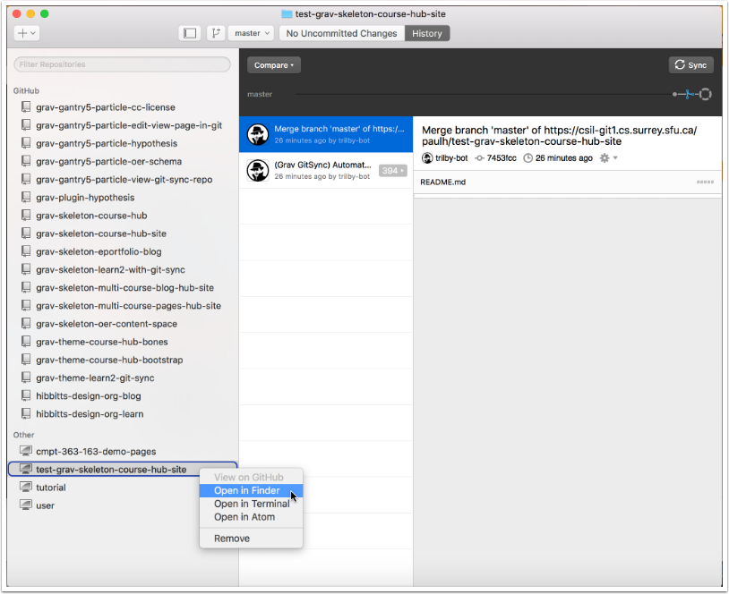
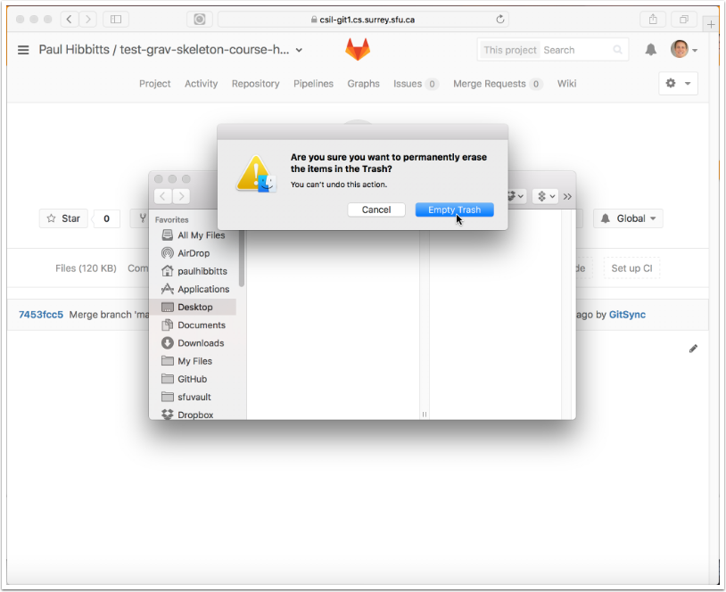
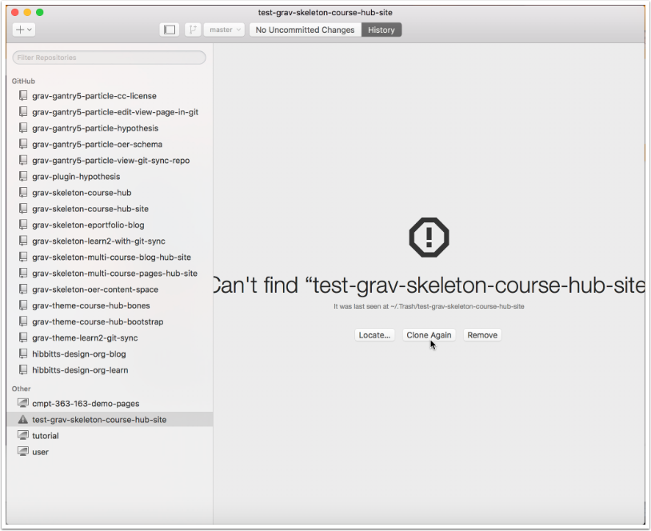

* [1. Create Local Repository](#1-create-local-repository)
* [2. Link Remote (GitLab) Repository](#2-link-remote-repository)
* [3. Quit GitHub Desktop](#3-quit-github-desktop)
* [4. Delete Local Repository Folder](#4-delete-local-repository-folder)
* [5. Launch GitHub Desktop](#5-launch-github-desktop)
* [6. Re-clone Repository](#6-re-clone-repository)

#### 1. Create Local Repository

##### 1.1 Tap on the "+" button in the upper-left of the GitHub Desktop window

##### 1.2 Enter the name of your new repository in the "Create" panel and tap "Create Repository"

While you can name this repository anything, it is recommended to use the same name as the GitLab repository that you will be using.

#### 2. Link Remote Repository

##### 2.1 Select your newly created repository (if not currently highlighted)

##### 2.2 View the settings for your newly created repository

On Mac, tap the "Repository" menu and chose "Repository Settings...".

On Windows, tap on the gear icon in the upper-right of your GitHub Desktop window.

##### 2.3 Open your Browser and sign into your GitLab account (with the "Remote" panel visible for your repository)

##### 2.4 Go to your GitLab project (repository) and tap on "HTTPS" to view that address for the repository

##### 2.5 Copy the HTTPS address of your GitLab project repository

##### 2.6 Return to GitHub Desktop, paste the HTTPS address of your GitLab project into the "Primary remote repository" field in the "Remote" panel and tap "Save"

##### 2.7 Tap the "Publish" button

##### 2.8 Right-tap the entry for your newly created local repository folder and view it's local folder

On Mac, choose "Open in Finder"

On Windows,  choose "Open in Explorer"

#### 3. Quit GitHub Desktop

#### 4. Delete Local Repository Folder

##### 4.1 Move the folder containing your local repository to the Trash/Recycling Bin

On Mac, right-tap the folder and choose "Move to Trash"

On Windows, right-tap the folder and choose "Delete"

##### 4.2 Permanently delete the repository folder from your Trash/Recycling Bin

On Mac, right-tap the Trash Can and choose "Empty Trash"

On Windows, right-tap the Recycling Bin and and choose "Empty Recycle Bin"

#### 5. Launch GitHub Desktop

#### 6. Re-clone Repository

##### 6.1 Select your newly created repository (if needed) and tap the "Clone Again" button in GitHub Desktop

##### 6.2 Right-tap the entry for your newly created local repository folder and view it's local folder

On a Mac, choose "Open in Finder"

On Windows,  choose "Open in Explorer"

##### 6.3 Review the files of your cloned GitLab repository

You can now edit these files locally, and use GitHub Desktop to push changes to your remote repository.

