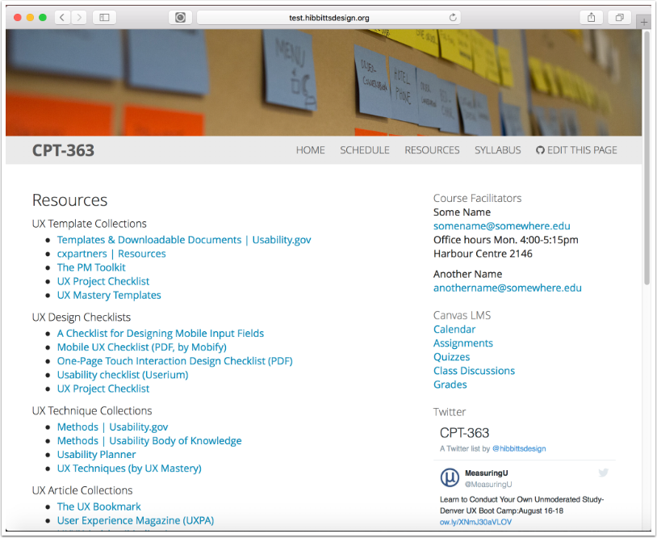

##### 3.1 Launch your desktop editor of choice (Atom.io shown) and open the Markdown file of your choice within the repository folder

![][10]

[10]: ../../images/course-hub-with-git-sync---desktop-editing/view-the--sidebarpagemd-.png

##### 3.2 Make edits to the markdown file

![][11]

[11]: ../../images/course-hub-with-git-sync---desktop-editing/make-edits-to-the-markdown-file.png

##### 3.3 Save the edited markdown file

![][12]

[12]: ../../images/course-hub-with-git-sync---desktop-editing/save-the-edited-markdown-file.png

##### 3.4 Open GitHub Desktop, select the cloned folder, and tap on the uncommitted changes button

![][13]

[13]: ../../images/course-hub-with-git-sync---desktop-editing/open-github-desktop--select-the-cloned-folder--and-tap-on-the-uncommitted-changes-button.png

##### 3.5 Add a comment for the change

![][14]

[14]: ../../images/course-hub-with-git-sync---desktop-editing/add-a-comment-for-the-change.png

##### 3.6 Tap the "Commit to master" button

![][15]

[15]: ../../images/course-hub-with-git-sync---desktop-editing/tap-the--commit-to-master--button.png

##### 3.7 Tap the "Sync" button

![][16]

[16]: ../../images/course-hub-with-git-sync---desktop-editing/tap-the--sync--button.png

##### 3.8 Tap on the "History" button to view the committed change

![][17]

[17]: ../../images/course-hub-with-git-sync---desktop-editing/tap-on-the--history--button-to-view-the-committed-change.png

##### 3.9 Refresh site page to view the committed change(s)

