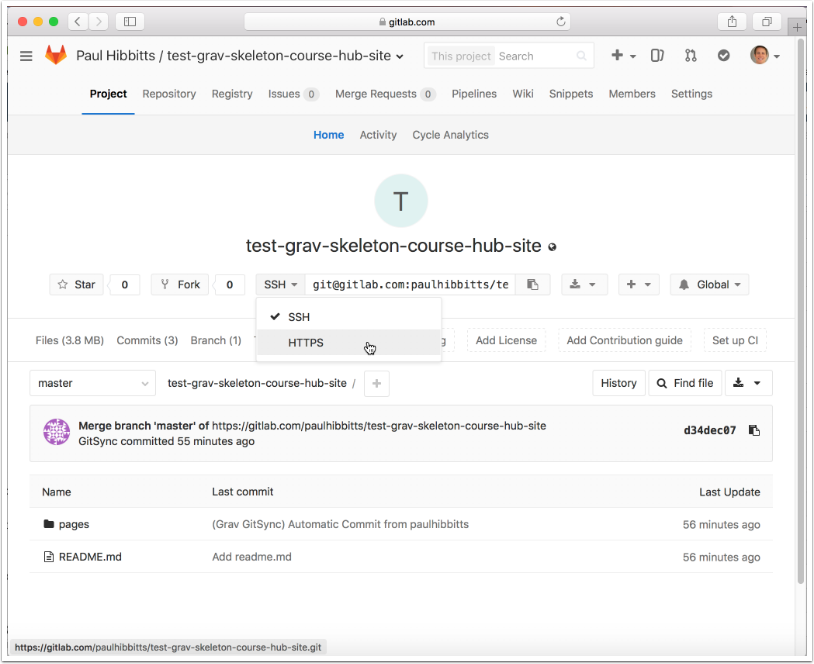
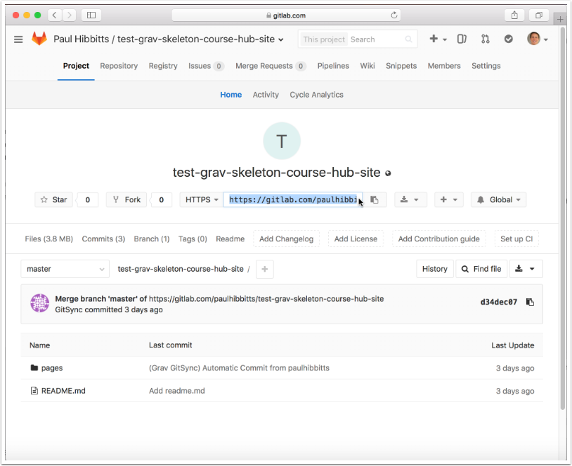
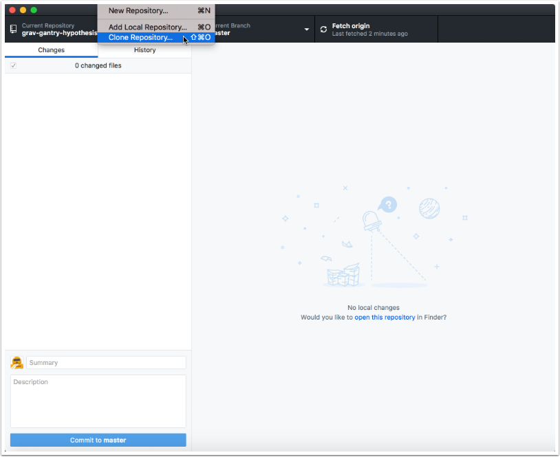
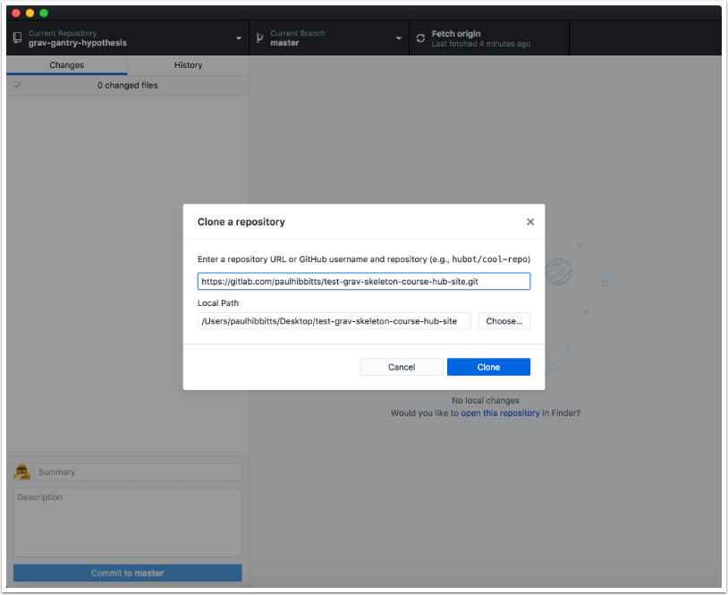
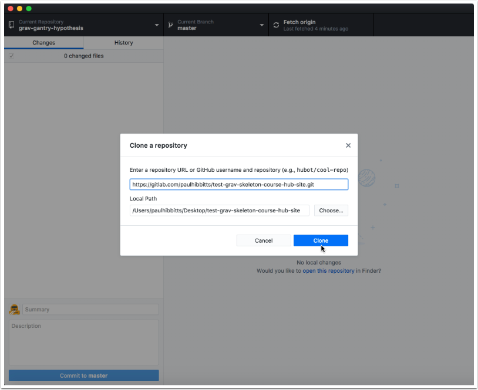
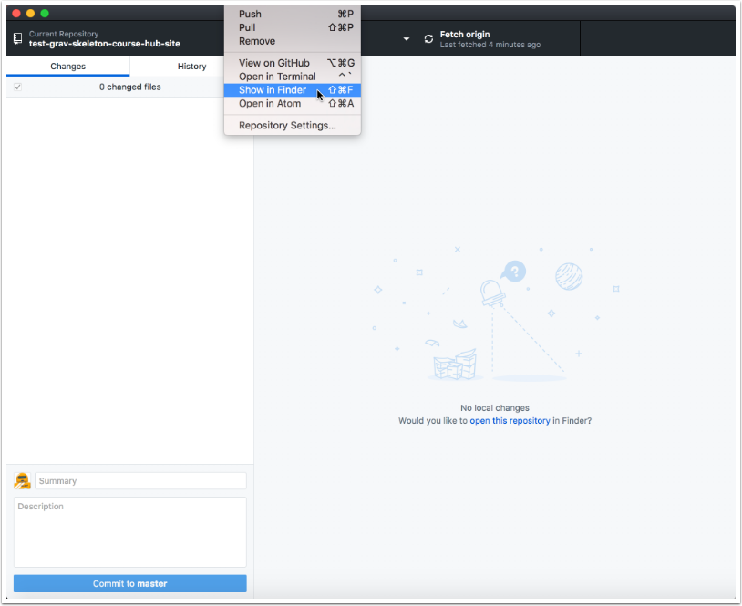
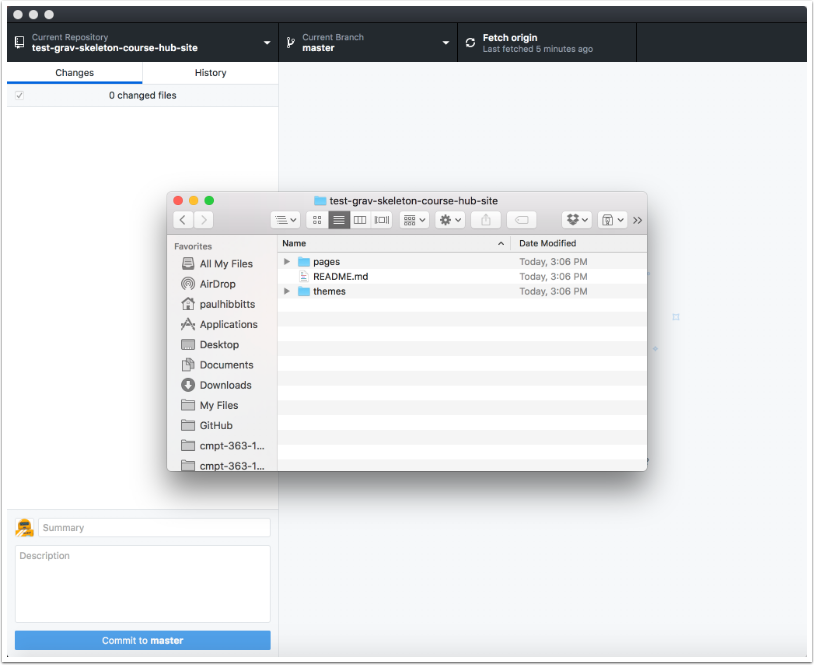

* [1. Clone Repository](#1-create-local-repository)
* [2. Create Local Repository](#2-create-local-repository)

#### 1. Clone Repository

##### 1.1 Go to your GitLab project (repository) and tap on "HTTPS" to view that address for the repository

##### 1.2 Copy the HTTPS address of your GitLab project repository

#### 2. Create Local Repository

##### 2.1 Tap the "File" menubar item and choose "Clone Repository..."

##### 2.2 Paste the previously copied HTTPS URL into the repository URL field.

Change the default provided for "Local Path" if needed.

##### 2.3 Tap the "Clone" button.

##### 2.4 Tap the "Repository" menubar item and view it's local folder

On a Mac, choose "Show in Finder"

On Windows,  choose "Show in Explorer"

##### 2.5 Review the files of your cloned GitLab repository.

You can now edit these files locally, and use GitHub Desktop Beta to push changes to your GitLab repository.

