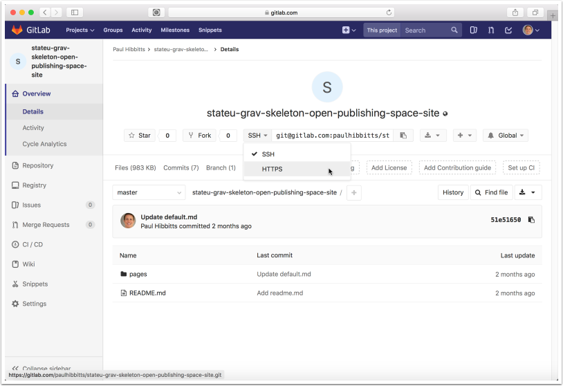
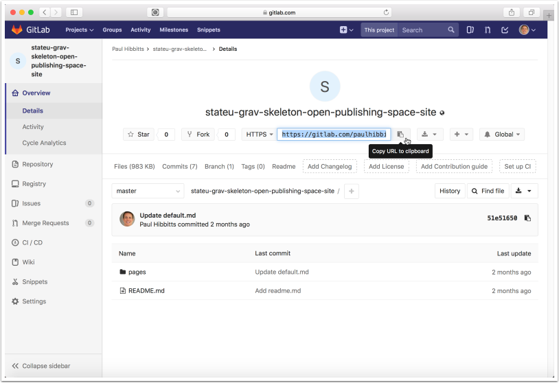
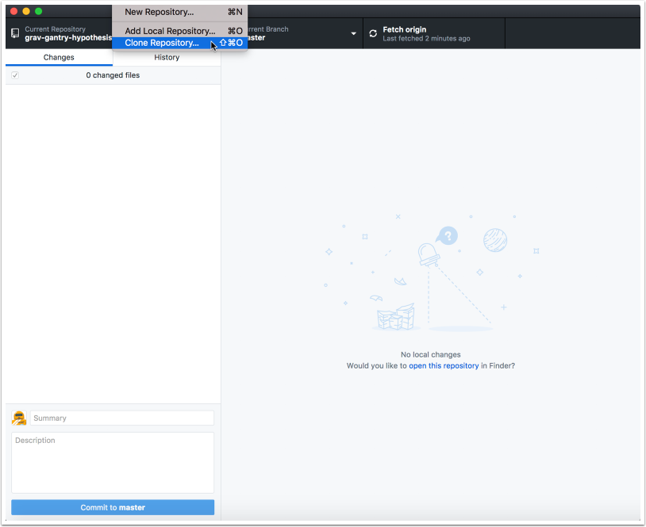
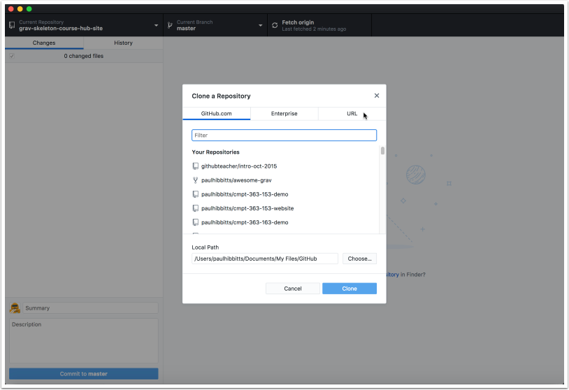
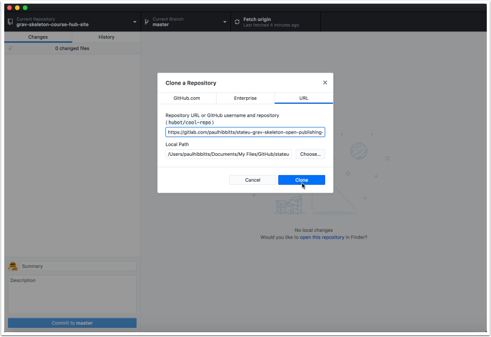
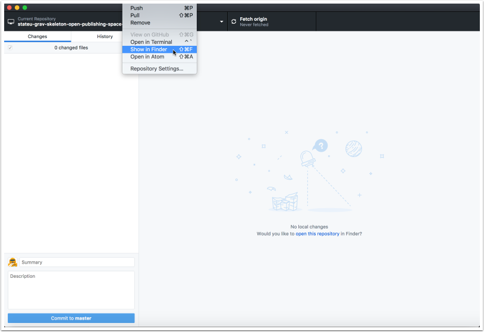
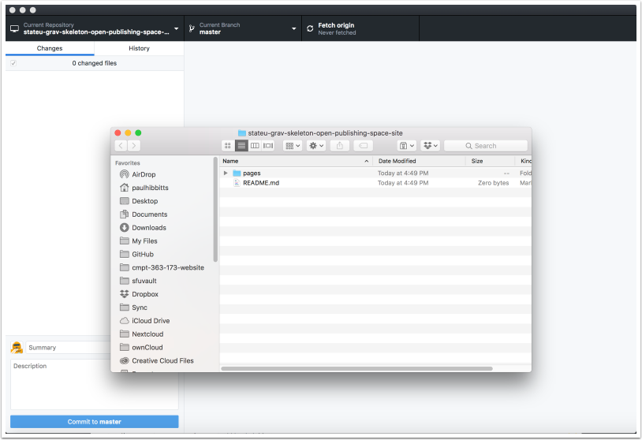

####Using GitHub Desktop (New Native) and GitLab

#### 1. Get Repository HTTPS Address

##### 1.1 Go to your GitLab project (repository) and tap on "HTTPS" to view that address for the repository

##### 1.2 Copy the HTTPS address of your GitLab project repository

#### 2. Clone Repository

##### 2.1 Launch GitHub Desktop and tap the "File" menubar item and choose "Clone Repository..."

##### 2.2 Tap on the "URL" tab

##### 2.3 Paste the previously copied HTTPS URL into the repository URL field

##### 2.4 Tap the "Clone" button

##### 2.5 Tap the "Repository" menubar item and view it's local folder

On a Mac, choose "Show in Finder"

On Windows,  choose "Show in Explorer"

##### 2.6 Review the files of your cloned GitLab repository.

You can now edit these files locally, and use GitHub Desktop to push changes to your GitLab repository.

