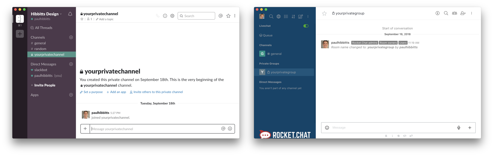

For a $7 USD/month subscription (introductory offer) get access to a private one-on-one [Slack](https://slack.com/) or [RocketChat](https://rocket.chat/) room with Paul Hibbitts to answer your questions about setting up and using any of his [Grav](https://getgrav.org/) Open Education packages ([Open Course Matter Hub](http://demo.hibbittsdesign.org/grav-open-matter-course-hub), [Open Publishing Space](https://demo.hibbittsdesign.org/grav-open-publishing-quark/), and [Learn2 with Git Sync](https://demo.hibbittsdesign.org/grav-learn2-git-sync/)).

Examples of things Paul can help you with:  
* Configuration of your Grav site
* Markdown content formatting
* Site structure and pages
* Page header options
* Embedding Grav content into other systems (e.g. an LMS)
* Git Sync setup and customization
* Basics of GitHub, GitLab, etc.
* Desktop editing of your Grav site

_Please allow 1-2 business days for a response, but under two-hour response times are typical [Monday-Friday 10am-4pm PST](https://www.timeanddate.com/worldclock/canada/vancouver). Screen sharing sessions and theme customizations are not included in this service, but can be arranged separately._

<form action="https://www.paypal.com/cgi-bin/webscr" method="post" target="_top">
<input type="hidden" name="cmd" value="_s-xclick">
<input type="hidden" name="hosted_button_id" value="QGMGRHLY8QDYY">
<input type="image" src="https://www.paypalobjects.com/en_US/i/btn/btn_subscribe_LG.gif" border="0" name="submit" alt="PayPal - The safer, easier way to pay online!">

</form>

Would you rather make a single donation to help fund Paul's open source Grav in education work? You can do that too - thank you!

<form action="https://www.paypal.com/cgi-bin/webscr" method="post" target="_top">
<input type="hidden" name="cmd" value="_s-xclick">
<input type="hidden" name="hosted_button_id" value="5RZ784EKKSZPN">
<input type="image" src="https://www.paypalobjects.com/en_US/i/btn/btn_donate_LG.gif" border="0" name="submit" alt="PayPal - The safer, easier way to pay online!">

</form>
